# Documentação IoTDoc - Módulo 4 - Inteli

## Voltz

#### Caio Teixeira de Paula

#### Eduardo Henrique Dos Santos

#### Pedro Henrique Oliveira Lima

#### Pedro Morita Bannwart

#### Raíssa Vieira de Melo

#### Raphaela Guiland Ferraz

## Sumário

[1. Introdução](#c1)

[2. Metodologia](#c2)

[3. Desenvolvimento e Resultados](#c3)

[4. Possibilidades de Descarte](#c4)

[5. Conclusões e Recomendações](#c5)

[6. Referências](#c6)

 

# 1. Introdução

&emsp; O Instituto de Pesquisas Tecnológicas (IPT), vinculado ao Governo do Estado de São Paulo, foi fundado em 1899. O instituto atua em quatro grandes áreas: pesquisa, desenvolvimento e inovação; serviços tecnológicos; serviços metrológicos; e educação em tecnologia. Possuindo uma infraestrutura laboratorial avançada e equipes multidisciplinares especializadas, o IPT desenvolve e aplica soluções tecnológicas para setores da economia, governos e a sociedade, auxiliando na superação de desafios [1].

&emsp; A Seção de Obras Civis (SOC) do IPT concentra-se em desenvolver soluções tecnológicas para a infraestrutura, atendendo setores como Transportes, Energia e Saneamento. Composta por especialistas em estruturas, geotecnia e geologia, a seção oferece desde consultorias e ensaios laboratoriais até estudos avançados de estruturas e geologia, abrangendo todas as fases da vida útil de obras civis [2].

&emsp; O desafio trazido pela Seção de Obras Civis (SOC) do IPT destaca uma dificuldade encontrada no monitoramento de estruturas civis. Atualmente, a complexidade na leitura, monitoramento e conexão das células de carga, junto aos altos custos associados, dificulta o monitoramento contínuo e eficaz das obras. Este contexto ressalta a necessidade de inovações que otimizem e tornem o processo mais acessível no setor.

## 1.1 Objetivos

### 1.1.1 Objetivos Gerais  

&emsp; A definição do objetivo geral é fundamental, uma vez que representa a ideia central que guiará o desenvolvimento de um projeto. Nesse sentido, considerando os problemas apresentados pelo TAPI [2], o objetivo geral deste projeto consiste em desenvolver um Mínimo Produto Viável (MVP) usando Arduino/ESP32 para reduzir os custos dos equipamentos utilizados no monitoramento de obras civis e simplificar a instalação por meio da utilização de comunicação sem fio entre os dispositivos presentes nas obras. Além disso, a solução desenvolvida deverá incluir, juntamente com o Arduino/ESP32, um display integrado e um sensor, que é a Célula de Carga.  

### 1.1.2 Objetivos Específicos  

&emsp; Em relação aos objetivos específicos, eles são relevantes para o projeto, haja vista que eles definem quais são os resultados que o projeto pretende alcançar, tornando possível a garantia do objetivo geral. Sendo assim, os objetivos específicos deste projeto são:  

- Realizar o entendimento do Termo de Abertura do Projeto do Inteli (TAPI);  
- Armazenar os dados coletados pela Célula de Carga de forma local ou em nuvem;  
- Realizar a comunicação entre os Arduino/ESP32 para transferência dos dados para nuvem ou enviar para um armazenamento local;  
- Possibilitar o acesso aos dados coletados pela Célula de Carga por meio de um dashboard;  
- Utilizar tecnologias e protocolos de comunicação sem fio, de modo a evitar a utilização de cabos, conforme a preferência do parceiro explícita no TAPI.  

## 1.2 Proposta da solução

&emsp;A solução que o grupo propõe para uma tentativa de solução para o problema apresentado anteriormente pela Seção de Obras Civis do IPT, consiste em um sistema de monitoramento de infraestrutura, baseado em IoT.

&emsp;O sistema em questão consiste em condicionadores de sinais, isto é, dispositivos ESP32 e células de carga. Nesse sentido, o ESP32 (condicionador de sinal) será responsável por armazenar os dados lidos das células de carga e enviar esses dados para a nuvem. Sendo assim, o ESP32 estará conectado com uma célula de carga, ele será responsável por realizar a leitura dos dados da célula de carga e enviará esses dados para o armazenamento em nuvem.

&emsp;Em relação aos dados coletados, eles serão armazenados localmente e em nuvem, algo que atende os requisitos do parceiro de projetos, que precisa que os dados sejam coletados em tempo real caso tenha conexão com a internet e, mesmo que não tenha, eles consigam armazenar esses dados em um local específico. Ademais, com esses dados armazenados, será possível visualizá-los através de um dashboard que acompanhará o módulo IoT que será desenvolvido. Esse software permitirá a visualização de gráficos específicos, algo que auxiliará a equipe técnica no monitoramento de infraestruturas.

&emsp;Desse modo, é possível observar que a proposta de solução que será desenvolvida atende aos objetivos específicos listados na seção anterior, pois:

- Para que seja possível a estruturação da lógica de funcionamento do projeto, foi necessário realizar o entendimento aprofundado do Termo de Abertura do Projeto Inteli (TAPI);
- O projeto está sendo arquitetado, desde o início, para armazenar os dados coletados das células de carga tanto localmente quanto na nuvem;
- O projeto conta com a realização da comunicação entre Arduino/ESP32 sem fio para transferência dos dados para a nuvem ou envio para um armazenamento local;
- O projeto possibilita o acesso aos dados coletados pela célula de carga por meio do dashboard que também será desenvolvido;
  Na arquitetura do projeto, há tecnologias e protocolos de comunicação sem fio, evitando a utilização de cabos, algo bem requisitado pelo parceiro de projetos.

&emsp;Tendo essas considerações em mente, é notório que a solução proposta conseguirá atender às necessidades do projeto, proporcionando um sistema robusto e eficiente para o monitoramento de carga.

## 1.3 Justificativa

&emsp;A proposta de solução apresentada destaca-se pela capacidade de inovar e simplificar o monitoramento em infraestruturas civis, considerando o cenário atual repleto de equipamentos de alto custo e sistemas dependentes de cabos.
Um dos pilares da nossa solução é a integração da tecnologia IoT por meio dos dispositivos ESP32. Essa estratégia não apenas reduz os custos relacionados ao monitoramento, mas também proporciona maior adaptabilidade graças à sua configuração sem fio. A possibilidade de coletar dados em tempo real e armazená-los tanto localmente quanto na nuvem reforça a confiabilidade e assegura a integridade das informações, mesmo quando a conexão com a internet enfrenta instabilidade.

&emsp;Além disso, o recurso de uma interface integrada com dashboard oferece uma visão detalhada e de fácil compreensão das métricas de acompanhamento, permitindo que os especialistas do IPT tomem decisões baseadas em informações precisas e atualizadas. A abordagem que elimina a dependência de cabos não só atende às necessidades do parceiro, mas também aponta para uma tendência emergente no setor de obras civis, valorizando a praticidade e eficácia.

# 2. Metodologia

&emsp;Para projetar com precisão a solução IoT que está sendo desenvolvida para o Setor de Obras Civis do IPT foi utilizado o Modelo de Referência de Processamento Distribuído Aberto (RM-ODP). A RM-ODP trata-se de um framework internacionalmente reconhecido e padronizado, utilizado no desenvolvimento de sistemas distribuídos abertos [48]. Desse modo, o RM-ODP foi definido em conjunto da ISO, IEC e ITU-T para ser um quadro de referência para o desenvolvimento de projetos ODP, de modo a definir o suporte de distribuição, interfuncionamento, independência de plataforma, tecnologia e portabilidade [48].

&emsp;Essa metodologia foi concebida para abordar desafios inerentes à construção de sistemas distribuídos que operam em ambientes abertos, nos quais os componentes heterogêneos e autônomos precisam interagir de maneira eficiente eficaz [50]. Em relação à estrutura fornecida pelo RM-ODP para especificação de um sistema, ela possui quatro mecanismos considerados fundamentais, sendo eles: modelagem de objetos, pontos de vista do ODP, transparências de distribuição e conformidade [48].

&emsp;Nessa direção, a modelagem de objetos consiste em desenvolver uma representação abstrata, mas compreensível, dos dados que o sistema irá gerenciar. Esse mecanismo também pode ser visualizado como uma estrutura genérica que contém conceitos arquiteturais e terminologias que possibilitam o surgimento de padrões específicos [49]. Dessa maneira, devido à abstração presente na modelagem de objetos, será possível separar as funcionalidades dos detalhes de implementação do sistema em questão. Ademais, esse mecanismo do RM-ODP permite a localização de falhas, maior segurança e a minimização da heterogeneidade [48].

&emsp;Em relação aos pontos de vista do ODP, eles estão relacionados aos aspectos específicos do sistema, os quais auxiliarão na descrição e especificação diferentes, bem como conseguirão evidenciar um conjunto específico de preocupações relacionadas ao sistema [48]. Isso significa que esses pontos de vista irão projetar o sistema aberto distribuído como todo, mas com a capacidade de visualizar um conjunto individual de aspectos de acordo com um público de interesse [49]. Sendo assim, cada ponto de vista utilizará uma linguagem que se otimiza com o vocabulário do seu respectivo público de interesse [48], ou seja, se é um stakeholder voltado para a parte de negócios do cliente, logo esse conjunto de aspectos terão que abordar conteúdos mais ligados a essa área e não de programação, por exemplo. Portanto, o RM-ODP define cinco pontos de vistas:
- Ponto de vista empresarial: A preocupação central desse ponto de vista está atrelada ao problema e demanda que a solução ODP deverá abordar. Além disso, tal ponto de vista se concentra no propósito, no escopo e nas políticas que deverão estar presentes nas funcionalidades do sistema, uma vez que ele será utilizado dentro de um contexto empresarial [48];
- Ponto de vista da informação: A preocupação que cerca este ponto de vista é sobre os tipos de informações que serão tratadas pelo sistema, bem como quais serão as restrições durante a usabilidade do sistema e quando ele realizar a interpretação desses dados [48]. Isso está bastante relacionado aos requisitos funcionais - aspectos de um sistema que representam as funcionalidades que ele irá abordar - e aos requisitos não funcionais - características que definirão a qualidade desse sistema, de modo a complementar os requisitos funcionais;
- Ponto de vista computacional: A preocupação cerne deste ponto de vista está ligada ao funcionamento do sistema, fazendo com que ele seja decomposto em um conjunto de objetos que poderão interagir com interfaces, algo que possibilita a sua distribuição [48]. Assim, por meio desse ponto de vista, é possível ter acesso amplo sobre as suas atividades e interações possíveis;
- Ponto de vista de engenharia: Este ponto de vista se preocupa com a infraestrutura total do sistema que será desenvolvido, de modo a olhar, de forma aprofundada, se ela será capaz de suportar toda a distribuição do sistema [48]. Com isso, a visão de engenharia permite uma representação do molde do sistema;
- Ponto de vista tecnológico: Já este ponto de vista está concentrado com as escolhas das tecnologias para fazer com que todos os outros pontos de vista acima possam ser implementados e para auxiliar a distribuição do sistema [48]. Sendo assim, diferentemente do ponto de vista anterior, este se concentra em evidenciar os recursos computacionais e físicos que serão necessários no sistema. 

&emsp;Já sobre a transparência de distribuição, tal aspecto permite que os detalhes de implementação relacionados à distribuição do sistema sejam ocultados, fornecendo uma visão mais simplificada para o usuário do sistema distribuído [48]. Ademais, esse aspecto permite que os desenvolvedores foquem apenas na parte lógica da aplicação, além de que eles poderão manter os requisitos não-funcionais de forma mascarada [49]. Assim sendo, a transparência contribui para a simplicidade e eficiência de funcionamento do sistema, algo de extrema importância para a concepção e utilização dos usuários. 

&emsp;O último mecanismo fundamental definido pelo RM-ODP é a conformidade, a qual se define por características básicas que asseguram que o relacionamento entre os diferentes pontos de vistas com as restrições e regras estabelecidas faça com que se tenha consistência, interoperabilidade e conformidade no sistema [50]. 

&emsp;Portanto, devido a todos aspectos que a metodologia oferece, é possível ter a visualização do projeto como um todo e de forma singular, haja vista que cada parte descritiva da metodologia fornece uma visão de uma área específica dos stakeholders, mas, ao mesmo tempo, é complementar das demais visões. Assim, a imagem abaixo demonstra a ligação entre os pontos de vista do RM-ODP:

Figura 1 - Metodologia RM-ODP

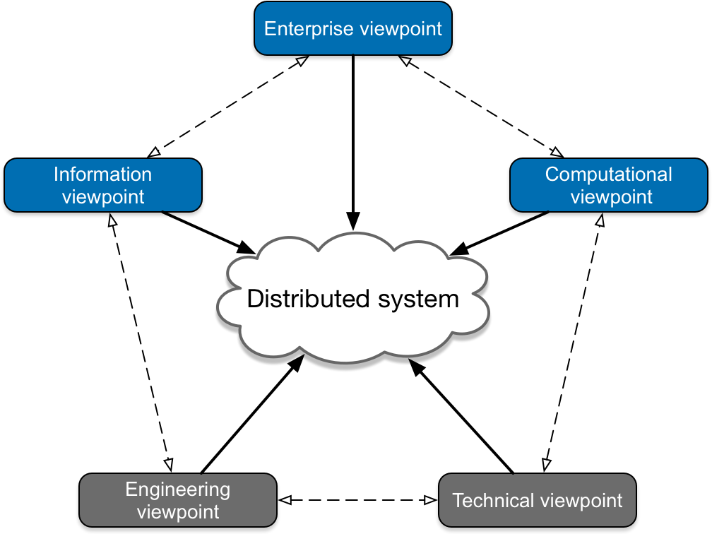

Fonte - DIARIAH-EU: ODP-RM Reference Model Why a Reference Architecture for 
DARIAH-EU? (https://priddy.github.io/DARIAH-RA/introduction/odp-rm/)
 

 &emsp;A aplicação da metodologia RM-ODP ajuda a garantir que um projeto seja desenvolvido de forma coesa, abordando os aspectos relacionados aos pontos de vista apresentados anteriormente. A sua aplicação facilita a compreensão, consistência, interoperabilidade e conformidade do sistema a ser desenvolvido, fazendo com que a sua aplicação em um projeto seja fundamental para o seu desenvolvimento. Em relação à seção de obras civis (SOC) do IPT e o projeto do condicionador de sinal, a metodologia RM-ODP poderia ser aplicada da seguinte forma:
- Ponto de vista empresarial: Este aspecto da metodologia assume uma importância crucial na identificação dos stakeholders envolvidos no projeto, tais como o Inteli e a SOC-IPT. Além disso, aborda as questões que os clientes apontam uma necessidade de resolução e a definição do escopo, sintetizando, assim, o propósito que a SOC-IPT possui em relação ao projeto da célula de carga que está sendo desenvolvido. Sendo assim, para que o grupo conseguisse ter tais aspectos mapeados, foram elaborados os componentes da seção [3.1](#c3), a qual trata sobre os fundamentos mercadológicos da SOC-IPT e da solução. Dessa maneira, para que o entendimento do negócio fosse de fato realizado, a seção contém uma série de ferramentas que ajudam a realizar tal compreensão, sendo: a Matriz SWOT em relação à SOC, as 5 forças de Porter em relação ao mercado em que o IPT está inserido, o Canvas de Proposta de Valor, que aborda a relação entre o parceiro e a solução, entre outros componentes. Além disso, esse ponto de vista está conectado ao TAPI, no qual é descrito o escopo geral do projeto, as dores do parceiro que demandaram o desenvolvimento dessa solução e uma breve contextualização sobre a SOC e o IPT, algo que também auxilia na compreensão geral do negócio.
- Ponto de vista da informação: A partir da perspectiva informacional, é viável estipular os tipos de dados que serão coletados pelo sistema IoT que está sendo desenvolvido. Desse modo, no contexto do projeto, os dados coletados serão referentes à deformação estrutural das pontes, e de outras infraestruturas, solicitadas pela SOC-IPT, uma vez que tais dados poderão ajudar o setor a identificar possíveis pontos de melhoria até perigos iminentes em determinada área física. Ademais, as limitações associadas às informações que serão coletadas são mapeadas neste tópico em conjunto com o TAPI do projeto, haja vista que o parceiro delimitou que se tenha uma precisão específica da leitura realizada pela célula de carga, algo que pode ser inviável devido à fatores que o grupo não tem controle, como, por exemplo, a qualidade do material da célula de carga que está sendo utilizado para desenvolver o módulo IoT. Sendo assim, o estabelecimento dessas limitações são essenciais para que o parceiro possa ter em mente que, futuramente, tal projeto pode apresentar resultados inesperados, mas que podem ser facilmente resolvidos. Além das limitações, este viewpoint traz uma definição das exigências que precisam ser contempladas tecnicamente pelo sistema IoT, como uma precisão aproximada daquela estipulada no TAPI, pois tais exigências podem ser cruciais para o cliente.
- Ponto de vista computacional: A finalidade deste ponto é a decomposição do sistema em objetos mais específicos, de modo a se ter uma visualização mais específica de cada parte do projeto que está sendo desenvolvido. Um exemplo de como esse ponto de vista pode ser aplicado ao projeto é a análise detalhada da célula de carga, conforme apresentado na seção [3.2.4.1](#3.2.4.1) da documentação. Essa análise revela os componentes físicos fundamentais da solução, como o ESP32, o módulo HX711 e o sensor de temperatura. Além disso, no tópico [3.2.4.3](#3.2.4.3) da documentação são evidenciadas as interações entre esses objetos, isto é, a interação entre a célula de carga e a interface do software Ubidots que será utilizado pelo parceiro, de modo a se ter uma visualização mais direta das funcionalidades que irão compor o sistema IoT como um todo.
- Ponto de vista de engenharia: O ponto de vista da engenharia aplicado a um projeto realiza-se uma análise minuciosa e um mapeamento da infraestrutura necessária para garantir o pleno funcionamento do sistema, além da garantia de que a infraestrutura atenda aos requisitos funcionais e não funcionais. No contexto do projeto que está sendo desenvolvido para a SOC-IPT, a abordagem pode incluir uma análise de escalabilidade, ou seja, até que ponto a aplicação do sistema IoT em desenvolvimento é viável para diversas pontes e construções, pois tais ambientes podem variar tanto de clima quanto de distância. Com isso, este viewpoint foi incorporado ao projeto durante o desenvolvimento dos requisitos, funcionais e não funcionais, os quais são detalhados nas seções [3.3.1](#3.3.1) e [3.3.2](#3.3.2) da documentação. Além disso, o ponto de vista de engenharia se fez presente na elaboração da arquitetura da solução, conforme apresentado na seção [3.3.4](#3.3.4), contemplando toda a estrutura técnica da solução em desenvolvimento.
- Ponto de vista tecnológico: Por fim, após o mapeamento de todos os demais viewpoints, surge a necessidade de selecionar as tecnologias a serem empregadas na solução, de modo a contemplar tudo que foi abordado anteriormente. Nesse sentido, a aplicação deste ponto se fez durante a fase de escolha das tecnologias, as quais são cruciais para atender às demandas do sistema requeridas pela SOC-IPT. A partir desse processo, as tecnologias como o protocolo MQTT e o Ubidots foram identificadas como as mais adequadas para este projeto. Além das escolhas tecnológicas, este tópico abrange a seleção dos recursos computacionais físicos essenciais para o funcionamento integral do sistema, como, por exemplo, a opção pelo microcontrolador ESP32.

&emsp;É possível realizar uma relação da transparência de distribuição implementada pela metodologia com o projeto. Uma dessas relações podem ser o funcionamento do ESP32, haja vista que ele atua como o cérebro do sistema IoT, de modo a coletar os dados da célula de carga e enviando-os para o Ubidots por meio de um protocolo específico, como o MQTT. Nesse sentido, a transparência de distribuição pode ser observada, pois não fica evidente para o usuário que é apenas o ESP32 quem realiza todos esses aspectos, devido à presença de vários componentes. Um outro exemplo pode ser a própria abstração do protocolo MQTT que permite o envio e o acesso dos dados da célula de carga pelo Ubidots, o qual é responsável por fornecer a aplicação web com os dashboards com os dados de medição. 

&emsp;Portanto, a incorporação da metodologia RM-ODP no desenvolvimento deste projeto em parceria com a SOC-IPT traz benefícios tangíveis e específicos, haja vista que ela consegue criar um relacionamento forte entre as necessidades do cliente e as funcionalidades que precisam estar presentes na solução desenvolvida. Desde a formulação precisa de políticas empresariais até a seleção estratégica de tecnologias, a aplicação consistente da RM-ODP garantiria clareza nas diretrizes, organização eficiente da informação, decomposição criteriosa dos componentes computacionais e uma análise minuciosa da engenharia. Esses elementos não só resultariam em uma implementação robusta para o monitoramento da segurança estrutural das pontes, mas também estabeleceriam uma base sólida para adaptações futuras. Em suma, a metodologia RM-ODP se traduziria em um sistema altamente adaptável, compreensível e eficaz, alinhando-se de maneira concreta aos objetivos específicos do projeto.

# 3. Desenvolvimento e Resultados

## 3.1. Domínio de Fundamentos de Negócio

### 3.1.1. Contexto da Indústria 

&emsp; O Instituto de Pesquisas Tecnológicas, mais conhecido como IPT, tem sido um pilar da inovação e do avanço tecnológico por décadas. Fundado em 1899, este renomado instituto brasileiro desempenha um papel crucial no desenvolvimento e no fortalecimento da capacidade tecnológica do país [1]. Para compreender plenamente a relevância do IPT na atual paisagem de pesquisa e tecnologia, é essencial considerar o cenário acadêmico e de pesquisa no Brasil.  
&emsp;O IPT surgiu em um momento em que o Brasil estava experimentando um crescimento industrial e buscava estabelecer sua base tecnológica. Desde então, o instituto se destacou como um centro de excelência em pesquisa e desenvolvimento, contribuindo significativamente para a inovação em setores que variam desde a indústria até a construção civil, passando pela saúde e pelo meio ambiente [3].  
&emsp;Nesse sentido, é notório que o IPT é um grande protagonista na pesquisa em território brasileiro. Entretanto, outras instituições de pesquisa bem desenvolvidas no país, como a USP, Unicamp, Inatel e as Universidades Federais, também desempenham papéis importantes e são bons concorrentes em termos de pesquisa. A USP, por exemplo, em junho de 2023, conquistou o título de 12ª universidade que mais produz pesquisa de impacto no mundo [10].  
&emsp;Na perspectiva acadêmica e de pesquisa, percebe-se que a USP detém uma excelente infraestrutura para realizar diversas novas pesquisas que contribuem para o avanço nas áreas tecnológicas e sociais. Outro potencial concorrente notável é a Unicamp, classificada como a segunda melhor instituição de ensino superior do Brasil [10] e responsável por 8% de toda a pesquisa brasileira. A Unicamp possui uma vasta infraestrutura de pesquisa, com 24 unidades de ensino e pesquisa, 21 centros e núcleos interdisciplinares de pesquisa, além de 26 centros temáticos de pesquisa vinculados a programas da Fapesp e do CNPq, juntamente com dezenas de laboratórios de última geração equipados para o desenvolvimento de pesquisas avançadas em todas as áreas do conhecimento [12].  
&emsp;A Unicamp mantém 568 grupos de pesquisa cadastrados na base CNPq, trabalhando em 1.612 linhas de pesquisa, com 302 instituições parceiras, nacionais e internacionais [13]. Com essa base sólida, a Unicamp se estabelece como uma forte competidora em pesquisa em relação ao IPT.  
&emsp;Outro concorrente a ser considerada é o Inatel, que possui uma vasta infraestrutura de laboratórios tecnológicos, totalizando mais de 40 mil metros quadrados. Além disso, o Inatel abriga uma incubadora de empresas com espaço para mais de 20 projetos, possibilitando o desenvolvimento de pesquisas em diversas áreas científicas em prol da sociedade [14]. O Inatel também se destaca por suas parcerias internacionais em pesquisa, como a colaboração com a Universidade Nacional Yang Ming Chiao Tung (NYCU) para o desenvolvimento de pesquisas em 6G. Portanto, o Inatel se apresenta como um desafiante competidor para o IPT no mercado de pesquisa.  
&emsp;Por fim, as Universidades Federais se destacam como algumas das maiores produtoras de pesquisa no país, estando atrás apenas da USP e da Unicamp, como demonstrado no site da UNIFESP entre 2011 e 2016 [15]. Universidades como a Universidade do Estado do Rio de Janeiro (UERJ) possuem um grande impacto nas citações internacionais de papers. Com base nessa descrição, essas instituições de ensino superior se mostram como concorrentes de peso para o IPT no cenário de pesquisa.  
&emsp;Nessa perspectiva, o IPT é uma instituição renomada por seu foco na pesquisa tecnológica. Essa pesquisa é o núcleo de sua existência e o elemento central de seu modelo de negócios. Ela não é apenas uma atividade que o IPT conduz; é a força-motriz que impulsiona todas as suas operações. É o alicerce sobre o qual a instituição constrói seu compromisso com o desenvolvimento tecnológico e a inovação.  
&emsp;A missão do IPT é de contribuir para o avanço tecnológico e o progresso da sociedade fornecendo soluções técnicas, científicas e tecnológicas em diversas áreas do conhecimento. Para atingir esse objetivo, a pesquisa é realizada em uma ampla gama de disciplinas, abrangendo desde a engenharia e ciência até questões ambientais e de sustentabilidade. [1]  
&emsp;O instituto se dedica a estar na vanguarda do conhecimento em suas áreas de atuação, mantendo uma equipe de especialistas altamente qualificados e investindo em infraestrutura de pesquisa de ponta, incluindo laboratórios e equipamentos de última geração. Esses recursos combinados com o expertise de seus pesquisadores permitem ao IPT enfrentar desafios complexos, gerar inovações e criar soluções eficazes.  
&emsp;O foco intrínseco na pesquisa é o que permite ao IPT abordar os desafios mais prementes da sociedade e da indústria. Os resultados de suas pesquisas têm um impacto tangível na vida das pessoas, na economia do estado de São Paulo e em todo o Brasil. Essas pesquisas não apenas resolvem problemas técnicos e científicos, mas também promovem o desenvolvimento sustentável, a qualidade de vida e a competitividade das empresas.  
&emsp;Nessa perspectiva, o IPT apresenta tendência em pesquisa aplicada. Assim, esse tipo de pesquisa implica um foco mais forte na aplicação direta do conhecimento para resolver problemas reais e criar impacto prático. Isso pode levar a colaborações produtivas, inovações significativas e um papel mais relevante na sociedade e na indústria. Consequentemente, o centro de pesquisa que adota essa abordagem pode se tornar um motor de inovação, desenvolvendo soluções práticas para problemas do mundo real e colaborando estreitamente com empresas e indústrias para enfrentar desafios comuns. Além disso, essa ênfase na pesquisa aplicada também pode atrair financiamento diversificado de várias fontes, contribuindo para o treinamento de talentos, a resolução de problemas complexos e a transferência de tecnologia para a indústria, bem como a monitorização contínua e avaliação de resultados. Por fim, o sucesso na pesquisa aplicada pode aumentar a visibilidade e a reputação do centro de pesquisa, atraindo mais parcerias e oportunidades de colaboração. [11]  

### 3.1.1 5 Forças Porter  

&emsp;As 5 forças de Porter são um conjunto de fatores que influenciam a competitividade de um mercado. O modelo apresenta os atores envolvidos, como concorrentes, fornecedores, compradores, novos entrantes e substitutos, e como eles se relacionam e influenciam o sucesso dos negócios. O modelo permite fazer uma análise setorial dos principais concorrentes, atores e forças que se relacionam dentro de um mercado. As cinco forças de Porter são: Rivalidade entre concorrentes; Poder de barganha dos fornecedores; Poder de barganha dos compradores; Ameaça de novos entrantes; Ameaça de produtos ou serviços substitutos [16].   
&emsp;Rivalidade entre concorrentes: A rivalidade entre concorrentes é a intensidade da competição entre as empresas que atuam no mesmo setor. A rivalidade pode ser influenciada por fatores como o número de concorrentes, a qualidade dos produtos ou serviços oferecidos, a diferenciação dos produtos ou serviços, a capacidade produtiva, a presença de barreiras à entrada e saída do mercado, entre outros [16].   
&emsp;Poder de negociação dos fornecedores: O poder de negociação dos fornecedores é a capacidade dos fornecedores de impor preços mais altos ou condições mais favoráveis aos compradores. O poder de negociação dos fornecedores pode ser influenciado por fatores como o número de fornecedores disponíveis, a concentração do mercado de fornecedores, a importância dos insumos fornecidos para o comprador, entre outros [16].   
&emsp;Poder de negociação dos clientes: O poder de negociação dos clientes é a capacidade dos compradores de impor preços mais baixos ou condições mais favoráveis aos fornecedores. O poder de barganha dos compradores pode ser influenciado por fatores como o número de compradores disponíveis, a concentração do mercado de compradores, a importância do produto ou serviço para o comprador, entre outros [16]. 
&emsp;Ameaça de novos entrantes: A ameaça de novos entrantes é a possibilidade da entrada de novas empresas no mercado e da intensificação da competição. A ameaça de novos entrantes pode ser influenciada por fatores como as barreiras à entrada do mercado (econômicas, legais, tecnológicas), o nível de diferenciação dos produtos ou serviços oferecidos pelas empresas já estabelecidas no mercado, entre outros [16].  
&emsp;Ameaça de produtos substitutos: A ameaça de produtos ou serviços substitutos é a possibilidade da entrada no mercado de produtos ou serviços que possam substituir os produtos ou serviços já existentes. A ameaça de produtos ou serviços substitutos pode ser influenciada por fatores como o nível de diferenciação dos produtos ou serviços oferecidos pelas empresas já estabelecidas no mercado, o preço relativo dos produtos ou serviços substitutos em relação aos já existentes, entre outros [16].  
&emsp;Abaixo pode ser visto as 5 Forças Porter analisadas no mercado macro de pesquisa científica que o IPT se encontra inserido:  

Figura 2 - 5 Forças de Porter do mercado macro de pesquisa científica

Fonte - Elaboração própria 

&emsp;Tendo em vista a imagem acima, logo abaixo serão listados os tópicos que explicam cada um dos apontamentos da imagem:

**Poder de negociação dos fornecedores:**  

- **Equipamentos:** Os equipamentos que talvez sejam utilizados em centros de pesquisas podem ser variados, representando ferramentas, máquinas tecnológicas, instrumentos, entre outros. Com isso, o poder do fornecedor em relação aos equipamentos é alto, haja vista que muitos equipamentos utilizados em centros de pesquisas são, majoritariamente, específicos, fazendo com que a empresa tenha que depender do fornecedor, em alguns casos, para obter o material necessário. Além disso, caso o fornecedor não disponha do equipamento necessário pela instituição de pesquisa, isso pode prejudicar o andamento científico em um determinado ponto, algo negativo para o andamento do desenvolvimento científico. Um exemplo claro desse poder alto de negociação dos fornecedores é o caso da empresa HBM, que é a principal fornecedora de células de cargas para o IPT e mesmo que tal equipamento apresente um preço elevado, o instituto de pesquisa continua comprando dessa empresa, haja vista que o material é de altíssima qualidade, algo difícil de encontrar no mercado [9].  
- **Tecnologias:** O poder do fornecedor em relação à tecnologia é alto, uma vez que os centros de pesquisas podem necessitar de uma tecnologia específica para dar continuidade em um projeto, fazendo com que se tenha uma alta dependência entre a instituição e o fornecedor de tecnologia. Ademais, os institutos de pesquisa normalmente precisam de tecnologias de pontas e as mais atuais possíveis, algo de extrema importância para a precisão das pesquisas desenvolvidas e, consequentemente, para o serviço prestado pelo instituto.  
- **Materiais de pesquisa:** Os materiais de pesquisa, diferentemente dos equipamentos, estão mais atrelados aos insumos que podem ser consumidos pelos pesquisadores em um determinado estudo. Nesse sentido, tais materiais podem ser reagentes, amostras, componentes, entre outros. Desse modo, o poder de fornecedor atrelado aos materiais de pesquisa é alto, pois muitos insumos de pesquisa podem ser fornecidos por organizações específicas, algo similar ao que ocorre nos equipamentos, porém, neste caso, o cenário pode ficar mais específico ainda, haja vista que insumos de pesquisas acadêmicas podem variar desde produtos químicos até materiais físicos necessários para o andamento da pesquisa.  

**Ameaça de novos entrantes:**  

- **Instituições estrangeiras de pesquisa:** As instituições estrangeiras de pesquisa representam uma moderada ameaça de novo entrante pelo fato de, às vezes, possuírem um maior poder aquisitivo para destinar ao desenvolvimento de pesquisas científicas. Além disso, tais instituições estrangeiras podem ter uma maior estrutura tecnológica, fazendo com que seja possível o desenvolvimento de soluções mais inovadoras, precisas e que consigam atender com mais eficiência as necessidades da população. Dessa forma, os órgãos estrangeiros de pesquisa podem ameaçar o setor de pesquisa brasileiro, devido aos aspectos já citados, algo que pode vir a tornar os serviços e pesquisas realizadas pelo IPT obsoletas, principalmente devido à fragilidade que tal instituto possui em relação à disponibilidade de sua verba. Um dado que ilustra essa fragilidade de verba destinada à pesquisa no Brasil é que, de acordo com a OCDE [20], o Brasil investiu apenas 1,3% do seu PIB em pesquisa e desenvolvimento em 2019, enquanto países como Estados Unidos, China e Alemanha investiram 2,8%, 2,2% e 3%, respectivamente.  
- **Empresas de consultorias:** As empresas de consultoria representam uma ameaça moderada de novo entrante devido ao fato de que podem se apresentar para o mercado mais flexível e rápido para o desenvolvimento de soluções. Ademais, tais empresas de consultorias podem contar com tecnologias inovadoras, algo que torna o tempo de execução de um projeto mais rápido do que o tempo normal que um centro de pesquisa levaria. Nesse sentido, as empresas de consultoria também podem apresentar menos processos burocráticos para prestação de serviços, algo que pode atrair mais os clientes de centro de pesquisas tradicionais, fazendo com que, possivelmente, os serviços prestados pelo IPT se tornem obsoletos ao decorrer do tempo. Um exemplo disso é o caso da McKinsey & Company, que foi contratada em 2011 pelo governo federal para realizar um estudo sobre a reforma administrativa do país [21].  
- **Crescimento de faculdades privadas focadas em pesquisa:** A criação de mais universidades privadas com maior investimento em pesquisa representa uma ameaça de novo entrante moderado, mas que, em um determinado período de tempo, pode se tornar alta, dado que podem apresentar parcerias com outras instituições de renome que desenvolvem pesquisa para prestação de serviços, como é o caso do Instituto Mauá de Tecnologia, o qual fornece serviços específicos com uma excelente qualidade científica e tecnológica. Desse modo, essas universidades podem tornar os serviços ofertados pelo IPT obsoletos devido ao fato de terem menos processos burocráticos, mais pessoas disponíveis para a realização de estudos e para o desenvolvimento do serviço e, principalmente, por causa da quantidade maior de verba que elas possuem disponíveis para utilizar em pesquisas.  
- **Centros de pesquisas nacionais focados em áreas diversas:** Outra ameaça de novo entrante, considerada como alta, seria os centros de pesquisas nacionais que tem foco em áreas diversificadas, pois elas poderão ter maior flexibilidade para realizar pesquisas científicas e prestar serviços de qualidade de acordo com a demanda do mercado como um todo. Sendo assim, por meio dessa flexibilidade, tais instituições também podem atrair mais clientes, haja vista que elas conseguirão atender as demandas atuais desses consumidores, algo que pode ser prejudicial aos serviços oferecidos e pesquisas desenvolvidas pelo IPT, que, normalmente, possui um foco maior em um tema mais especializado, o qual não é definido de acordo com a demanda do mercado.  

**Ameaça de produtos/serviços substitutos:**  

- **Startups:** As startups podem ser consideradas como uma ameaça moderada de produtos/serviços substitutos em relação ao que é ofertado pelo IPT para o mercado, devido ao fato de que tais empresas apresentam princípios que trazem mais flexibilidade nos processos de desenvolvimento de soluções na área de pesquisa, haja vista que elas podem ser inauguradas com o objetivo de desenvolver pesquisas tecnológicas de forma mais rápida. Nesse sentido, as startups também trazem a comunicação com o cliente mais aberta, fazendo com que os consumidores fiquem retidos naquela empresa. Ademais, as startups apresentam em seus processos maior agilidade e uso de metodologias ágeis que podem reduzir o tempo de produção de determinadas soluções. Sendo assim, tais organizações podem tornar os serviços ofertados pelo IPT obsoleto devido às características simples, como menor quantidade de processos burocráticos, menor tempo de entrega do projeto e tecnologias cada vez mais atualizadas e alinhadas com o mercado atual, já que essas startups podem ter um grande poder aquisitivo. Um dado que ilustra a possibilidade de uma startup representar uma ameaça de produto substituto para o IPT é que, segundo a FAPESP [22], somente a cidade de São Paulo se mostra como um polo do Estado em relação à quantidade de startups científicas, uma vez que abriga cerca de 40% dessas que atuam no ramo científico.  

**Poder de negociação dos clientes:**  

- **Órgãos governamentais:** Os órgãos governamentais apresentam um alto poder de negociação, pois caso um desses órgãos decida não fornecer o orçamento necessário para o setor de pesquisa, diversos projetos e estudos científicos não conseguirão ter as mínimas condições de continuarem. Ademais, isso pode fazer com que serviços parem de serem prestados devido à quantidade baixa de equipamentos e de funcionários disponíveis para a realização de tal atividade. Um exemplo desses órgãos governamentais é o próprio Estado de São Paulo, uma vez que o IPT faz parte de uma autarquia do governo, o que significa que quem tem o poder diretamente da instituição de pesquisa é o governo estadual de São Paulo e, como se trata de um órgão governamental, o IPT pode com a falta de verba caso o governo não disponibilize o orçamento necessário para a realização de pesquisa e soluções científicas.  
  &emsp;Após essa análise, abaixo serão listados alguns dos órgãos governamentais que são clientes do IPT são:
- Agência Brasileira de Desenvolvimento Industrial - ABDI
- Ministério da Economia
- Agência Nacional do Petróleo, Gás Natural e Biocombustíveis - ANP
- Agência de Transporte do Estado de São Paulo - ARTESP
- Defensoria Pública do Estado de São Paulo
- **Empresas privadas:** Empresas privadas que são consumidoras das soluções desenvolvidas pelo IPT apresentam um baixo nível de negociação, uma vez que tais organizações dependem dos centros de pesquisa para desenvolver soluções precisas ou, até mesmo, ter acesso aos dados de fontes altamente confiáveis. Assim, essas empresas não possuem muitas opções, algo que faz com que elas tenham que aceitar os termos das instituições de pesquisa para obter o serviço necessário.
  &emsp;Já em relação à algumas empresas privadas que são clientes do IPT, elas são:  
- Eletrobras
- Braskem
- Embraer
- Natura
- Lenovo

**Rivalidade entre concorrentes:**  

- **Centro de pesquisas:** Centros de pesquisa são altos concorrentes por poderem realizar o mesmo serviço de forma mais barata, com materiais mais diversificados e de maior qualidade e com menores processos burocráticos. Em relação ao IPT em específico, a rivalidade entre ele e os outros centros de pesquisas é moderado, pois o renome e o reconhecimento nacional e internacional de tal instituto de pesquisa é muito grande, algo que pode ofuscar os resultados de outras instituições de pesquisas, fazendo com que a preferência esteja mais voltada ao IPT.  
  No entanto, o Instituto Mauá de Tecnologia se apresenta como um concorrente sólido devido ao seu compromisso contínuo com a pesquisa e inovação em várias disciplinas tecnológicas e de engenharia. Além disso, mantém conexões com a indústria que envia projetos específicos para serem solucionados por essa instituição [23].   
  &emsp;Outra instituição concorrente é o Instituto Nacional de Telecomunicações (Inatel), que concentra os seus esforços em pesquisa com forte ênfase em tecnologia, telecomunicações e eletrônica. Essa organização é amplamente reconhecida por desenvolver pesquisas em colaboração com empresas de todo o país. Além disso, o Inatel promove a pesquisa interdisciplinar, abordando desafios complexos que requerem conhecimento de diversas áreas da tecnologia, tornando-se assim outro concorrente de destaque na área de pesquisa [24].  
  &emsp;O Instituto Eldorado também se destaca como um concorrente significativo. Atuando nas áreas de eletrônica, tecnologia da informação, telecomunicações e inovação, o instituto é reconhecido por sua contribuição significativa para o avanço da pesquisa e inovação em tecnologia no país. Além disso, dedica-se à pesquisa aplicada, com o objetivo de desenvolver soluções práticas e tecnologias utilizáveis pela indústria e outras organizações, tornando-se assim um bom concorrente no ramo científico [25].   
  &emsp;Finalmente, a Fundação CERTI (Centros de Referência em Tecnologias Inovadoras) é outra instituição notável. Ela se dedica à pesquisa aplicada e ao desenvolvimento de tecnologias inovadoras em diversas áreas. A organização promove a inovação tecnológica e a transferência de conhecimento para o setor produtivo, contribuindo para o avanço da ciência e tecnologia no Brasil. Além disso, concentra seus esforços na resolução de desafios específicos enfrentados pela indústria e por outras organizações, incluindo o desenvolvimento de produtos, processos e sistemas inovadores.[26]  
- **Empresas de consultoria:** As empresas de consultoria podem trazer certa rivalidade, devido ao fato de que podem apresentar soluções mais rápidas e ter uma alta personalização em relação ao serviço ou à pesquisa como um todo. Ademais, é válido ressaltar que tais empresas de consultoria podem apresentar menos processos burocráticos para a realização de projetos.  

### 3.1.2. Análise SWOT

&emsp;A Matriz SWOT, também conhecida como matriz FOFA, é uma ferramenta utilizada para a realização de planejamento estratégico, a qual permite analisar as forças, as fraquezas, as oportunidades e as ameaças de um negócio ou de um projeto [4]. Nesse sentido, a matriz SWOT é composta por quatro elementos: Strenghts (Forças), Weaknesses (Fraquezas), Opportunities (Oportunidades) e Threats (Ameaças).

&emsp;Os elementos Forças e Fraquezas fazem parte do ambiente interno da organização, referindo-se a tudo que compõe a gestão interna da empresa e que ela possui um determinado controle [4]. Sendo assim, as forças estão relacionadas às características de destaque de uma empresa no mercado, permitindo compreender as suas vantagens competitivas [4]. Já as fraquezas, por outro lado, estão atreladas às questões internas que podem ser prejudiciais para o negócio.

&emsp;Em relação aos elementos Oportunidades e Ameaças, eles compõem o ambiente externo de uma instituição, o qual aborda questões que podem prejudicar ou beneficiar a organização, mas que ela em si não possui nenhum controle sobre as ocorrências desses eventos. Normalmente, o ambiente externo está ligado ao cenário econômico, político, legislativo, entre outros [4]. Nesse sentido, as oportunidades podem ser entendidas como as ocorrências do ambiente externo que são benéficas para a organização, enquanto as ameaças podem ser compreendidas como as ações do ambiente externo que impactam negativamente a empresa [4].

&emsp;A partir das informações que a SWOT combina, do ambiente interno e externo da organização, é possível identificar quais são o pontos fortes que a organização precisa manter para desenvolver o seu negócio e quais são os pontos fracos que ela precisa ter mais foco para corrigir e evitar situações que possam afetar o seu desempenho. Ademais, o desenvolvimento da matriz SWOT é uma maneira detalhada de entender qual é o posicionamento da empresa no mercado atual.

&emsp;Portanto, para que o desenvolvimento deste projeto ocorresse de forma compatível com o cenário atual do IPT, foi desenvolvido a matriz SWOT com o foco na Seção de Obras Civis, haja vista que o projeto desenvolvido é para tal área. A figura abaixo exibe a matriz SWOT.

Figura 3 - Matriz SWOT da seção de obras civis do IPT

Fonte - Elaboração própria 

&emsp;Sendo assim, abaixo há o detalhamento de cada quadrante da Matriz SWOT:

**_Strengths_ (Forças):**

- **Equipe Multidisciplinar de Engenharia e Geologia:** Equipe especializada composta por técnicos, engenheiros estruturais, geotécnicos e geólogos [8];
- **Tecnologias Avançadas para Obras Civis:** Utilização de tecnologias sofisticadas para a execução, manutenção e monitoramento de obras civis [9];
- **Atuação em diferentes segmentos da obra civil:** Atuação em diversos segmentos do mercado, como Transportes, Energia, Saneamento, Habitação e Mineração [8];
- **Alto reconhecimento do Instituto de Pesquisa Tecnológica:** Reconhecimento nacional e internacional pela qualidade dos serviços prestados, fazendo com que o setor de obras civis do IPT tenha uma alta confiabilidade [9];
- **Parcerias com diferentes órgãos e instituições:** Parceria com órgãos públicos e instituições privadas (em menor escala) para a realização de projetos e serviços de interesse públicos e para o desenvolvimento de soluções tecnológicas e científicas para o segmento de infraestrutura [9];
- **Foco em sustentabilidade em obras civis:** Ações e projetos voltados para a sustentabilidade na construção civil [4];
- **Desenvolvimento de pesquisas para inovação:** Desenvolvimento de pesquisas aplicadas para modificar e inovar os processos padrões de execução de construções civis [9];
- **Estudos específicos de obras civis:** Realização de ensaios estruturais em campo e em laboratório de componentes estruturais [9];
- **Contribuições para a melhora geral da sociedade, da mobilidade e de locais estratégicos:** Contribuições diretas para a melhora do bem-estar da sociedade, do fluxo de mobilidade de vários locais estratégicos do Brasil e para a conservação de locais históricos, como o Museu Museu de História localizado em São Paulo/SP [9];
- **Excelência na qualidade de materiais:** Utilização de materiais de alta qualidade em diferentes equipamentos, utensílios de equipamentos, etc [9].

**_Weaknesses_ (Fraquezas):**

- **Altos custos operacionais:** Altos custos de operação e manutenção dos equipamentos e laboratórios [9];
- **Dependência de verba pública:** Dependência de recursos públicos para financiar projetos de pesquisa e desenvolvimento [9];
- **Marketing insuficiente:** Baixa divulgação dos resultados e soluções desenvolvidas pela seção de obras civis do IPT [9];
- **Baixa quantidade de equipamentos:** Escassez de equipamentos modernos e eficientes para atender às demandas de monitoramento das infraestruturas [9];
- **Alta quantidade de processos burocráticos:** Excesso de processos burocráticos para a realização de projetos que atendam a esfera privada, limitando a possibilidade de adquirir mais verba e a captação de novos clientes/projetos [9];
- **Quantidade excessiva de cabos em equipamentos:** Equipamentos que precisam, majoritariamente, de cabos para enviar os dados armazenados para os computadores da equipe técnica, algo que pode ser prejudicial devido às limitações físicas de conexão que os cabos oferecem ao serem utilizados em obras civis [8];
- **Possibilidades de furtos e danificação de equipamentos caros:** Alta possibilidade de furto ou de danificação dos equipamentos tecnológicos utilizados durante a execução das construções [9].

**_Opportunities_ (Oportunidades):**

- **Demandas por manutenção profunda de infraestrutura:** Crescimento da demanda de manutenção de infraestrutura no país, especialmente em mobilidade urbana e locais históricos [5];
- **Busca por revolução tecnológica na construção civil:** Inovação tecnológica e pesquisa aplicadas à construção civil, a partir do uso de materiais sustentáveis, inteligência artificial e internet das coisas [9];
- **Busca por alternativas de infraestruturas sustentáveis no Brasil:** Busca por alternativas mais eficientes e sustentáveis de transporte no Brasil, como as ferrovias [7][9];
- **Demanda de produtividade e qualidade em obras civis:** Busca pelo aumento da produtividade e qualidade das obras civis no Brasil [5];
- **Busca pela diminuição de impactos ambientais e sociais em construções civis:** Busca pela adoção de materiais tecnológicos sustentáveis que possam diminuir os impactos ambientais e sociais das construções civis [5];
- **Inovação dos processos de gestão em obras civis:** Busca pela inovação dos processos de gestão das obras e execução, utilizando ferramentas digitais, inteligência artificial e internet das coisas [8];
- **Incentivos públicos para construções sustentáveis:** Incentivos fiscais e políticas públicas que estimulam a construção de edificações sustentáveis [9];
- **Busca pelo desenvolvimento de cidades inteligentes:** Crescente busca pela implementação de internet das coisas em infraestruturas para o desenvolvimento de cidades inteligentes [9][6];
- **Busca por investigações de causas de acidentes estruturais:** Crescente busca por soluções tecnológicas e pesquisa científica para investigações de causas de acidentes estruturais [1];
- **Buscas por dados científicos e tecnologias concisas e confiáveis:** Busca constante, por parte da esfera pública, por pesquisas científicas e tecnologias que gerem dados concisos e confiáveis [9].

**_Threats_ (Ameaças):**

- **Concorrência de instituições de pesquisas e de consultorias:** Concorrência de outras instituições de pesquisa e consultoria na área de obras civis [9];
- **Instabilidade política e econômica no país:** Instabilidade política e econômica no país, algo que afeta o investimento público e privado em infraestrutura [9];
- **Alterações regulatórias e normativas:** Mudanças regulatórias e normativas que podem impactar o setor de obras civis;
- **Marketing forte de empresas concorrentes:** Alta divulgação de resultados das concorrentes, de modo a reduzir a visibilidade e o reconhecimento do trabalho realizado pela seção de obras civis do IPT. Além disso, essa alta divulgação pode afetar a competitividade e a captação de novos clientes e projetos para tal seção;
- **Barreiras das mudanças climáticas:** Desafios das mudanças climáticas bruscas para o desenvolvimento científico e tecnológico da seção de obras civis [9];
- **Quantidade de funcionários incompatível com a quantidade de projetos para o setor de obras civis do IPT:** Declínio da quantidade de funcionários atuando na seção de obras civis, fazendo com que os funcionários fiquem mais sobrecarregados, devido ao aumento da quantidade de projetos [9];
- **Redução da quantidade de pessoas com alto grau de especialização em engenharia civil:** Quantidade reduzida de pessoas com um alto grau de especialização no mercado como um todo, de modo a defasar um futuro processo de contratação de funcionários para a seção de obras civis [8];
- **Desafios com roubo, vandalismo e furtos:** Desafio com o vandalismo, roubo e furto de equipamentos com alta tecnologia utilizados em obras [9];
- **Limitações em relação à disponibilidade de verba pública:** Instabilidade política e econômica do país, algo que afeta a continuidade e a disponibilidade de verba para o investimento em pesquisa e desenvolvimento na área de obras civis [9].

&emsp;Através da matriz SWOT formulada acima, o grupo conseguiu realizar o entendimento de negócio de forma mais aprofundada da seção de obras civis do IPT, o qual é parceiro de projeto deste módulo.

### 3.1.3. Descrição da Solução a ser Desenvolvida 

#### 3.1.3.1 Qual é o problema a ser resolvido

&emsp;Atualmente, o monitoramento de obras civis enfrenta obstáculos com a complexidade e os altos custos na leitura e repasse de informações de células de carga. O armazenamento e transmissão de dados via cabo torna muitas vezes inviável e limitada as medições em obra e a preservação correta dos dados. Equipamentos atuais, como os utilizados pelo IPT, são confiáveis, porém com custos muito elevados.

#### 3.1.3.2 Qual a solução proposta (visão de negócios)

&emsp; A solução proposta é um sistema integrado de monitoramento para infraestruturas civis com base na tecnologia IoT, aproveitando a capacidade dos dispositivos ESP32. Essa abordagem une os módulos, distribuídos em várias regiões de um determinado local para se obter os dados da Célula de Carga.
&emsp;Com a transmissão das informações, os dados são armazenados de forma dual: localmente e na nuvem. Este design oferece redundância, permitindo monitoramento em tempo real e facilitando a análise dos dados através de um dashboard. Ao adotar essa estratégia inovadora, não só se atendem às demandas atuais do setor civil, mas também se antecipam as tendências futuras do mercado. Dessa forma, o IPT se posiciona como uma referência em inovação, simplicidade e confiabilidade no campo do monitoramento de estruturas.

#### 3.1.3.3 Como a solução proposta deverá ser utilizada

&emsp; O sistema baseado em IoT será composto por dispositivos ESP32. As células de carga serão conectadas aos módulos, que serão responsáveis pela leitura e transmissão dos dados. Assim, os ESP32 implementados nos locais enviarão as informações coletadas para armazenamento, seja local ou na nuvem, conforme a disponibilidade de conexão à internet. Para acessar e interpretar esses dados, os usuários utilizarão um dashboard integrado, que fornecerá gráficos e métricas detalhadas, facilitando o monitoramento e tomada de decisões. A comunicação dos dispositivos será sem fio, eliminando a necessidade de cabos e aumentando a flexibilidade da instalação.

#### 3.1.3.4 Quais os benefícios trazidos pela solução proposta

&emsp;A solução proposta traz múltiplos benefícios:

- Redução de Custos: A utilização da tecnologia ESP32, combinada com a abordagem IoT, minimiza gastos com equipamentos tradicionais de alto custo.
- Simplicidade e Flexibilidade: O design sem fio oferece uma instalação mais simplificada e flexível, adequando-se a diversos ambientes de obra.
- Confiabilidade e Integridade de Dados: O sistema garantirá a coleta e armazenamento de dados em tempo real, tanto localmente quanto na nuvem, assegurando sua integridade mesmo em cenários de interrupção de conectividade.
- Visão Detalhada: O dashboard integrado permite uma análise aprofundada das métricas, oferecendo insights precisos e atualizados para o monitoramento eficaz das estruturas.
- Tendência de Mercado: Ao adotar uma solução baseada em IoT, o IPT se posiciona à frente no mercado, alinhando-se às tendências tecnológicas e atendendo às demandas futuras do setor civil.
- Sustentabilidade: A eliminação da necessidade de cabos reduz o uso de materiais e os resíduos gerados, promovendo uma abordagem mais ecológica.

&emsp;Ao considerar estes benefícios, fica evidente que a solução proposta não só atende às necessidades imediatas, mas também posiciona o setor para um futuro mais eficiente e inovador.

#### 3.1.3.5 Qual será o critério de sucesso e qual medida será utilizada para o avaliar

&emsp;O critério de sucesso deste projeto se baseia na precisão e confiabilidade das leituras processadas pelo ESP32 em relação ao sinal da célula de carga. O dispositivo deve amplificar o sinal a uma precisão de 10^-5 casas decimais (0,00001) e arredondar a 10^-6 casas, com um erro de linearidade que não ultrapasse 0,001%. Além disso, a repetibilidade das leituras é fundamental, garantindo a consistência dos resultados. [2]

### 3.1.4. Value Proposition Canvas 

&emsp;O Value Proposition Canvas é uma ferramenta estratégica que ajuda a entender como um produto ou serviço oferece valor aos clientes. Ele analisa as necessidades dos clientes e como a oferta da empresa atende a essas necessidades. É útil para desenvolver estratégias de negócios, melhorar a comunicação e identificar oportunidades de inovação. Em resumo, o Value Proposition Canvas é uma ferramenta valiosa para desenvolver e comunicar propostas de valor eficazes, garantindo que o projeto atenda às expectativas dos clientes e se destaque em um mercado competitivo.

Figura 4 - Value Proposition Canvas

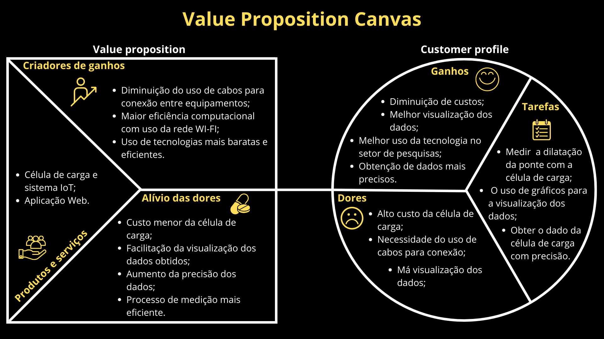

Fonte - Elaboração própria 

&emsp;O Value Proposition Canvas que apresentamos é dividido em duas seções fundamentais: "Value Proposition" e "Customer Profile". A seção de "Value Proposition" concentra-se em descrever como o projeto em questão atende às necessidades do cliente, explorando a solução em profundidade e destacando os principais benefícios para o público-alvo, que, no caso, é o IPT (Instituto de Pesquisas Tecnológicas). Esta seção é subdividida em três tópicos essenciais. O primeiro deles aborda os produtos e serviços oferecidos, neste projeto, uma célula de carga e uma aplicação web. O segundo tópico explora os benefícios que a solução trará, como a redução de custos, que é a principal demanda do IPT. Por último, temos o tópico "Alívio de Dores", que identifica as soluções para os problemas enfrentados pelo cliente, agindo como uma espécie de remédio para suas dificuldades. 
&emsp;A seção "Customer Profile" tem como objetivo descrever o cliente e suas necessidades, também dividida em três tópicos: Dores, Ganhos e Tarefas. No tópico "Dores", examinamos as questões que o cliente deseja resolver, como o alto custo da célula de carga atual e a necessidade de usar cabos para a conexão, ambos desafios significativos neste projeto. Em "Ganhos", destacamos os benefícios tangíveis que o cliente obterá ao adotar a solução proposta, incluindo a redução de custos e a utilização de tecnologia mais precisa, dois pontos de destaque para o IPT. Por fim, o tópico "Tarefas" visa compreender o processo e as etapas que o IPT segue ao buscar alcançar seus objetivos ou resolver problemas, fornecendo insights valiosos para simplificar processos, otimizar a eficiência e integrar soluções de forma mais eficaz à rotina do cliente.

### 3.1.5. Matriz de Riscos

&emsp;A matriz de riscos é uma ferramenta de gerenciamento de riscos que permite identificar visualmente quais riscos devem receber mais atenção. Ela é composta por uma tabela orientada por duas dimensões: probabilidade e impacto. A probabilidade mede o quão provável é a ocorrência do risco, enquanto o impacto se refere às consequências do risco caso ele vier a ocorrer. A matriz de riscos é uma ferramenta gráfica que facilita a visualização das informações sobre um determinado conjunto de riscos, possibilitando a tomada de decisões e a realização de medidas preventivas para tratar esses riscos. Ela também pode ser dividida em riscos e oportunidades.[27][28][29]

&emsp;No projeto, a matriz de risco pode auxiliar em seu desenvolvimento, pois ela consegue medir as tarefas que o grupo deve priorizar e dar uma maior atenção, otimizando tempo e recursos. Ela também ajuda o grupo
a entender o que é possível ser realizado e quais os riscos que são tomados a cada decisão realizada.

Figura 5 - Matriz de Riscos do Projeto Voltz

Fonte - Elaboração própria 

 

Figura 6 - Matriz de Riscos do Projeto Voltz

Fonte - Elaboração própria 

#### Ameaças:

&emsp;1. **Defeito de alguma peça atrasar o desenvolvimento**: Peças sofrerem avarias ou deixarem de funcionar podem afetar o andamento do projeto, visto que deverão ser &emsp;substituídas e esse processo de substituição pode levar algum tempo.

&emsp;2. **Integrante do grupo faltar durante o desenvolvimento**: Eventuais ausências de integrantes durante desenvolvimento podem atrapalhar o andamento de tarefas e o planejamento de conclusão das tais.  

&emsp;3. **Problemas com o teste de conexão do dispositivo devido aos bloqueios na rede do Inteli**: Devido às restrições da rede wifi do Inteli, alguns testes do projeto podem ser afetados ou até mesmo serem incapacitados de serem realizados.  

&emsp;4. **Dificuldade em fazer a conexão entre o hardware e o software de maneira eficiente**: Realizar a conexão e a interação entre o hardware e o software pode ser uma tarefa desafiadora, pois para garantir o funcionamento adequado e bem integrado pode-se gastar um bom tempo e esforços do time no desenvolvimento.  

&emsp;5. **Dificuldade de manuseamento do sistema de armazenamento em nuvem**: O desconhecimento do grupo em relação à utilização de sistemas de armazenamento em nuvem pode vir a se tornar uma problemática, visto que seria um dos pontos de atenção devido ao fato de que tomaria muito do tempo de desenvolvimento, algo que pode atrasar cronogramas. 

&emsp;6. **Prazo não ser suficiente para o desenvolvimento do projeto**: O prazo de 10 semanas pode não ser suficiente para o desenvolvimento total do projeto, pois o time pode abandonar algumas das features que deveriam ser desenvolvidas em prol de atender esse prazo, além de que o projeto desenvolvido possui um alto grau de complexidade.  

&emsp;7. **Desconhecimento técnico dos integrantes**: O desconhecimento técnico sobre o funcionamento da solução ou como projetá-la, pode afetar o processo de desenvolvimento, onde os integrantes podem acabar se encontrando em situações que não conseguem resolver, afetando o andamento do projeto.  

&emsp;8. **Acesso limitado aos recursos tecnológicos mais sofisticados devido ao baixo custo do projeto**: Como o custo do projeto deve ser mantido baixo, justamente para que o dispositivo seja barateado para ser produzido em larga escala, não é possível obter recursos tecnologicamente mais avançados que poderiam acelerar ou facilitar o processo de desenvolvimento.  

&emsp;9. **Necessidade do desenvolvimento de uma capa de proteção atrasar o projeto**: Com a exigência de uma caixa de proteção para o projeto contra intemperismos e possíveis danos, o desenvolvimento pode ser afetado no sentido do tempo necessário para a projeção dessa caixa e seus testes de funcionamento, tanto para verificar resistência quanto para verificar se ela comporta todos os componentes de forma organizada.

#### Oportunidades:

&emsp;1. **Alta disponibilidade de equipamento para desenvolvimento**: A facilidade de acesso aos equipamentos, tais como impressoras 3D, placas ESP e Arduino fazem com que o desenvolvimento seja simplificado e mais acelerado pela disponibilidade desses equipamentos.

&emsp;2. **Parceiro ter bem definido seu MVP e quais as features a mais que são desejáveis**: Com isso, é possível alinhar melhor as expectativas e as necessidades do cliente, ajudando, também, no planejamento da solução e na administração do tempo de desenvolvimento.

&emsp;3. **Maior facilidade de acesso às instalações da empresa parceira**: Ao ter um acesso mais fácil às instalações da empresa, o grupo consegue ter uma melhor noção de como funciona seu trabalho e o ambiente em que possivelmente o produto será utilizado, fazendo com que o grupo consiga adaptar melhor o produto a seu contexto de uso.

&emsp;4. **Empresa já ter tentado outras soluções para o problema**: O desenvolvimento de soluções anteriores ajuda no entendimento junto ao parceiro o que é interessante de ser feito e o que já foi testado e não obteve resultados, reduzindo, assim, chances possíveis de erros.

&emsp;5. **Alta disponibilidade de conteúdos de estudo gratuitos**: O fácil acesso aos materiais de estudo, principalmente nos meios digitais, agiliza e facilita o aprendizado para que a solução possa ser desenvolvida com mais rapidez e eficácia.

&emsp;6. **Parceiro conseguir disponibilizar informação e ser acessível**: Com um parceiro disponível e disposto a fornecer informação, o grupo consegue obter obter insights melhores sobre informações relevantes, tais como a utilização do produto, requisitos técnicos e possíveis maneiras de melhorarmos, auxiliando no desenvolvimento de forma geral.

&emsp;7. **Parceiro disponibilizar um equipamento para comparação de resultados**: Utilizando-se de soluções anteriores que já estão efetivadas, o grupo consegue fazer comparações de resultados e verificar o quão efetiva é a solução. Também podemos avaliar o que melhorar em relação à solução anterior, o que facilita muito o processo de desenvolvimento.

### 3.1.6. Política de Privacidade de acordo com a LGPD

&emsp;Política de Privacidade - Última atualização: Outubro de 2023

#### 3.1.6.1 Informações gerais sobre a empresa / organização:

&emsp;Instituto de Pesquisas Tecnológicas (IPT) é uma pessoa jurídica de direito privado, com sede localizada em Av. Prof. Almeida Prado, 532 - Butantã, São Paulo - SP, 05508-901. O CNPJ/MF da organização é 60.633.674/0001-55.

#### 3.1.6.2 Informações sobre o tratamento de dados:

&emsp;As informações pessoais coletadas são processadas com a finalidade de administrar a interação com o usuário, aprimorar a experiência na plataforma, assegurar sua segurança e realizar a coleta de dados por meio de sensores, conforme especificado na seção [3.3.1](#3.3.1).

#### 3.1.6.3 Quais são os dados coletados:

&emsp;Os dados coletados incluem informações como nome do usuário, cargo no IPT, além de dados coletados de forma indireta, como IP e localização. Também são coletados dados referentes ao sensor, que consistem em temperatura e deformação, que é transformada em peso por meio do módulo HX711. 

#### 3.1.6.4 Onde os dados são coletados:

&emsp;Os dados são coletados principalmente por meio dos sensores, mas também ocorre recolhimento de dados pela plataforma web.

#### 3.1.6.5 Para quais finalidades os dados serão utilizados:

&emsp;Os dados são utilizados para garantir a segurança na plataforma web, identificação do usuário, e para o monitoramento de obras civis a partir dos dados gerados pelos sensores.

#### 3.1.6.6 Onde os dados ficam armazenados:

&emsp;Os dados são armazenados em um sistema cloud.

#### 3.1.6.7 Qual o período de armazenamento dos dados (retenção):

&emsp;O período de armazenamento dos dados é de 6 meses, mas podendo variar de acordo com a necessidade do usuário.

#### 3.1.6.8 Uso de cookies e/ou tecnologias semelhantes:

&emsp;Não há utilização de cookies e/ou tecnologias semelhantes em nossa solucão.

#### 3.1.6.9 Com quem esses dados são compartilhados (parceiros, fornecedores, subcontratados):

&emsp;As informações são compartilhadas com o IPT, potencialmente com uma empresa de serviços em nuvem, e com dispositivos integrados à nossa rede IoT, em conformidade com as diretrizes de segurança e privacidade.

#### 3.1.6.10 Informações sobre medidas de segurança adotadas pela empresa:

&emsp;Foram implementadas medidas técnicas e organizacionais apropriadas para salvaguardar dados pessoais, em conformidade com as Leis de Proteção de Dados. Isso inclui o uso de criptografia e protocolos de segurança para a transmissão de dados entre sensores e nossa plataforma, como exemplificado pelo protocolo MQTT mencionado na seção [3.4.3](#3.4.3).

#### 3.1.6.11 Orientações sobre como a empresa/organização atende aos direitos dos usuários:

&emsp;Os usuários podem exercer seus direitos entrando em contato conosco através do e-mail ipt@ipt.br. Garantimos a transparência e o acesso aos dados pessoais, bem como a correção e eliminação dos mesmos quando solicitado.

#### 3.1.6.12 Informações sobre como o titular de dados pode solicitar e exercer os seus direitos:

&emsp;O titular dos dados pode solicitar acesso, correção, eliminação, entre outros direitos, entrando em contato conosco através do e-mail ipt@ipt.br. Nos comprometemos a responder a todas as solicitações em um prazo razoável e conforme a legislação aplicável.

#### 3.1.6.13 Informações de contato do Data Protection Officer (DPO) ou encarregado de proteção de dados da organização:

&emsp;
O Instituto de Pesquisas Tecnológicas (IPT) reafirma seu compromisso com a transparência e a proteção dos dados pessoais de seus usuários, clientes, parceiros e fornecedores. Com o intuito de assegurar a conformidade de todos os procedimentos relacionados ao tratamento de dados pessoais com a Lei Geral de Proteção de Dados (LGPD), designamos um Encarregado de Proteção de Dados (Data Protection Officer - DPO).

O DPO tem a responsabilidade de supervisionar todas as atividades associadas ao tratamento de dados pessoais, garantindo a conformidade do IPT com as leis de proteção de dados aplicáveis. Além disso, atua como ponto de contato entre o IPT, os titulares dos dados e a Autoridade Nacional de Proteção de Dados (ANPD).

Para entrar em contato com nosso DPO, você pode enviar um e-mail para ipt@ipt.br, especificando o motivo do contato e fornecendo informações suficientes para identificarmos seus dados em nossos sistemas, possibilitando o atendimento eficiente de sua solicitação. Nosso DPO está à disposição para esclarecer dúvidas, receber reclamações ou sugestões, e tratar de quaisquer questões relacionadas à proteção de seus dados pessoais.

Reiteramos nosso compromisso com a privacidade e a segurança de seus dados, e estamos prontos para auxiliar em qualquer assunto relacionado à proteção de suas informações pessoais.

O Data Protection Officer (DPO) da organização é Silvana Bentley Murbak, e ela pode ser contatada diretamente em linkedin.com/in/silvana-bentley-murbak-61392525. [33]

### 3.1.7. Bill of Material (BOM) 

&emsp; O Bill of material (BOM) é um método utilizado por empresas para se ter uma estimativa do valor do desenvolvimento de um produto, como um PCB customizado. Isso ajuda a empresa a prever uma linha de produção, quais serão os possíveis fornecedores e como gerir as despesas da produção sem que ultrapassem, de forma anormal, os valores estimados. A seguir, está o BOM inicial do projeto, tendo em vista cada unidade. Com isso, a figura abaixo evidenciará todos os materiais que serão necessários para desenvolver a solução IoT para a seção de obras civis do IPT.

Figura 7 - Listagem de materiais necessários para o projeto 

  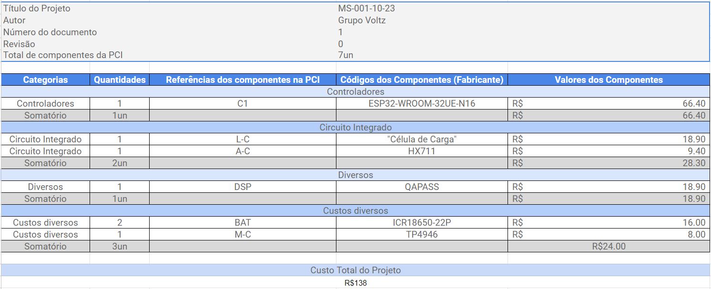

Fonte - Elaboração própria 

&emsp;Diante disso, é correto dizer que o projeto a ser desenvolvido reduz drasticamente os custos de operação para o IPT, que atualmente gasta em torno de R$10.000,00 [9] em dispositivos de captação dos sensores. Ademais, é válido ressaltar que as referências [35], [36], [37], [38], [39] e [40] para buscar os preços das peças utilizadas no projeto desenvolvido. 

## 3.2. Domínio de Fundamentos de Experiência de Usuário

### 3.2.1. Personas 

&emsp;As personas em UX são representações fictícias de usuários ideais que ajudam a entender melhor as necessidades e desejos dos usuários de um produto ou serviço. Elas são criadas a partir de pesquisas e análises de dados reais, e são usadas para orientar o design e a criação de produtos que atendam às necessidades dos usuários. As personas são úteis porque permitem que os designers se concentrem nas necessidades dos usuários, em vez de se concentrarem em seus próprios preconceitos ou suposições.[30][31]

&emsp;Para o projeto, as personas são particularmente úteis para o entendimento do pulbico alvo a ser atingido, suas necessidades e dores, fazendo assim com que o projeto esteja mais direcionado a atender as expectativas do cliente e seja adaptável a maneira com que ele pensa e age.

Figura 8 - Persona Rogério de Almeida

Fonte - Elaboração própria 

 

Figura 9 - Persona André Pereira

Fonte - Elaboração própria 

### 3.2.2. Jornadas do Usuário e Storyboard

&emsp;A User Journey, ou jornada do usuário, é uma representação visual que descreve a experiência de um usuário ao interagir com um produto, serviço ou sistema ao longo do tempo. Ela mapeia as etapas pelas quais um usuário passa, desde a descoberta inicial até a conclusão de um objetivo específico, demonstrando suas emoções ao longo de todo o processo. Essa técnica é fundamental no design de experiência do usuário (UX) e permite identificar pontos de dor, melhorar a usabilidade e otimizar a satisfação do usuário.[32]

&emsp;Para o projeto, a user journey auxilia a entender como será a interação do cliente com o produto, os pontos que se pode alterar para melhorar essa interação, o que o usuário pensa durante a utilização e quais são as dores dele no processo. Com isso, é possível moldar o produto de acordo com a realidade do cliente e a suas necessidades.

 

Figura 10 - Jornada de usuário Rogério

Fonte - Elaboração própria 

 

Figura 11 - Persona André

Fonte - Elaboração própria 

 

Já os storyboards são uma ferramenta visual utilizada no processo de design de experiência do usuário (UX) para representar a sequência de ações que um usuário pode realizar em um produto ou serviço. Eles são frequentemente usados para fornecer contexto adicional ao trabalho das equipes de design e partes interessadas, ajudando a visualizar ideias e elaborar e detalhar uma sequência de ações por parte dos usuários. Esses storyboards também podem ser facilmente compreendidos por pessoas que não têm conhecimento técnico, pois colocam os personagens em seus papéis reais e permitem uma leitura mais humana sobre o caso de uso.[41][42]

Para o projeto, os storyboards se tornam muito interessantes pois ajudam na visualização simples e entendível da interação do usuário com a solução proposta, de forma a facilitar o entendimento do funcionamento do produto pelo cliente e validar se realmente o uso descrito nos quadros é o desejável

Figura 12 - Storyboard Rogério de Almeida

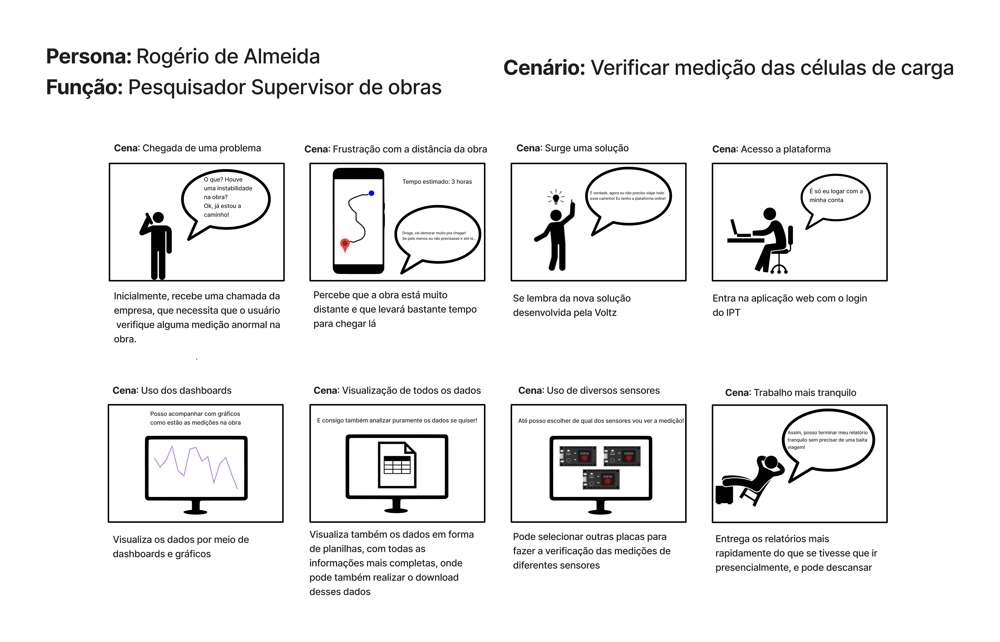

Fonte - Elaboração própria 

 

Figura 13 - Storyboard André Pereira

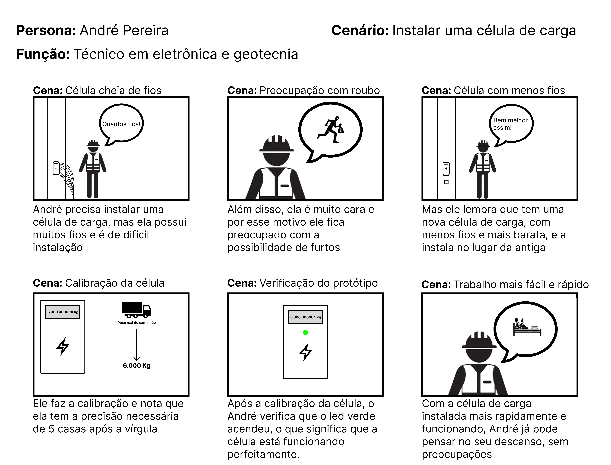

Fonte - Elaboração própria 

### 3.2.3. User Stories

&emsp;As User Stories, ou Histórias de usuário, são um elemento central da metodologia ágil de desenvolvimento de qualquer projeto, consistindo em descrições concisas de funcionalidades sob a perspectiva do usuário. Elas ajudam a focar no que é importante para os clientes e a colaborarem eficazmente no desenvolvimento do projeto, sem a necessidade de documentação extensa. Essas histórias são fundamentais para definir, priorizar e adaptar os requisitos do projeto, garantindo que ele atenda às necessidades dos usuários finais. As User stories a seguir estão em ordem de prioridade, sendo as primeiras com um grau de prioridade maior. [34]

### User stories da persona André Pereira:

Figura 14 - User storie 1

Fonte - Elaboração própria 

 

Figura 15 - User storie 2

Fonte - Elaboração própria 

 

Figura 16 - User storie 3

Fonte - Elaboração própria 

 

Figura 17 - User storie 4

Fonte - Elaboração própria 

 

Figura 18 - User storie 5

Fonte - Elaboração própria 

 

Figura 19 - User storie 6

Fonte - Elaboração própria 

 

Figura 20 - User storie 7

Fonte - Elaboração própria 

 

Figura 21 - User storie 13

Fonte - Elaboração própria 

 

### User stories da persona Rogério de Almeida:

Figura 22 - User storie 8

Fonte - Elaboração própria 

 

Figura 23 - User storie 9

Fonte - Elaboração própria 

 

Figura 24 - User storie 10

Fonte - Elaboração própria 

 

Figura 25 - User storie 11

Fonte - Elaboração própria 

 

Figura 26 - User storie 12

Fonte - Elaboração própria 

 

&emsp;No contexto do projeto com o IPT, desenvolvemos User Stories para atender às necessidades de duas personas distintas. Inicialmente, concentramo-nos nas User Stories do André Pereira, técnico em geotecnia do IPT, que estão relacionadas ao processo de instalação e da conexão da célula de carga, detalhando as suas prioridades nesse contexto específico. Por outro lado, abordamos as histórias de usuário relacionadas ao Rogério de Almeida, engenheiro civil responsável pela obra. Estas histórias dizem respeito às etapas de análise de dados e da gestão de obra como um todo, tomando como base requisitos cruciais para aprimorar a experiência de trabalho do engenheiro em seu dia a dia.

### 3.2.4. Protótipo de interface com o usuário

### 3.2.4.1 Desenhos Esquemáticos

&emsp;Os desenhos esquemáticos em projetos de IoT são representações detalhadas que não apenas ilustram as mudanças de estado no sistema, mas também como essas alterações são comunicadas ao usuário. Eles mostram, de forma clara e precisa, como os sensores e atuadores respondem a diferentes condições e a maneira pela qual essas respostas são apresentadas – seja através de indicadores visuais, sonoros ou outras formas de alerta. Destacando o fluxo de informações e as condições operacionais, esses esquemas são peças-chave no planejamento de um sistema de IoT, pois permitem antecipar e visualizar o comportamento do sistema em várias situações, contribuindo para a identificação precoce de pontos de atenção e possíveis erros de design.

Figura 27 - Desenho Esquemático

Fonte - Elaboração própria 

 

&emsp;A elaboração do desenho esquemático mostrou-se um instrumento fundamental no desenvolvimento do projeto, proporcionando uma compreensão ampliada das interações do usuário com o sistema. Esta ferramenta evidenciou aspectos da experiência do usuário que requeriam atenção e refinamento, contribuindo inclusive para o aprimoramento das user stories e do storyboard.

&emsp;Dentro do processo de entendimento da experiência do usuário, cada componente desempenhou seu papel na construção de uma compreensão completa e integrada. O desenho esquemático se conecta de forma complementar com o mapa de jornada e o storyboard, enriquecendo a narrativa das interações previstas para a persona André.

&emsp;O desenho esquemático, evidenciado pela figura 25, não apenas apoia o desenvolvimento visual da solução, mas também serve para alinhar com precisão as funcionalidades essenciais destacadas nas seguintes user stories:
- Na [User Story 5](#User-Story-5), o desenho assegura que André possa facilmente verificar as medições no display LCD e o estado do LED verde, essencial para confirmar o funcionamento correto da célula de carga.
- A [User Story 6](#User-Story-6) é refletida no desenho esquemático pela forma como os feedbacks de erro são apresentados no display LCD, atendendo à necessidade de André por um retorno visual claro no caso de falhas de conexão.
- Para a [User Story 7](#User-Story-7), o desenho esquemático destaca um sistema de alerta sonoro para a condição de sobrecarga, fornecendo a André um aviso auditivo essencial para evitar ultrapassar o limite de peso.

&emsp;Para obter uma compreensão mais aprofundada dessas necessidades, consulte a seção [3.2.3 User Stories](#User-Stories).

&emsp; Além do desenho esquemático apresentado pela figura 25, o qual tem como objetivo representar aspectos visuais da solução e as suas funcionalidades, o grupo desenvolveu um desenho esquemático voltado para a parte técnica, conforme evidencia a figura 27. 

Figura 28 - Desenho Esquemático Técnico

Fonte - Elaboração própria 

 
&emsp; O desenho esquemático técnico destacado na figura acima foi desenvolvido pelo grupo como um complemento do desenho esquemático evidenciado pela figura 25. Essa completude se dá devido à visualização direta e concisa que a figura 26 fornece sobre cada módulo que estará presente na solução que está sendo desenvolvida para o setor de obras civis do IPT. Ademais, o desenho esquemático técnico possibilita o entendimento direto de como são formadas as conexões de cada componente na solução que será desenvolvida. 

&emsp; Portanto, os desenhos esquemáticos desenvolvidos permitem que os usuários consigam entender, de forma geral e concisa, os efeitos visuais, as funcionalidades e a parte física do projeto que está sendo desenvolvido. 

### 3.2.4.2 Wireframe

&emsp;Os wireframes são esboços simples de telas de produtos digitais, como sites e aplicativos. Eles são usados para estruturar e validar ideias, por isso não contam com detalhes como cores, fontes, ícones e imagens. Dessa forma, os wireframes conseguem demonstrar de forma direta a arquitetura final de uma interface. Os wireframes possuem dois objetivos principais: auxiliar o UX Designer na diagramação e aplicação da identidade visual e alinhar a expectativa do cliente quanto ao que o usuário quer e ao projeto criado.[43]

&emsp;Esses wireframes são de muita importância ao projeto, visto que eles ajudam a ter um  pré-entendimento de qual tipo de interface atende as necessidades do cliente, sem ter que desenvolver uma solução  complexa e ter eventualmente de retrabalhá-la posteriormente, assim economizando tempo e esforços.

Figura 29 - Tela de login da plataforma

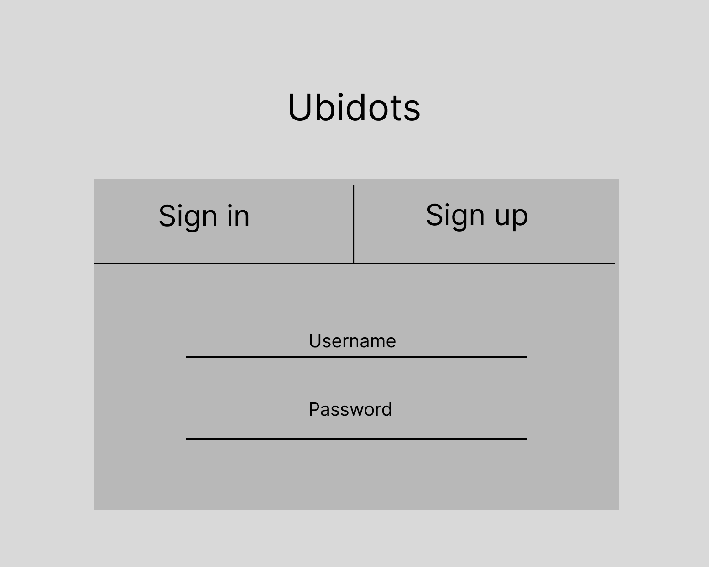

Fonte - Elaboração própria 

 

Figura 30 - Tela de erro de conexão

Fonte - Elaboração própria 

 

Figura 31 - Tela de menu lateral

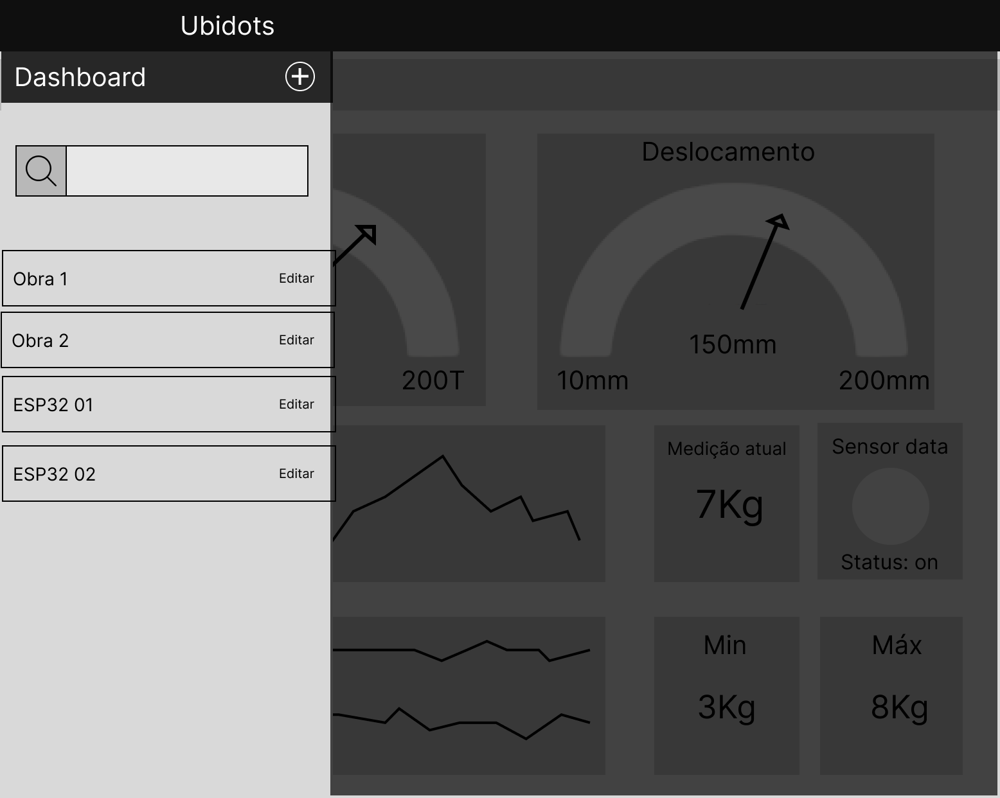

Fonte - Elaboração própria 

 

Figura 32 - Tela de dashboards de 1 sensor

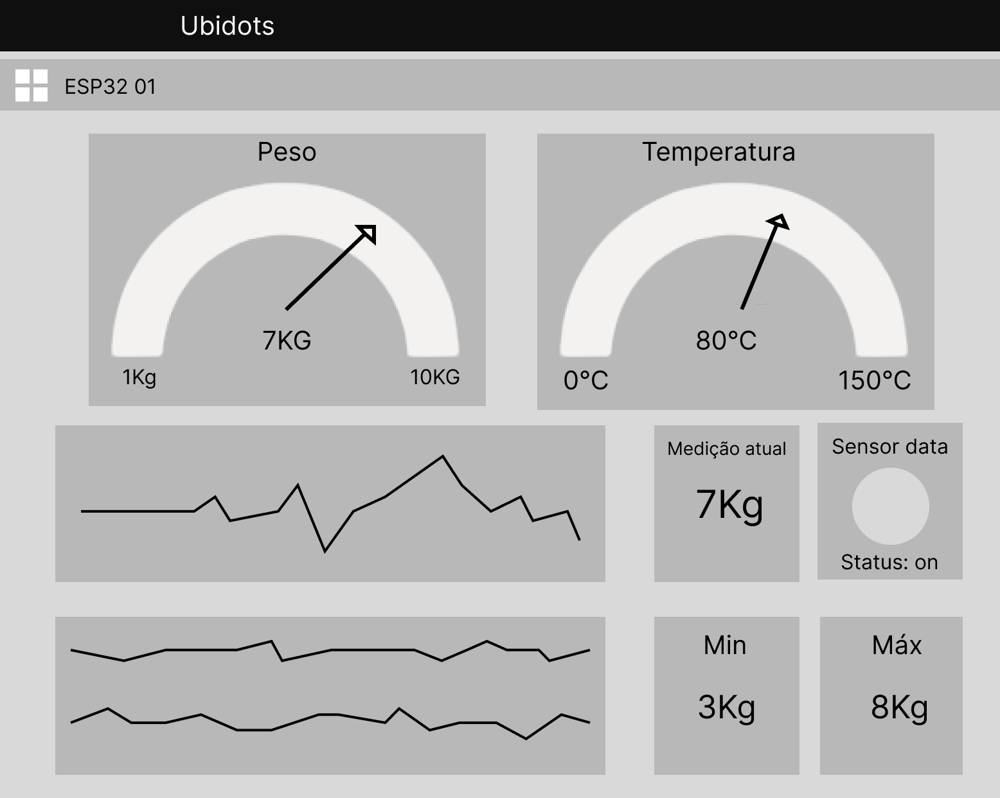

Fonte - Elaboração própria 

 

Figura 33 - Tela de dashboards de 2 sensores

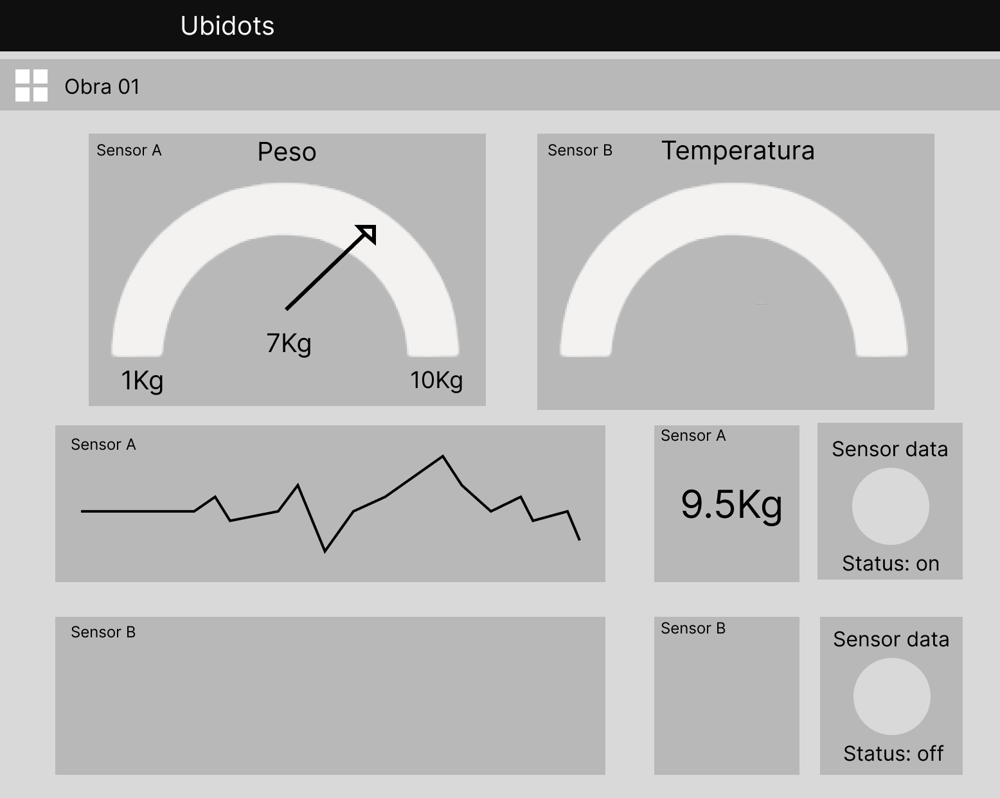

Fonte - Elaboração própria 

 

Figura 34 - Tela da tabela de dados

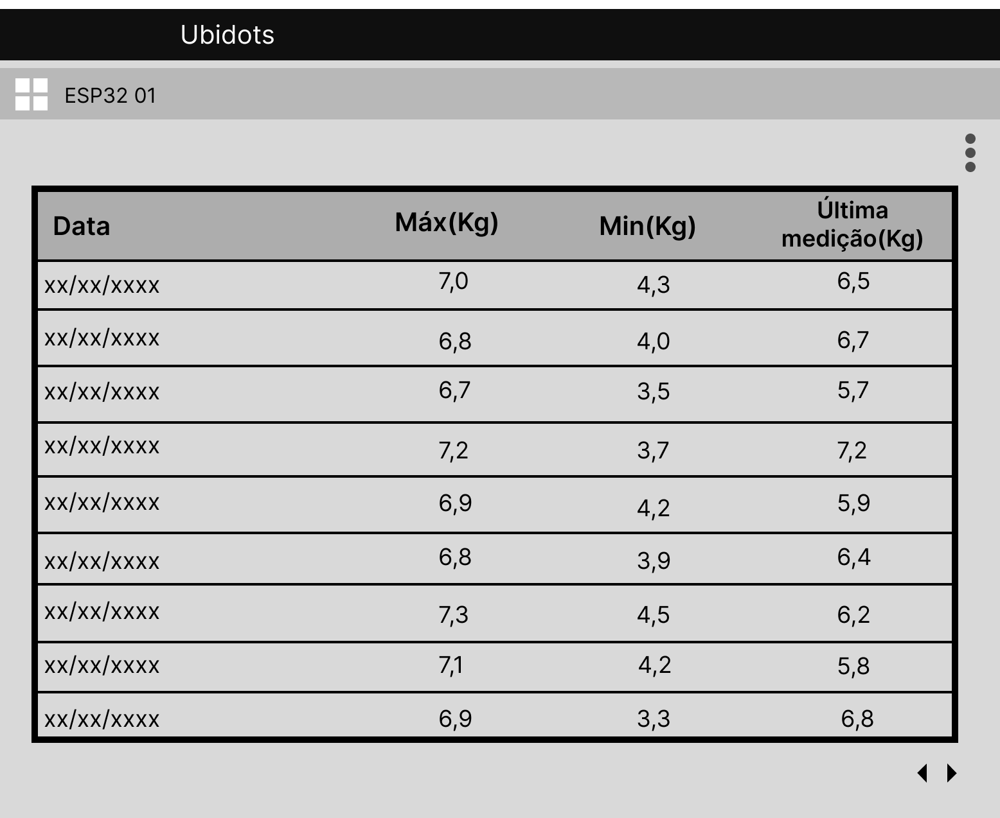

Fonte - Elaboração própria 

 

Figura 35 - Tela de seleção de dispositivo/local

Fonte - Elaboração própria 

 

Figura 36 - Tela de exportação de dados

Fonte - Elaboração própria 

 

&emsp;Iniciando pela tela de login (Figura 29), a interface acolhe os usuários, permitindo-lhes criar uma nova conta ou acessar uma existente utilizando nome de usuário, ou e-mail e senha. Este é o ponto de partida para a interação com a plataforma.

&emsp;Eventualmente, os usuários podem se deparar com problemas técnicos, e é para esses momentos que a tela de erro (Figura 30) foi projetada. Esta tela é essencial para informar aos usuários sobre qualquer desconexão ou problemas com dispositivos, ou com o sistema, permitindo que tomem as medidas necessárias para restabelecer a conexão e continuar seu trabalho sem maiores interrupções.

&emsp;Após resolverem quaisquer questões de acesso, os usuários são levados à barra lateral da interface (Figura 31), que funciona como o eixo central de navegação. Aqui, eles podem escolher entre diferentes obras e sensores para monitorar, alternando entre as visualizações conforme necessário.

&emsp;Com os dispositivos selecionados, os usuários são apresentados à tela de visualização de dados e dashboards (Figura 32), onde gráficos de linhas, histogramas e gráficos de gauge são disponibilizados para uma compreensão abrangente do estado atual das medições, incluindo dados como o sinal recebido, as medições atuais da célula de carga, e os registros de mínimo e máximo.

&emsp;Para um olhar mais aprofundado em múltiplos pontos de dados, a tela correspondente à visualização de múltiplos sensores na mesma obra (Figura 33) oferece uma perspectiva comparativa, facilitando a análise dos dados de diferentes sensores denominados "A" e "B".

&emsp;Aprofundando a análise, os dados podem ser explorados em um formato de tabela (Figura 34), que mostra não só as medições e datas, mas também permite o download dos dados, uma ferramenta útil para revisão detalhada e elaboração de relatórios.

&emsp;Para uma visão panorâmica, a tela que apresenta todos os dispositivos e obras cadastrados (Figura 35) oferece ao usuário um método visual para acessar e entender os parâmetros medidos, bem como as localizações específicas dos sensores.

&emsp;Por fim, a interface proporciona uma tela para exportação de dados (Figura 36), onde os usuários podem definir especificações como o período, as colunas desejadas, o e-mail de recebimento e o fuso horário para o download de dados em formato de planilha, seja em xlsx ou csv. Esta funcionalidade é essencial para a fase final de compilação de dados para relatórios e análises posteriores.

&emsp;Através deste fluxo sequencial e interativo, a interface garante uma experiência de usuário eficiente e produtiva, desde o acesso inicial até a conclusão do trabalho com os dados coletados.

&emsp;Os wireframes demonstram todas as fases de interação do usuário com a interface, conseguindo atender a todas as necessidades para executar as ações da [Fase 3 à Fase 6](#Jornada-Rogério) da jornada de usuário e das Cenas ["Acesso à plataforma" a "Trabalho mais tranquilo"](#Storyboard-Rogério), ambas da persona Rogério de Almeida. Eles contemplam toda a usabilidade da plataforma, desde o acesso até a geração de relatórios pelo usuário, nos ajudando a entender os processos de interação do usuário com a plataforma e como melhor adaptá-la as necessidades do cliente.

&emsp;Os mesmos também atendem ao critério de aceitação da [User Story 11](#User-Story-11), pois os dados são facilmente entendíveis e destingíveis em suas medições e tipo (peso, temperatura entre outros), auxiliando na conclusão do objetivo de analisar o comportamento das dilatações de uma ponte. Para obter uma compreensão mais aprofundada dessas necessidades, consulte a seção [3.2.3 User Stories](#User-Stories).

### 3.2.4.3 Desenho da usabilidade geral do protótipo
&emsp;Através da formulação dos desenhos esquemáticos da solução IoT e dos wireframes relacionados à plataforma web que será desenvolvida para compor o sistema IoT, foi possível realizar um desenho que integre esses dois aspectos do protótipo - os desenhos esquemáticos e os wireframes - o qual o grupo denominou como desenho da usabilidade geral do protótipo.

&emsp;Com isso, esse desenho irá abordar, de maneira geral, como será a usabilidade do protótipo como um todo, desde o seu módulo IoT até a utilização da plataforma web, a qual permite ter acesso aos dados coletados pelo módulo. Sendo assim, esse desenho pode ser visualizado na figura 35, o qual relaciona todos os desenhos esquemáticos com os wireframes, além de estarem conectados com user stories específicas.

Figura 37 - Desenho da usabilidade geral do protótipo

Fonte - Elaboração própria 
  
A imagem acima pode ser acessada através do drive do grupo, por meio do seguinte link: <a href="https://drive.google.com/file/d/1rECVPfvl2-KKqGn8L5eOZlzC6LNn944c/view?usp=sharing">Drive do Grupo 2</a>

&emsp;Portanto, a imagem destaca que há wireframes da plataforma web associados ao funcionamento de LED’s específicos, como, por exemplo, quando o LED vermelho é aceso no módulo IoT, a plataforma web irá exibir um pop-up, alertando ao usuário que está ocorrendo um erro de conexão no hardware. Além disso, há dois wireframes, que exibem dashboards de 1 ou de 2 sensores, que estão conectados a [User Story 11](#User-Story-11), uma vez que o Rogério, uma persona que trabalha na área de engenharia civil da seção de obras do IPT, possui a necessidade de visualizar os gráficos que estarão disponíveis na plataforma.

&emsp;Uma outra parte que a imagem destaca blocos que contém as explicações acerca das funcionalidades de cada LED que irá compor o sistema IoT. Essas funcionalidades foram retiradas do desenho esquemático, destacado na figura 25 e destrinchados para se conectarem tanto ao desenho esquemático técnico quanto aos wireframes. Sendo assim, como já dito anteriormente, esses blocos de explicação estão associadas a algumas telas específicas da aplicação web, além de que há blocos que estão atrelados a uma determinada User Story.

&emsp;Nesse sentido, o bloco que explica sobre a funcionalidade do LED azul e o bloco que explica sobre o LED vermelho, ambos estão associados a [User Story 6](#User-Story-6), haja vista que o André, uma persona que trabalha como técnico em eletrônica e geotecnia na seção de obras do IPT, possui a necessidade de receber um feedback de erro tanto no display quanto nas saídas dos LED’s, de modo que ele tenha ciência da ocorrência de algum erro no sistema.

&emsp;Já o bloco que expõe a funcionalidade do LED verde, ele está ligado a [User Story 5](#User-Story-5), haja vista que o André possui a necessidade de ver as medições em um display e, também, de ter um retorno por meio do LED verde, para saber que o funcionamento da célula de carga está ocorrendo normalmente.

&emsp;Há um último bloco, o qual explica sobre a funcionalidade do Buzzer no sistema, que está conectado a [User Story 11](#User-Story-11), haja vista que o André possui a necessidade de receber um feedback sonoro quando ocorrer uma sobrecarga na célula de carga, de modo a evitar que o limite do peso máximo suportado pela célula de carga seja alcançado.

&emsp;Por fim, o desenho da usabilidade geral do protótipo também aborda o desenho esquemático técnico da solução, de modo a evidenciar em qual módulo os LED’s, o sensor de temperatura e o buzzer estarão conectados, além de evidenciar as conexões da célula de carga e do display LCD.
## 3.3. Solução Técnica

### 3.3.1. Requisitos Funcionais

&emsp;Os requisitos funcionais são uma categoria de requisitos de software que descrevem o comportamento do sistema, seus requisitos para o funcionamento de cada item, ou seja, os requisitos que descrevem o trabalho que o sistema deve realizar [18]. Eles são a base do projeto porque descrevem as funções que o sistema deve ter [18]. Alguns exemplos comuns de requisitos funcionais incluem regulamentos de negócios, requisitos de certificação, requisitos de relatório, funções administrativas, níveis de autorização, rastreamento de auditoria, interfaces externas, gestão de dados e requisitos legais e regulamentares [19]. Os requisitos funcionais deste projeto estão na tabela abaixo: 

 Quadro 1 - Requisitos Funcionais 

| Requisitos funcionais | Descrição                                                                                                                                                                                                                                                                                      |
| --------------------- | ------------------------------------------------------------------------------------------------------------------------------------------------------------------------------------------------------------------------------------------------------------------------------------------------ |
| RF01                  | O condicionador de sinal deve estar conectado a uma célula de carga, a qual precisará estar bem calibrada para receber os dados de deformação da infraestrutura, em forma de energia, de forma precisa.                                                                  |
| RF02                  |O condicionador de sinal deve armazenar os dados obtidos da leitura da célula de carga, os quais devem estar devidamente convertidos para as suas unidades de medida correta, como, por exemplo, em newtons, quilogramas e toneladas.                                                            |
| RF03                  |O condicionador de sinal deve enviar os dados armazenados das células de carga para a nuvem uma vez ao dia.                                                                                                                                                       |
| RF04                  | Implementação de uma antena Wi-fi para ampliar o sinal de distribuição dos dados do condicionador de sinal. |
| RF05                  | O condicionador de sinal deve utilizar o protocolo Message Queuing Telemetry Transport MQTT para transformação e transferência dos dados transportados pela rede local (LAN).        |                                                                                                                              
| RF06                  | O condicionador de sinal deve possuir um display LCD para possibilitar a observação dos resultados da célula de carga.                   |
| RF07                  |O sistema IoT desenvolvido deve implementar uma plataforma web, utilizando Ubidots, para permitir que os usuários tenham um acesso facilitado aos dados em formato de gráficos espectrais e que possam gerar relatórios com base nesses gráficos.                                                                                                                                                                   |
| RF08                  | O sistema IoT desenvolvido terá um manual de instruções para ilustrar as necessidades de tal sistema, bem como as tecnologias necessárias para o seu funcionamento.                                          |

Fonte - Elaboração própria 

&emsp;Com base nas descrições dos requisitos funcionais do quadro acima, é possível se ter uma descrição mais detalhadas de tais requisitos, de modo a ter um entendimento completo de cada um deles:

- RF01: O sistema IoT que será desenvolvido como solução do problema proposto pela seção de obras civis do IPT será composto por um condicionador de sinal. Esse condicionador de sinal deve estar conectado com uma célula de carga. Essa célula de carga precisa ser implementada junto ao condicionador de sinal de forma calibrada, isto é, ela deverá estar medindo a energia da deformação de infraestrutura com uma precisão de 10^-5 casas decimais (0,00001) e arredondar a 10^-6 casas. Sendo assim, todas as células de carga que serão utilizadas no sistema deverão estar conectadas a um condicionador de sinal, o qual irá receber os dados de deformação captados das células de carga.
- RF02: O condicionador de sinal deve armazenar os dados obtidos da leitura da célula de carga. O armazenamento desses dados deverá ocorrer quando ele estiver convertido corretamente para uma unidade de medida, como, por exemplo, Newton. Tal armazenamento é importante para que, depois, os usuários do sistema IoT possam ter acesso a tais dados de forma mais otimizada.
- RF03:  Após os dados serem armazenados pelo condicionador de sinal, ele deve enviar tais informações para a nuvem uma vez ao dia, para que, posteriormente, esses dados possam ser acessados pela plataforma web utilizada (Ubidots).
- RF04:  Além do armazenamento na nuvem, o condicionador de sinal irá armazenar os dados localmente, uma vez que a computação em nuvem pode apresentar algumas falhas por diversos motivos. Assim, é de extrema importância o armazenamento dos dados coletados de forma local, haja vista que a perda de tais informações é dificultada e a sincronização da nuvem pode ser realizada rapidamente por meio de wi-fi.
- RF05: Para que o condicionador de sinal possa se comunicar com o hospedeiro que realiza o armazenamento dos dados na nuvem, é necessário que ele esteja conectado com a internet por meio de uma antena wi-fi. Além disso, essa conexão é essencial para que o condicionador de sinal possa enviar os dados para a nuvem.
- RF06: Quando o condicionador de sinal estiver conectado à internet, por meio da implementação das antenas wi-fi, ele deverá utilizar o protocolo Message Queuing Telemetry Transport MQTT para transformar os dados no tipo e estrutura necessária, além de permitir a sua transferência entre os condicionadores e para o armazenamento em nuvem. Esse protocolo funcionará na rede local (LAN) em que os dispositivos estarão conectados.
- RF07: O condicionador de sinal deve possuir um display LCD, ou seja, uma tela, que possibilite a visualização dos resultados dos sensores de temperatura e da célula de carga, algo de extrema importância para os técnicos e engenheiros que utilizarem o sistema IoT para realização de estudos e ensaios na construção em questão.
- RF08:Após a estruturação física do sistema IoT, é necessário que o usuário tenha uma ferramenta que permita o acesso facilitado aos dados armazenados pelo condicionador de sinal da célula de carga. Esse acesso ocorrerá por meio de uma plataforma web, que será desenvolvida usando o Ubidots. Essa plataforma incluirá uma tela de login, na qual o acesso aos dados, dashboards e análises estará restrito a indivíduos da área específica. O acesso será concedido com base em uma chave de usuário, como, por exemplo, o número de contrato do colaborador do IPT, e uma senha escolhida individualmente por cada usuário. Além disso, o software permitirá a visualização de gráficos espectrais de todos os dados coletados pelo sistema IoT. Por fim, essa plataforma permite a visualização de outros tipos de informações importantes para o usuário, facilitando suas tomadas de decisões no cotidiano de pesquisa e trabalho.
- RF09: Além dos recursos que serão disponibilizados para que o usuário não tenha grandes dificuldades ao utilizar o sistema de internet das coisas desenvolvido, ele terá um manual de instruções, o qual será responsável por transmitir informações instrucionais para os usuários, de modo que eles possam utilizá-lo sem problemas. Sendo assim, tal manual irá ilustrar as necessidades específicas do sistema IoT (como peças necessárias, por exemplo), bem como as tecnologias essenciais para que o seu funcionamento ocorra como um todo.
  &emsp; Tendo em vista o entendimento aprofundado de cada um dos requisitos funcionais, é de suma importância a relação entre esses requisitos e as users stories, as quais foram especificadas no tópico 3.2.3. Essa relação é relevante, pois é através dela que os desenvolvedores do projeto põe em prática as dores e as necessidades dos usuários destacadas nas histórias dos usuários. Nesse sentido, abaixo será detalhado a relação entre cada requisito funcional com user stories.  
  
  &emsp; O requisito funcional 1 (RF01) está atrelado à história de usuário da persona André Pereira, que é técnico em eletrônica e geotecnia, a qual expressa que a sua necessidade é calibrar a célula de carga. Essa relação se dá devido ao fato de que, para que o André possa realizar tal calibração, a célula deve estar conectada diretamente com um condicionador de sinal. Nesse viés, através do cumprimento deste requisito funcional, é possível atender o objetivo do André, em sua user story, haja vista que a calibração tornará as medições realizadas precisas, fornecendo dados concisos e seguros para os engenheiros e demais envolvidos no processo de construção da infraestrutura.  
  
  &emsp; Já em relação aos requisitos funcionais 2, 3, 4, 5 e 6 (RF02, RF03, RF04, RF05 e RF06), todos eles estão ligados à história de usuário da persona André Pereira, a qual expressa que a sua necessidade é garantir o funcionamento do sistema IoT, conectando hardware e software. Essa relação ocorre porque o funcionamento correto do sistema IoT depende de muitas ações que os desenvolvedores devem garantir, como: 1) permitir a conversão dos dados lidos da célula de carga originalmente em forma de energia elétrica para a newton (RF02); 2) possibilitar o compartilhamento dos dados entre o condicionador de sinal e a nuvem (RF03); 3) permitir que os dados sejam armazenados localmente e em tempo real (RF04); 5) possibilitar a conexão à internet, por meio de wi-fi, do condicionador de sinal (RF05); 6) implementar um protocolo de comunicação compatível com os condicionadores de sinais, no caso o MQTT, para que eles possam transferir e transformar os dados que serão enviados na rede local (RF06). Nesse sentido, por meio de todos esses requisitos funcionais, é possível garantir o objetivo do André, em sua user story, uma vez que o engenheiro conseguirá monitorar a obra, por meio da conexão entre os dispositivos hardwares que logo irão se conectar com o software, através da implementação correta do sistema IoT.  
  
  &emsp; Os requisitos funcionais 3 e 4 (RF04) também estão relacionados com uma outra user story, mas, agora, a persona é o Rogério de Almeida, o qual é engenheiro civil. A sua história de usuário expressa a necessidade do Rogério de que os dados que são armazenados pelo condicionador de sinal tenham um armazenamento seguro. Sendo assim, ao implementar o sistema de armazenamento tanto na nuvem quanto local, o desenvolvedor será responsável por adicionar as configurações necessárias para evitar que ocorra o vazamento de informações sensíveis, fazendo com que o objetivo do Rogério seja garantido.  
  
  &emsp;Sobre o requisito funcional 7 (RF07), ele está conectado à história de usuário da persona André, a qual expressa a necessidade dele de ter um display LCD associado ao hardware IoT. Sendo assim, este requisito funcional faz com que o André possa ter tal componente no sistema IoT, de forma a garantir o seu objetivo de saber se o funcionamento da célula de carga está correto ou não em tempo real.  
  
  &emsp; Já o requisito funcional 8 (RF08), ele está atrelado com várias histórias de usuário diferentes da persona Rogério, pois é ele quem garante o funcionamento do software como um todo. Com isso, para que o software atenda corretamente às necessidades de tal persona, é necessário que os desenvolvedores possam garantir diversas funcionalidades da plataforma, como: 1) permitir que a plataforma seja acessada pelo usuário de forma rápido e fácil, isto é, que a plataforma tenha uma disponibilidade altíssima; 2) possibilitar que o usuário tenha acesso à gráficos gerados pelos dados armazenados em nuvem ou localmente na própria plataforma web; 3) desenvolver uma plataforma que tenha uma usabilidade intuitiva, facilitando a utilização da plataforma para o usuário; 4) possibilitar que o usuário possa gerar relatórios com base nas informações que são evidenciadas nos gráficos ou com outros tipos de informações. Nessa direção, este requisito funcional faz com que diversos objetivos da persona Rogério sejam alcançados, algo que garante que o sistema IoT como um todo possa ser utilizado com excelência pelos usuários.  

&emsp;  Por fim, o requisito funcional 09 (RF09) está ligado à história de usuário da persona André, a qual expressa a sua necessidade de um manual de instruções claro. Essa relação se dá principalmente ao fato de que a montagem correta de todo o módulo físico do sistema IoT depende do encaixe e das peças essenciais, algo que deve ser descrito em um documento de fácil acesso e instrucional, como o manual de instruções. Desse modo, este requisito funcional faz com que o objetivo da história de usuário de tal persona seja alcançado, haja vista que, através do manual, ele conseguirá instalar o sistema desenvolvido de forma correta.  

### 3.3.2. Requisitos Não Funcionais

&emsp;Os requisitos não funcionais, também conhecidos pela sigla RNF, especificam como um sistema deve se comportar e não interferem diretamente no desenvolvimento do sistema [45]. Ademais, essas condições não possuem conexão direta com as regras de negócios, mas, sim, com a qualidade que o software pode atingir a partir de suas funcionalidades. Nessa direção, a ISO 25010 determina quais são os aspectos de qualidade que todos os sistemas devem ter e, para isso, ela também define oito características essenciais para um software [46]:
- **Adequação funcional:** Capacidade que o sistema possui de fornecer as funcionalidades que atendem às necessidades dos usuários quando esse sistema é utilizado sob condições especificadas [46];
- **Performance eficiente:** Capacidade que o sistema tem de fornecer níveis as propriedades de desempenho, de acordo com a quantidade de recursos utilizados, em determinadas condições [46];
- **Compatibilidade:** Capacidade que o sistema admite de trocar informações e realizar funções enquanto compartilham um ambiente ou recursos com outros sistemas, produtos ou componentes [46];
Confiabilidade: Capacidade que o sistema possui de realizar as suas funções determinadas de acordo com condições específicas [46];
- **Segurança:** Capacidade que o sistema tem de proteger os dados e as informações dos usuários de ataques maliciosos que podem comprometer o sistema como um todo [46];
- **Manutenibilidade:** Capacidade que o sistema possui de ser modificado com facilidade, prezando por melhorias ou adaptações necessárias [46];
- **Portabilidade:** Capacidade que o sistema admite de ser transferido de um ambiente de hardware ou software para outro.  [46];
- **Usabilidade:** Capacidade que o sistema possui de ser compreendido, aprendido e usado com facilidade pelo usuário, em determinadas condições. Ou seja, esse atributo preza por uma boa experiência do usuário [46].
&emsp;A partir desses oito atributos de qualidade definidos pela ISO 25010, é possível mapear os requisitos funcionais do projeto que está sendo desenvolvido para a seção de obras civis do IPT. Nessa direção, o quadro abaixo fornece tais informações: 

 Quadro 2 - Requisitos Não Funcionais 

| Requisito Não Funcional | Descrição | Atributo de Qualidade (ISO 25010) | Possível Teste |
|-------------------------|------------|----------------------------------|----------------|
| RNF01                   | A taxa de falha durante a transmissão de dados para a nuvem deve ser de, aproximadamente, 5%. | Confiabilidade | Avaliar a quantidade de dados que chegaram na plataforma web (Ubidots) e a quantidade de dados que foram armazenados no condicionador de sinal. |
| RNF02                   | Plataforma web deve fornecer compatibilidade com diferentes dispositivos. | Compatibilidade | Acessar a plataforma em dispositivos diferentes, como celulares, tablets e computadores. |
| RNF03                   | A permanência dos dados armazenados deve ser de, no mínimo, 6 meses. | Disponibilidade | A partir da quantidade de dados obtidos em um dia, simular a contagem de seis meses. |
| RNF04                   | Plataforma web deve ser compatível com os navegadores de internet mais comuns. | Compatibilidade | Acessar a plataforma em navegadores diferentes, como Firefox, Google Chrome, Microsoft Edge, entre outros. |
| RNF05                   | Imagens presentes no manual de instrução devem explicar claramente os passos de montagem do sistema IoT. | Usabilidade | Fornecer os equipamentos necessários e o manual de instrução para uma pessoa que nunca teve contato com o projeto, de modo a observar se ela consegue montar todo o sistema IoT. |
| RNF06                   | O sistema IoT deve ser capaz de medir a carga aplicada sobre a célula de carga com um peso máximo entre 9kg e 10 kg, mantendo a precisão. | Adequação funcional | Colocar diversos materiais com pesos mínimos e com pesos máximos. |
| RNF07                   | O código desenvolvido para o sistema IoT deve seguir padrões e especificações. | Manutenibilidade | Comparar os códigos escritos pelos desenvolvedores com as especificações de código apontados na documentação. |

Fonte - Elaboração própria 

&emsp;Com base nas descrições dos requisitos não funcionais do quadro acima, é possível se ter uma descrição mais detalhadas de tais requisitos, de modo a ter um entendimento completo de cada um deles:

- **RNF01:** O condicionador de sinal deve enviar os dados para a nuvem evitando, ao máximo, falhas e a presença de informações corrompidas, isto é, a taxa de falha durante essa transmissão de dados não deve ultrapassar de 5%. Nesse sentido, esse requisito não funcional, em segundo a ISO 25010, está atrelado à qualidade do sistema de confiabilidade, pois é de extrema importância que essa transmissão ocorra corretamente para que os dados sejam armazenados corretamente para que, depois, os técnicos e engenheiros consigam utilizá-los com precisão. Para que isso ocorra, o sistema IoT desenvolvido precisa funcionar corretamente, algo destacado pela confiabilidade.
  - Possível teste do RNF01: Uma maneira de verificar se o RNF01 foi atendido é através do teste prático de avaliar a quantidade dos dados que chegaram na plataforma web (Ubidots) em comparação com a quantidade de dados que foram armazenados no condicionador de sinal. Assim, por meio desse teste, é possível verificar a eficácia da transmissão de dados do condicionador para a nuvem. Desse modo, ao comparar a quantidade de dados armazenados no condicionador de sinal, podemos calcular a taxa de sucesso da transmissão. Caso a taxa de falha esteja abaixo do limite estabelecido de 5%, isso indicará que o requisito de confiabilidade foi atendido, assegurando uma transmissão de dados confiável e eficiente.

- **RNF02:** A plataforma web que será desenvolvida em conjunto com o módulo IoT deve ser compatível com diferentes dispositivos, isto é, ela deve funcionar normalmente em diferentes dispositivos, como computadores, notebooks, tablets e smartphones. Com isso, esse requisito não funcional está atrelado à qualidade especificada pela ISO 25010 de compatibilidade, uma vez que o software conseguirá executar suas funções de forma eficiente enquanto compartilha um ambiente ou recursos com outros dispositivos, sem impactar negativamente em nenhum deles e, por meio desse requisito, esse acesso será possível para os usuários.
  - Possível teste do RNF02: Uma forma de verificar se o RNF02 foi atendido pode ser realizado o acesso da plataforma desenvolvida em diferentes dispositivos, tornando possível a validação de que o sistema está atendendo ou não esse requisito não funcional, uma vez que será observado o seu comportamento em dispositivos diferentes, haja vista que eles podem ter tamanhos diferentes, resoluções diferentes, sistemas operacionais diferentes, entre outros fatores. Sendo assim, o sucesso dessa compatibilidade indicará que o sistema está funcionando em quaisquer dispositivos e, com isso, o RNF02 foi implementado na plataforma web. 

- **RNF03:** Os dados que são armazenados, na nuvem, precisam ter uma persistência de, no mínimo, 6 meses. Isso significa que o local que será utilizado para armazenar os dados deve suportar 6 meses de registros, algo que foi especificado pelo parceiro de projetos, pois são dados que serão muito utilizados como comparativos em obras ou até mesmo em pesquisas. Desse modo, esse requisito não funcional está relacionado à qualidade definida pela ISO 25010 de disponibilidade, haja vista que os dados persistidos durante 6 meses poderão ser aproveitados para diversos fins, algo que será possível com o cumprimento desse requisito.
  - Possível teste do RNF03: Uma maneira de verificar se esse requisito não funcional foi implementado é por meio da simulação da contagem de seis meses. Por meio dela é possível avaliar a capacidade do sistema de armazenar e manter os dados por um período prolongado, garantindo a integridade e disponibilidade do sistema como um todo. Portanto, o sucesso dessa simulação indicará que o RNF03 foi implementado no sistema IoT, fazendo com que ele possa ser cada vez mais escalável, de acordo com as preferências dos usuários.

- **RNF04:** A plataforma web, desenvolvida em conjunto com o módulo IoT, deve ser compatível com os navegadores de internet mais comuns, como Google Chrome, Firefox e Microsoft Edge. Isso assegura que os usuários possam utilizar o software sem problemas, sem depender de aspectos técnicos específicos para sua utilização. Portanto, esse requisito não funcional está diretamente relacionado à qualidade definida pela ISO 25010 de compatibilidade, uma vez que o sistema conseguirá se adaptar eficientemente a diferentes navegadores, proporcionando uma experiência consistente e funcional para os usuários.
  - Possível teste do RNF04: Uma forma de verificar se RNF05 foi atendido pode ser por meio da realização de acesso à diferentes navegadores, como Firefox, Google Chrome, Microsoft Edge, entre outros, de modo a avaliar a compatibilidade da plataforma com esses navegadores. Esse teste é essencial para validar a capacidade do sistema de se adaptar a ambientes diversos, garantindo que a plataforma funcione da melhor maneira possível. Essa abordagem de teste não apenas verifica a conformidade com o atributo de compatibilidade, mas, também, contribui para a qualidade geral da plataforma, gerando a sua adaptabilidade total a diferentes ambientes de navegação. Por fim, o sucesso desses acessos aos diferentes navegadores indicará que o sistema está totalmente compatível com tais softwares, indicando que o RNF04 foi implementado.

- **RNF05:** As imagens presentes no manual de instruções devem explicar claramente os passos de montagem do sistema IoT, de modo que ele consiga ser reproduzido do zero por qualquer pessoa. Com isso, esse requisito não funcional está ligado à qualidade de software, de acordo com a ISO 25010, de usabilidade, haja vista que, por meio de fotos bem elaboradas e detalhadas, os técnicos e engenheiros civis do IPT conseguirão reproduzir a montagem do sistema IoT sempre que precisarem, algo que facilita o cotidiano deles, além de não depender de alguma pessoa que tenha um determinado conhecimento técnico.
  - Possível teste do RNF05: Para garantir que o RNF05 foi garantido pode ser realizado um teste prático, a partir do fornecimento dos equipamentos necessários e o manual de instruções para uma pessoa que não possui experiência prévia com o projeto. Assim, esse teste visa avaliar o quanto as imagens são úteis para os usuários para que eles consigam montar o sistema IoT do zero, independente dos seus conhecimentos. Portanto, o sucesso desse teste prático de montagem dos sistema indicará que as fotos realmente ajudam os usuários a montar do zero os componentes do sistema, sem precisar de algum conhecimento técnico, indicando, então, que o RN05 foi implementado. 

- **RNF06:** O sistema IoT deve ser capaz de medir a carga aplicada sobre a célula de carga com um peso máximo entre 9KG até 10 KG, de modo que consiga evidenciar a sua resistência total. Com isso, esse requisito não funcional aborda a qualidade de adequação funcional, de acordo com a ISO 25010, pois é por meio dessa medição, respeitando o limite máximo, que os módulos IoT conseguirão armazenar os valores da célula de carga, algo que é uma necessidade do parceiro de projetos.
  - Possível teste do RNF06: Para validar a implementação do RNF06, é possível realizar um teste prático ao colocar diversos materiais com pesos mínimos e máximos sobre a célula de carga do sistema IoT. Com isso, esse teste conseguirá avaliar a capacidade do sistema em medir a carga aplicada dentro dos parâmetros especificados (9KG - 10KG). Assim, ao colocar diferentes materiais com pesos variados, pode-se simular uma variedade de situações de carga que o sistema IoT pode encontrar no uso real. Isso permitirá verificar se as medições são precisas e se o sistema consegue armazenar os valores da célula de carga corretamente, atendendo assim à necessidade do parceiro de projetos conforme descrito no requisito. Portanto, o sucesso desse teste será quando for evidenciado que o sistema IoT consegue medir com precisão as cargas que estão dentro das faixas estipuladas, indicando que o RNF06 foi implementado.

- **RNF07:** O código desenvolvido para o módulo IoT deve seguir as especificações e padrões definidos pelo grupo, de modo a tornar a sua leitura e organização fluídas. Sendo assim, esse requisito não funcional está atrelado à qualidade de software definida pela ISO 250010 de Manutenibilidade, haja vista que, um código que possui suas nomenclaturas e organização bem definidas, é possível que a manutenção nos módulos IoT sejam realizadas de forma mais rápida e eficiente, garantindo que o sistema funcionará corretamente sempre.
  - Possível teste do RNF07: Uma maneira de verificar se o RNF07 foi implementado no sistema pode ser por meio de uma comparação entre os códigos escritos pelos desenvolvedores com as especificações de código apontadas na documentação. Nessa direção, essa comparação irá avaliar se o código do sistema IoT está em conformidade com os padrões estabelecidos. A conformidade do código com as especificações contribuirá para um ambiente de desenvolvimento mais consistente e facilitará o processo de manutenção contínua do sistema IoT. Portanto, se a comparação indicar a conformidade do código, significa que o RNF07 foi implementado no sistema. 

### 3.3.4. Arquitetura da Solução

&emsp;A arquitetura da solução oferece uma representação visual e abrangente, essencial para uma compreensão completa e unificada do sistema como um todo. Ela ilustra a disposição, as conexões, a estrutura geral dos componentes e suas respectivas funções, facilitando a percepção de como cada parte se integra e colabora dentro do sistema. Ao focar na estrutura geral em vez de detalhes técnicos de cada tecnologia, ela permite que todos os stakeholders tenham uma fácil compreensão do funcionamento completo da solução. A arquitetura é fundamental também para assegurar que todos os elementos do sistema estejam coesos, atendendo aos requisitos funcionais e não funcionais estabelecidos para o projeto. [47]

Figura 38 - Arquitetura da Solução

Fonte - Elaboração própria 

 

&emsp;A imagem acima pode ser acessada através do drive do grupo, por meio do seguinte link: <a href="https://drive.google.com/file/d/1IMhZum4fpFNXeYprI4WDSFk8Tcpj3bLj/view?usp=sharing">Drive do Grupo 2</a>

&emsp;Video de explicação para arquitetura de solução: https://youtu.be/byEQOidyHAw

&emsp;Observação: Os condicionadores de sinal 2, 3 e 4 são representados de forma simplificada na arquitetura, mas compartilham a mesma funcionalidade e estrutura do condicionador de sinal 1, que é apresentado de maneira detalhada, a fim de facilitar o entendimento da solução.

&emsp;A construção da arquitetura da solução foi um processo essencial para o avanço do projeto, oferecendo uma visão clara de como os componentes individuais se conectam e interagem dentro do sistema. Através dela, é possível visualizar de maneira detalhada a estrutura de cada condicionador de sinal, além da integração entre os condicionadores de sinais e o servidor web. Assegurando que tudo seja consistente no projeto, a arquitetura também sustenta os requisitos funcionais e não funcionais definidos anteriormente, como é possível observar nos quadros abaixo:
 

Quadro 3 - Relação Arquitetura x Requisitos Funcionais

| Requisitos funcionais | Motivação|
| --------------------- | ------------------------------------------------------------------------------------------------------------------------------------------------------------------------------------------------------------------------------------------------------------------------------------------------ |
| RF01                  | A arquitetura possui uma célula de carga conectada a um amplificador que faz a conversão da energia para peso (em kg) de forma precisa e é recebida pelo microcontrolador do condicionador de sinal, dessa forma atendendo a necessidade deste requisito funcional                                                                   |
| RF02                  |A arquitetura possui um amplificador que realiza a conversão de energia para a unidade de medida necessária que, atualmente, é a de quilogramas, dessa forma atendendo a necessidade deste requisito funcional                                                              |
| RF03                  |A arquitetura possui um broker MQTT conectado à internet que faz o envio de dados para a nuvem, o qual foi configurado para fazê-lo uma vez ao dia, dessa forma atendendo a necessidade deste requisito funcional                                                                                                                                                      |
| RF04                  | A arquitetura possui uma antena de Wi-Fi que amplifica o sinal de envio de dados do condicionador de sinal para a rede, a qual depois envia para a nuvem, dessa forma atendendo a necessidade deste requisito funcional |
| RF05                  | A arquitetura faz o uso do protocolo MQTT para a transmissão de dados na rede local (LAN), dessa forma atendendo a necessidade deste requisito funcional         |                                                                                            
| RF06                  | A arquitetura possui um display LCD que mostra as medições dos sensores de temperatura e da célula de carga no condicionador de sinal, dessa forma atendendo a necessidade deste requisito funcional                 |
| RF07                  |A arquitetura faz o uso de um software que exibe os dados em dashboards, com o uso de gráficos e com a possibilidade de download desses dados em formato de tabela, dessa forma atendendo a necessidade deste requisito funcional|                                                                                                        
| RF08                  | Não se aplica, pois o manual de instruções não se insere no contexto de arquitetura de solução

Elaboração própria

 

Quadro 4 - Relação Arquitetura x Requisitos não Funcionais

| Requisito Não Funcional | Motivação                                                                                                                     |
|-------------------------|-----------------------------------------------------------------------------------------------------------------------------------|
| RNF01                   | A arquitetura apresenta uma conexão direta entre microcontrolador e servidor, sem nenhum intermédio de um outro microcontrolador secundário, auxiliando na redução da taxa de possíveis falhas de transmissão, atendendo às necessidades do requisito.                                    |
| RNF02                   | A arquitetura possui uma plataforma web que é compatível com qualquer dispositivo que tenha acesso a um navegador e internet, atendendo às necessidades do requisito.    |
| RNF03                   | Na arquitetura, os dados são mantidos por um período de 6 meses, na nuvem, atendendo a necessidade do requisito
| RNF04                   | A arquitetura possui uma plataforma web que é compatível com qualquer navegador, atendendo as necessidades do requisito                      |
| RNF05                   | Não se aplica, pois o manual de instruções não se insere no contexto de arquitetura de solução                                                                                                                    |
| RNF06                   | A arquitetura possui uma célula de carga calibrada com um limite de segurança de 9kg, com aviso sonoro e visual se excedido, atendendo às necessidades do requisito |
| RNF07                   | Não se aplica a arquitetura de solução, sendo representada futuramente na arquitetura de tecnologias|

Elaboração própria

### 3.3.5. Arquitetura do Protótipo

&emsp;A arquitetura de protótipo, avançando além da representação introduzida pela arquitetura de solução apresentada na [seção 3.3.4](#3.3.4), destaca-se por sua especificação detalhada das tecnologias envolvidas. Nesta fase, são escolhidas e definidas as tecnologias de hardware e software que serão utilizadas, detalhando aspectos como microcontroladores, sensores, interfaces de comunicação, ambiente de desenvolvimento e protocolos de rede. Alinhando-se com a visão de tecnologia da metodologia RM-ODP, a arquitetura de protótipo proporciona aos stakeholders uma visão mais concreta e precisa do sistema proposto, assegurando que as escolhas tecnológicas sejam alinhadas com os objetivos e requisitos do projeto. [47]

Figura 39 - Arquitetura de Protótipo

Fonte - Elaboração própria 

 

&emsp;A imagem acima pode ser acessada através do drive do grupo, por meio do seguinte link: <a href="https://drive.google.com/file/d/1y8vAkxVcVjqwgdFtI1i32ggescHjpyOk/view?usp=sharing">Drive do Grupo 2</a>

&emsp;Observação: Os condicionadores de sinal 2, 3 e 4 são representados de forma simplificada na arquitetura, mas compartilham a mesma funcionalidade e estrutura do condicionador de sinal 1, que é apresentado de maneira detalhada, a fim de facilitar o entendimento da solução.

&emsp;Video de explicação da arquitetura de protótipo: <a href="https://youtu.be/7OEJFQGy-ww">https://youtu.be/7OEJFQGy-ww</a>

Quadro 5 - Lista de Tecnologias

| Índice | Nome                           | Especificação                                                | Descrição de Funcionamento                              | Tipo        |
| ------ | ------------------------------ | ------------------------------------------------------------ | ------------------------------------------------------ | ----------- |
| 1      | ESP32 Wroom 32u                | Placa de desenvolvimento com microcontrolador ESP32, 4MB de flash, WiFi e Bluetooth integrados | Controla e processa todas as informações geradas pelos sensores, além de realizar as operações lógicas e a transmissão de dados, tanto localmente e quanto para a nuvem (Ubidots) | Placa       |
| 2      | Antena Wi-Fi                        | Antena de 2.4GHz                                             | Melhora a comunicação sem fio e o alcance dessa comunicação entre o sistema IoT e a internet| Componente  |
| 3      | Chave tátil - Push button (1)     | Chave tátil de 4 terminais para entrada de comandos         | Marca a tara do sensor da célula de carga, de forma a reiniciar sua medição | Componente  |
| 4      | Chave tátil - Push button (2)     | Chave tátil de 4 terminais para entrada de comandos         | Acende ou apaga o display LCD ao ser pressionado | Componente |
| 5      | Chave Hh 2 posições - Switch          | Chave de 2 posições para ativação da bateria                | Aciona o circuito ligado à bateria, fornecendo energia ao sistema | Componente  |
| 6      | Conversor TP4946               | Conversor de tensão TP4946 para alimentação do sistema      | Faz a conversão da energia da bateria e regula a tensão para uso no sistema | Componente  |
| 7      | Bateria ICR18650-22P           | Bateria recarregável de íons de lítio ICR18650-22P, 3.7V, 2200mAh | Fornece energia ao sistema | Componente  |
| 8      | Carregador TP4056              | Carregador de bateria de Lítio TP4056 | Carrega a bateria do sistema por meio de um cabo micro-USB
| 9     | Sensor de Temperatura DHT11    | Sensor de temperatura DHT11 para medições de temperatura e de umidade        | Mede temperatura do local em que o sistema IoT está instalado | Sensor      |
| 10     | Célula de Carga - Peso máximo de 10Kg           | Célula de carga com de 10Kg de limite para medição de peso  | Mede a força aplicada, convertendo-a em peso medido em KG | Sensor      |
| 11     | Amplificador HX711             | Amplificador de sinal HX711 para converter a energia da célula de carga em um sinal que o ESP32 seja capaz de trabalhar | Amplifica o sinal da célula de carga, transformando-a de força para kilogramas e transmitindo para o ESP32 | Componente  |
| 12     | Display LCD 16x2               | Display LCD QAPASS para exibição de informações dos sensores | Exibe informações medidas dos sensores localmente em tempo real, como peso na célula de carga e temperatura do local | Componente  |
| 13     | LED RGB Ânodo comum            | LED RGB com ânodo comum para indicação de estado de funcionamento do sistema | Indica o estado de funcionamento do sistema através de diferentes cores | Componente  |
| 14     | Buzzer ATIVO 5v                | Buzzer ativo de 5V para geração de alertas sonoros          | Gera alertas sonoros caso o limite de 9kg da célula de carga seja excedido | Componente  |
| 15     | C++                            | Linguagem de programação de alto nível com recursos de baixo nível | Usado para a programação e configuração do condicionador de sinal e seus módulos | Linguagem de Programação |
| 16     | Arduino IDE                    | Ambiente de desenvolvimento integrado para programação de placas Arduino e ESP32 | Utilizado para programar as funções do condicionador de sinal e enviar as configurações e códigos a ele | Software/Plataforma de Desenvolvimento |
| 17     | Wi-Fi                           | Tecnologia de conexão de rede sem fio                        | Rede que faz o envio dos dados gerados pelos sensores (célula de carga e sensor de temperatura) ao servidor web | Tecnologia de Comunicação |
| 18     | MQTT                           | Software intermediário de mensagens                         | Protocolo responsável pelo envio de dados do condicionador de sinal para o servidor em nuvem (Ubidots) | Protocolo de Comunicação |
| 19     | Servidor em Nuvem / BROKER MQTT (UBIDOTS) | Plataforma de serviço de armazenamento e gerenciamento de dados em nuvem | Armazena os dados enviados pelo condicionador de sinal em nuvem por um período de 6 meses e envia esses dados para a interface de dashboards | Serviço em Nuvem |
| 20     | Interface de Dashboards (UBIDOTS)| Software de visualização de dados                           | Interface web que recebe os dados gerados pelo condicionador de sinal e os exibe em formato de dashboards e gráficos, com a possibilidade de download desses dados em formato xlsx ou csv | Aplicação Web |

Elaboração Própria

&emsp;A arquitetura de protótipo desenvolvida é um elemento essencial para o andamento do projeto. Ela não apenas representa uma visão completa da solução mas também detalha as tecnologias e permite entender como elas trabalham juntas, funcionando como um guia claro que nos mostra como as diferentes tecnologias, como microcontroladores, sensores e protocolos, se encaixam e colaboram. Essa visão detalhada das tecnologias e sua integração proporciona uma compreensão tangível do protótipo e facilita a transição do conceito teórico para a implementação prática. A arquitetura também representa a aplicação direta da visão de tecnologia da metodologia RM-ODP. Ela colabora para a aplicação eficaz da abordagem, garantindo que tudo esteja alinhado, ou seja, que as tecnologias estejam em sintonia com os objetivos de negócios, requisitos e funcionalidades.

### 3.3.6. Arquitetura Refinada da Solução

&emsp;Como evolução das entregas anteriores de Arquitetura de Solução e Arquitetura de Protótipo, foi desenvolvida uma versão final da arquitetura, agora refinada, guiada pelos feedbacks apontados pelo parceiro de projeto e pelas correções da instrutora de UX. Este processo de aprimoramento envolveu, inicialmente, o redimensionamento da imagem da arquitetura para melhorar sua legibilidade e clareza. Em seguida, o foco foi direcionado para o refinamento do vídeo explicativo da arquitetura, garantindo que ele demonstrasse de forma clara e precisa como a arquitetura apoia os requisitos do projeto. As melhorias do vídeo incluíram: explicitar qual a aplicação prática da arquitetura, aumentar o tempo das legendas e contextualizar melhor os requisitos com o conteúdo da arquitetura e adicionar um comentário final que traga uma visão panorâmica sobre os requisitos.

 Figura 47 - Arquitetura Refinada da Solução 
 

Fonte - Elaboração própria 
  

Vídeo da arquitetura revisada da solução: <a src="https://youtu.be/ELQtlwqG6OQ">https://youtu.be/ELQtlwqG6OQ</a>

&emsp;Além da imagem refinada da arquitetura, o projeto inclui quadros detalhados que detalham aspectos específicos. O [Quadro 3 - Relação Arquitetura x Requisitos Funcionais](#Quadro-3) e o [Quadro 4 - Relação Arquitetura x Requisitos Não Funcionais](#Quadro-4) desempenham um papel importante, explicando como a arquitetura proposta suporta cada um dos requisitos funcionais e não funcionais do projeto. Por outro lado, o [Quadro 5 - Lista de Tecnologias](#Quadro-5) oferece uma visão detalhada das tecnologias incorporadas na arquitetura. Esses quadros não sofreram alterações durante o processo de refinamento portanto podem ser acessados diretamente na respectiva seção.

## 3.4. Resultados

### 3.4.1.Protótipo Inicial do Projeto usando o Simulador Wokwi

&emsp;Para se dar início ao projeto, é de extrema importância o desenvolvimento de um protótipo inicial, utilizando um simulador. Nesse sentido, o simulador possibilita o desenvolvimento prático, rápido e seguro do projeto que utiliza hardware, de modo a economizar materiais e tempo de trabalho. Com isso, o simulador que o grupo terá que simular o projeto é o Wokwi. Portanto, o link a seguir redireciona para o protótipo inicial do projeto IoT que está sendo desenvolvido para o setor de obras civis do IPT: [https://wokwi.com/](https://wokwi.com/projects/379476256342389761).

&emsp;A figura abaixo demonstra a montagem física do protótipo incial, de modo a possibilitar uma visualização rápida do que foi desenvolvido na primeira sprint. 

Figura 39 - Protótipo inicial

Fonte - Elaboração própria 

 

&emsp;Já em relação ao funcionamento do protótipo desenvolvido, é de suma importância a realização de testes específicos de seus módulos, algo que facilita o entendimento funcional do projeto. Assim sendo, o quadro abaixo evidencia 3 casos de teste de funcionamento que evidenciam, principalmente, o funcionamento da célula de carga implementada no protótipo e do display LCD. 
| **#** | **Bloco** | **Componente de entrada** | **Leitura da entrada** | **Componente de saída** | **Leitura da saída**                                                                                                                                                                                                                                                                                                                                        | **Descrição**                                                                                                                                                                                                                                                                                                                                                                                                                                                                                                                                                                                          |
| ----------- | --------------- | ------------------------------- | ---------------------------- | ------------------------------ | ------------------------------------------------------------------------------------------------------------------------------------------------------------------------------------------------------------------------------------------------------------------------------------------------------------------------------------------------------------------ | -------------------------------------------------------------------------------------------------------------------------------------------------------------------------------------------------------------------------------------------------------------------------------------------------------------------------------------------------------------------------------------------------------------------------------------------------------------------------------------------------------------------------------------------------------------------------------------------------------------- |
| 01          | Medidor de peso | Amplificador HX711              | 0v ~ 3,3v                    | Sem saídas                    | **Esperado:** - Leituras digitais do amplificador;  **Possível falha:** - Leituras incorretas do amplificador.                                                                                                                                                                                            | - Teste de calibração da célula de carga com os valores de leitura o amplificador.                                                                                                                                                                                                                                                                                                                                                                                                                                                                                                                     |
| 02          | Medidor de peso | Amplificado HX711               |                              | LEDs verde e laranja           | **Esperado:** - Mudança de estado dos dos LEDs, dependendo do peso da carga medida;  **Possível falha:** - O LEDs não variam de estado;                                                                                                                                                               | - No caso do poso ser menor que 40kg, apenas o LED verde fica aceso.  - Caso o peso seja maior 40kg e menor que 45kg, os LEDs irão piscar de forma alternada.  - No cado do peso ser maior que 45kg, apenas o LED laranja piscará.                                                                                                                                                                                                                                                                                                                                      |
| 03          | Medidor de peso | Amplificador HX711              | 0v ~ 3,3v                    | LCD                            | **Esperado:** - Atualização em tempo real do LCD;  **Possível falha:** - O LCD não projetar corretamente os valores do peso;                                                                                                                                                                                   | - Enquanto ocorre a medição do peso, o LCD projeta esses valores.  - Caso o peso seja maior que 40kg e menor que 45kg, o LCD indicará que a célula de carga está próxima do seu limite de carga.  - No caso do peso ser superior a 45kg, o LCD indicará que o peso está muito próximo do limite de carga da célula.                                                                                                                                                                                                                             |
| 04          | Medidor de peso | Amplificador HX711              | 0v ~ 3,3v                    | LCD  LEDs verde e laranja | **Esperado:** - Atualização em tempo real do LCD, além da mudança do estado dos LEDs, dependendo dos valores da carga medida;  **Possível falha:** - Os LEDs não alterarem os seus   estados de forma correta; - O LCD não projetar os dados como deveria; - Ambos os casos acima; | - Enquanto ocorre a medição, o LCD projeta os valores.  - Caso o peso seja menor que 40kg, apenas o LED verde fica acesso, sem piscar.  - No caso do peso ser maior que 40kg e menor que 45kg, os LEDs irão piscar, de forma alternada, ao passo que o LCD indicará que a célula de carga está próxima do seu limite.  - No caso do peso ser maior que 45kg, apenas o LED laranja irá piscar e o LED verde ficará desligado. Ao mesmo tempo, o LCD indicará que a célula de carga está muito próxima do seu limite de carga. |

### 3.4.2. Protótipo Físico do Projeto (offline)

&emsp;O protótipo físico do projeto (offline), no contexto de IoT, representa uma etapa crucial na evolução do desenvolvimento de um sistema completo. Nesta fase, foi dedicado esforço para criar uma representação tangível do sistema IoT que está sendo projetado para a seção de obras civis do IPT, mas que ainda não está conectado à internet ou a uma rede em tempo real.  

&emsp;A partir disso, durante o desenvolvimento do protótipo físico, a ênfase foi colocada na validação das funcionalidades do sistema e na avaliação do hardware e software subjacentes. Desse modo, o protótipo físico, que pode ser um conjunto de dispositivos interconectados, sensores e módulos de comunicação, permitiu realizar testes de conceito e avaliar o desempenho em um ambiente controlado. Assim, o desenvolvimento concentrou-se na criação de um protótipo que representa com precisão as características principais do sistema IoT, incluindo a coleta de dados de sensores, o processamento desses dados e a interação com o ambiente físico.

&emsp;A criação deste protótipo físico é um marco significativo, pois fornece conhecimentos valiosos sobre o design e as funcionalidades do sistema antes de avançar para a fase de implementação completa. Isso ofereceu à equipe a oportunidade de identificar problemas, otimizar o desempenho e fazer ajustes no projeto com base nas descobertas da segunda sprint.  

&emsp;Ademais, nesta fase há o objetivo de refinar e aprimorar o protótipo físico, a fim de preparar o ambiente para a próxima etapa do projeto, que envolverá a integração com a conectividade IoT em tempo real. A criação deste protótipo offline representa um passo importante em direção à implementação bem-sucedida de um sistema IoT funcional.

&emsp;Com base nisso, pode-se visualizar os testes com protótipo físico do projeto (offline) na tabela abaixo:  

 Tabela 1 - Casos de Teste 
  

|**Caso de teste** | **Descrição** | **Pré-condição** | **Procedimento de teste** | **Pós-condição/Resultado esperado** | **Observações** (opcional)
|----------|----------|----------|----------|----------|----------|
|01|Calibragem da Célula de Carga. |Estar com a Célula de Carga conectada com o ESP32 e ao módulo HX711 e descalibrada. | 1. Colocar em cima da Célula de Carga um objeto com o peso conhecido; 2. Armazenar os valores que estão sendo dispostos no monitor serial e tirar sua média; 3. Utilizar o valor calculado da média e dividir pelo valor conhecido; 4. Substituir, no código, o valor encontrado pelo cálculo anterior. | A Célula de Carga está apresentando o valor correto do peso conhecido do objeto, indicando a sua calibração.| 1. Para o componente de saída dos dados foi utilizado o próprio monitor serial da plataforma Arduino Uno; 2. É necessário repetir os procedimentos deste caso de teste até chegar no valor do peso conhecido do objeto.|
|02| Verificando o Funcionamento do LCD com módulo I2C na apresentação dos dados medidos pela Célula de Carga. | Estar com o LCD com módulo I2C implementado na Célula de Carga e todos os componentes ligados. | 1. Colocar um objeto com o seu valor de peso conhecido na Célula de Carga; 2. Verificar se o display LCD com módulo I2C está apresentando o valor do seu peso corretamente. | O display LCD com módulo I2C deve estar apresentando os dados requisitados corretamente. |O dispositivo de saída está sendo o próprio display LCD com o módulo I2C. |
|03|Verificar o funcionamento do buzzer ao ocorrer uma sobrecarga na Célula de Carga.|Estar com um buzzer implementado no sistema IoT junto com a Célula de Carga.| 1. Colocar na Célula de Carga um objeto com o valor do seu peso conhecido que passe de 0,35 kg.| Caso o valor do objeto escolhido ultrapasse 0,35 kg, o buzzer deve emitir um efeito sonoro para indicar a sobrecarga.| 1. O dispositivo de saída nesse caso se trata do buzzer emitindo seu som; 2. O valor de 0,35 kg foi considerado para o protótipo físico do projeto (offline) atual, ou seja, esse valor está sujeito à alterações. |

Fonte - Elaboração própria 
  
&emsp;Com base nos dados da tabela acima, é possível se ter uma descrição mais detalhada de tais abordagens utilizadas no projeto, de modo a ter um entendimento completo de cada um deles:

&emsp;**Caso de teste 01:**

&emsp;No projeto, realizou-se a integração do ESP32 com a célula de carga e o módulo HX711 para possibilitar a implementação e o controle da célula de carga nos ambientes físico e digital. No entanto, durante a implementação e programação da célula de carga, identificou-se que ela estava descalibrada.  

&emsp;Dessa forma, para solucionar esse problema, utilizou-se a fórmula da Escala, fornecida por Matheus Gebert Straub da (2019, USINAINFO), a qual é definida como Escala = valor da média / peso real do objeto de calibração. O objeto de calibração escolhido foi um celular (iPhone 14) com peso conhecido de 172 g, enquanto os valores da média foram obtidos a partir do monitor do notebook. Repetiu-se o cálculo e substituíram-se os parâmetros no programa, de modo a obter uma aproximação ao valor real do objeto. Esse processo foi repetido várias vezes até que se chegasse a um valor conhecido.  

&emsp;Os valores anteriores à calibragem correta podem ser visualizados na Imagem 36, enquanto os valores após a calibragem estão representados na Imagem 37. Além da calibragem descrita acima, os dados estavam apresentando muitos “ruídos”, os quais seriam sinais indesejados ou perturbações que podem interferir na transmissão, processamento ou recepção de sinais elétricos. Então, para sanar essa dificuldade para obter dados mais precisos, foi colocado um capacitor de cerâmica de 100nF e, assim, foram obtidos os valores da Imagem 37. Essa abordagem de calibração foi adotada para atender às demandas da User Story 4 apresentada pelo técnico André Pereira durante o processo de calibragem da célula de carga. Esse teste pode ser visto no vídeo: https://www.youtube.com/watch?v=lxog6xWTB0A entre o tempo de 0:00 a 0:20.  

 Figura 40 - Valores da Célula de Carga descalibrada 
 

Fonte - Elaboração própria 
 

 Figura 41 - Valores da Célula de Carga calibrada 
 

Fonte - Elaboração própria 
 

&emsp; **Caso de teste 02:**

&emsp;No projeto, foi incorporado um display LCD com módulo I2C ao circuito com o objetivo de proporcionar uma visualização mais eficaz e em tempo real dos dados fornecidos. Esse procedimento envolveu a integração do display com a Célula de Carga, ESP32 e protoboard.  

&emsp;Essa abordagem foi implementada em resposta às solicitações da User Story 5 apresentada pelo técnico André Pereira, visando ao monitoramento dos dados de forma presencial e em tempo real. Os detalhes desta implementação estão disponíveis na Imagem 38, além de que pode ser visualizada por meio do vídeo: https://www.youtube.com/watch?v=lxog6xWTB0A entre o tempo de 0:20 a 0:38.  

 Figura 42 - Célula de Carga com o display LCD com módulo I2C 
 

Fonte - Elaboração própria 
 

&emsp;**Caso de teste 03:**

&emsp;No protótipo, foi adaptado um Buzzer na protoboard para um cenário de ocorrência de sobrecarga do peso na Célula de Carga. Desse modo, o Buzzer emitirá um efeito sonoro para indicar que está ocorrendo algo incomum dentro do sistema, ou seja, que há um peso ultrapassando o limite que, no caso, é acima de 350g. Esse cenário foi para o caso haver uma sobrecarga. 
&emsp;A forma de montagem pode ser vista na Imagem 39 e seu funcionamento pode ser visualizado no vídeo: https://www.youtube.com/watch?v=lxog6xWTB0A entre o tempo de 0:38 a 1:05.  

 Figura 43 - Célula de Carga com buzzer 
 

Fonte - Elaboração própria 
  

 *Não houve implementação de LED pelo fato do nosso planejamento do projeto não haver a necessidade. Entretanto, foi colcocado o display LCD e o Buzzer para as saídas. Essas alterações foram discutidas e acordadas com o professor Leonardo Bontempo no dia 08/11/2023 no perído de autoestudo(das 10:30 às 12:30) 

### 3.4.3. Protótipo do Projeto com MQTT e I2C

&emsp;As situações de uso referem-se ao estado atual e às condições do ecossistema conectado que está sendo desenvolvido para o setor de obras civis do IPT. Essas situações envolvem diversos elementos, desde dispositivos físicos e sensores até a infraestrutura de comunicação e as camadas de software que compõem o sistema IoT.

&emsp;Além dessas situações de uso, o sistema que está sendo desenvolvido terá o uso do protocolo I2C e protocolo MQTT. O protocolo I2C (Inter-Integrated Circuit) é um padrão de comunicação serial utilizado para a troca de dados entre dispositivos eletrônicos em um circuito integrado ou entre placas diferentes. Ele foi desenvolvido pela Philips (hoje NXP Semiconductors) na década de 1980 e é amplamente empregado em uma variedade de aplicações. Este protocolo é baseado em uma comunicação síncrona, o que significa que a transferência de dados ocorre em momentos específicos, coordenados por um sinal de clock compartilhado entre os dispositivos.[51] A comunicação é realizada por meio de dois fios principais:
- SDA (Serial Data Line): Uma linha bidirecional utilizada para a transferência de dados entre os dispositivos.
- SCL (Serial Clock Line): Uma linha de clock que sincroniza a transmissão de dados entre os dispositivos.

&emsp;A topologia do barramento I2C pode incluir um ou mais dispositivos principais e vários dispositivos secundários. O dispositivo principal controla a comunicação e inicia as transmissões, enquanto os dispositivos secundários respondem conforme necessário.

&emsp;Cada dispositivo I2C possui um endereço único de 7 bits (embora possa ser estendido para 10 bits em algumas implementações), o que é utilizado para selecionar o destinatário dos dados na rede. [51]
A comunicação I2C é baseada em frames de dados que consistem em 8 bits de informações, seguidos por um bit de Acknowledge. A transmissão de dados é iniciada com um sinal de "start" e finalizada com um sinal de "stop", delimitando a transmissão. [51]

&emsp;A flexibilidade do I2C, aliada a sua simplicidade e eficiência em curtas distâncias, tornou-o um protocolo amplamente adotado em uma variedade de dispositivos eletrônicos, incluindo sensores, memórias EEPROM, módulos de comunicação e outros componentes integrados. Assim, nesse projeto esse protocolo está sendo utilizado principalmente no display LCD para que haja a transmissão dos dados da célula de carga para o computador e depois para esse display por meio desse protocolo. [51]
Já o protocolo MQTT (Message Queuing Telemetry Transport) é um protocolo de comunicação projetado para facilitar a troca eficiente de mensagens entre dispositivos em redes, especialmente em contextos de Internet das Coisas (IoT). Criado em 1999 por Andy Stanford-Clark e Arlen Nipper, o MQTT é conhecido por sua leveza e eficiência, sendo particularmente adequado para dispositivos com recursos limitados e ambientes com restrições de largura de banda.[52]

&emsp;A comunicação no MQTT segue o modelo de publicação/assinatura (publish/subscribe). Os dispositivos podem publicar mensagens em "tópicos" e, ao mesmo tempo, se inscrever para receber mensagens de tópicos específicos. Isso oferece uma abordagem flexível e escalável para a comunicação entre dispositivos. Sendo assim, o protocolo MQTT oferece três níveis de qualidade de serviço (QoS) para garantir a confiabilidade na entrega das mensagens:
-QoS 0: A entrega da mensagem não é confirmada.
-QoS 1: Pelo menos uma vez - a mensagem é entregue pelo menos uma vez ao destinatário.
-QoS 2: Exatamente uma vez - a mensagem é entregue exatamente uma vez ao destinatário. [52]

&emsp;Além disso, o MQTT suporta recursos como retenção de mensagens, onde um tópico pode manter a última mensagem publicada para que novos assinantes recebam a mensagem mais recente ao se conectarem. O protocolo também lida bem com desconexões intermitentes, permitindo que os clientes se reconectem facilmente ao broker MQTT, que é o intermediário responsável por gerenciar a comunicação entre os dispositivos.
Em termos de segurança, o MQTT pode ser implementado com camadas de proteção, como TLS/SSL, garantindo uma comunicação segura entre os dispositivos e o broker.

&emsp;Sua arquitetura simples e eficiente torna o MQTT uma escolha popular em cenários onde a comunicação assíncrona e confiável entre dispositivos é essencial, como em aplicações de IoT, automação residencial e sistemas distribuídos.

&emsp;Nessa perspectiva, o MQTT no projeto que está sendo desenvolvido é utilizado para fazer a comunicação da aplicação IoT com o servidor para os dados serem lidos pelo computador e escritos no servidor do Ubidots para que o usuário possa visualizar os dados coletados.

&emsp;Com base no que seriam situações de uso, abaixo pode-se ver diversas situações da tabela de uso do sistema:

 
 Tabela 2 - Sitações de uso do sistema 
 

| **#** | **Configuração do ambiente**                                                                                                             | **Ação do usuário**                                                                | **Resposta esperada do sistema**                                                                                                                  |
| ----------- | ------------------------------------------------------------------------------------------------------------------------------------------------ | ------------------------------------------------------------------------------------------- | ------------------------------------------------------------------------------------------------------------------------------------------------------- |
| 01          | Possuir uma Célula de Carga conectada em uma protoboard juntamente com o ESP32, o qual deve estar conectado ao notebook. |1) Usuário deve acessar o Arduino IDE;  2) Ao abrir, ele deve carregar o código responsável por realizar a leitura da Célula de carga;  3) Após isso, ele deverá abrir o monitor serial. | O monitor serial deverá apresentar os resultados da leitura da Célula de Carga, a qual irá medir o peso de um objeto, convertidos em quilograma (KG) no monitor serial.|
|02| Possuir um display LCD conectado em uma protoboard juntamente com o ESP32, o qual deverá estar conectado ao notebook. |1) Usuário deve acessar o Arduino IDE; 2) Ao abrir, ele deve carregar o código responsável pelo funcionamento do display LCD; 3) Após isso, o usuário deve olhar para o display conectado.| O display LCD deverá exibir os resultados medidos pela Célula de Carga, convertidos em KG. |
|03| Possuir um buzzer conectado em uma protoboard juntamente com o ESP32, o qual deve estar conectado ao notebook. | 1) Usuário deve acessar o Arduino IDE;  2) Ao abrir a IDE, ele deverá carregar o código responsável pelo funcionamento do buzzer;  3) Após isso, o usuário deverá ouvir o som em caso de sobrecarga.| Em caso do peso do objeto que estiver sob a Célula de Carga ultrapassar 0,350 KG, o buzzer deverá emitir um som, de modo a se ter um alerta de sobrecarga do peso. |
|04| Possuir um celular com o sistema operacional Android, realizar o download do aplicativo IoT MQTT Panel nesse dispositivo e ter a configuração desse app para acessar a sua rede. Assim, deve-se possuir, também, um notebook conectado com o ESP32 e com outros componentes, como: Célula de Carga, display LCD e buzzer.| 1) Usuário deve acessar o Arduino IDE;  2) Ao abrir a IDE, ele deverá carregar o código responsável pelo funcionamento do MQTT e dos demais componentes do sistema IoT; 3) Após isso, o usuário deve visualizar no seu celular os dados do peso de um objeto, os quais são obtidos por meio da leitura da Célula de Carga. | O sistema deverá publicar (publisher) os dados obtidos pela leitura da Célula de Carga em um tópico específico no broker MQTT, e, depois, se inscrever (subscriber) nesse tópico para receber e visualizar os dados enviados.|
|05| Possuir o protocolo MQTT implementado de forma correta, além de ter a Célula de Carga, o display LCD e o LED RGB conectados em uma protoboard. Assim, eles devem estar conectados, também, no ESP32, o qual deve estar conectado ao notebook. | 1) Usuário deve tentar desconectar algum componente da protoboard e visualizar a resposta do LED RGB. | No caso da implementação do LED RGB, caso haja a desconexão de algum componente, o sistema deve deve acender o LED RGB na cor azul. Entretanto, ele não apresentou essa coloração, mas, sim, a coloração verde, a qual é para ser acesa quando todos os componentes estão conectados corretamente. Sendo assim, esta situação de uso evidencia um possível erro que pode vir a ocorrer no atual estado do sistema. | 
|06| Possuir uma pilha de lítio de 3.7V conectada em uma protoboard, além de ter a Célula de Carga, o display LCD, o LED RGB e, agora, um switch, também conectados na protoboard. Ademais, eles devem estar conectados no ESP32, o qual não deve estar conectado ao notebook. | 1) Usuário deve ativar o switch para ligar o ESP32 e os demais componentes conectados. | A operação do sistema desenvolvido foi concebida para ser independente do cabo de alimentação, haja vista que isso é uma necessidade apresentada pelo parceiro, já que há construções que nem sempre terá acesso fácil à tomadas, por exemplo. Com isso, ao ativar o switch, a bateria deve entrar em funcionamento, a qual irá fornecer energia para todo o sistema IoT. No entanto, tal implementação está enfrentando problemas, pois, de acordo com os testes realizados, o sistema está experimentando flutuações de energia, alternando entre momentos de fornecimento substancial de eletricidade e outros de escassez. Essas variações resultam no desligamento inesperado do sistema, o que não é desejado. Sendo assim, esta situação de uso evidencia um possível erro que pode vir a ocorrer no atual estado do sistema. |

Fonte - Elaboração própria 
  

*Não houve a implementação de dashboards pelo fato de Ubidots não estar disponível nessa Sprint. Assim, foi combinado com o professor Leonardo Bontempo durante o período de instrução que não era necessário ter esse quesito nessa entrega.

### 3.4.4. Protótipo Físico do Projeto (online)

&emsp;Uma maneira de verificar as situações de uso do sistema é por meio de casos de testes, como já foi abordado no tópico 3.4.3. Dessa forma, como o estado atual do projeto está mais complexo, devido à comunicação com a internet para envio de dados, é possível verificar as situações de uso deste sistema utilizando uma outra abordagem, que é a partir dos Diagramas de Sequência da UML. 

&emsp;Em princípio, antes de entender do que se trata o diagrama mencionado anteriormente, é de suma importância o entendimento da UML. Nesse sentido, a UML corresponde à sigla em inglês para Unified Modeling Language, que, traduzido fica Linguagem de Modelagem Unificada. Assim, a UML fornece diversas ferramentas que possibilitam a criação e notação de diversos tipos de diagramas, de modo a atender a visualização pretendida por parceiros de negócios ou pelos desenvolvedores do projeto [68]. A partir disso, a UML contempla diferentes diagramas que podem abordar o comportamento, a interação e a estrutura do sistema. 

&emsp;A partir disso, é possível dar um maior destaque, devido à documentação deste tópico, no diagrama de interação que a UML propõe. Com isso, tal diagrama aborda o comportamento interativo sistema, ou seja, permite que toda a interatividade seja demonstrada em um fluxo [69]. Porém, como essa interação pode se tornar cada vez mais complexa, é necessário outros diagramas que consigam especificar mais os diversos recursos e aspectos de interação que estão presentes no projeto/sistema [69].

&emsp;Nesse sentido, o diagrama que será utilizado com o intuito de demonstrar a interatividade do sistema IoT que está sendo desenvolvido para a SOC-IPT será o diagrama de sequência, o qual pode ser considerado como uma espécie de diagrama de interação [68]. Essa relação próxima entre os dois tipos de diagramas ocorre porque o diagrama de sequência descreve como e a ordem em que um grupo de objetos do software trabalham em conjunto [68].

&emsp;Portanto, como citado anteriormente, o diagrama de sequência também pode ser utilizado para parceiros de negócios e pelos desenvolvedores do software em questão, de modo a contribuir para o entendimento maior dos requisitos necessários para a concretização do sistema [68]. Desse modo, neste projeto os diagramas de sequência foram utilizados para ilustrar três casos de teste em específico. Ademais, será apresentado imagens que demonstram a testagem, tanto da parte física quanto da parte digital, ao longo da descrição do caso de teste. É válido ressaltar que para todos os casos de teste deste tópico foi considerado que o ambiente de configuração já está finalizado. 

**Situação de uso 1:** Engenheiro Civil deve acessar os gráficos gerados pelas medições da célula de carga, a qual foi instalada pelo Técnico de Instalação, através do Dashboard Ubidots. Esta situação de uso em específico tem como objetivo verificar se o envio de dados do módulo IoT como um todo para a plataforma Ubidots está funcionando corretamente, haja vista que, conforme o expresso pelo parceiro, é de extrema importância o acesso aos dados capturados da célula de carga por meio de uma plataforma na nuvem. Além disso, este caso de teste e o seu diagrama de sequência UML, estão relacionados com duas user stories: A [user story 2](#User-Story-2) e a [user storie 11](#User-Story-11). Essa relação se dá devido ao fato de que a user stories 2 aborda a necessidade do técnico de instalação de instalar a célula de carga na estrutura da ponte e de garantir o funcionamento do sistema IoT como um todo, respectivamente. Isso pode ser observado no diagrama de sequência 1, haja vista que o técnico de instalação é o primeiro ator envolvido no processo. Ele é responsável por colocar o módulo de sensores, o qual engloba a célula de carga e outros sensores, algo evidenciado na primeira parte do diagrama de sequência. Já a relação da user storie 11 com o diagrama se dá por conta da necessidade que ela expressa do Engenheiro Civil visualizar os gráficos presentes na plataforma, algo observável na última parte do diagrama.

 Figura 44 - Diagrama de Sequência UML 01 
 

Fonte - Elaboração própria 
  

> A imagem acima pode ser visualizada por meio deste [link](https://drive.google.com/file/d/1Yfkoi6StLh46CNZ22L2PZxsrIloHTw2M/view?usp=drive_link)  

&emsp;No tocante ao diagrama de sequência 1, ele demonstra, de forma clara, todo o fluxo de trabalho do sistema IoT para que ambos os atores envolvidos (técnico de instalação e engenheiro civil) consigam ter suas necessidades atendidas, como demonstram as user stories citadas anteriormente. Com isso, a primeira parte do diagrama consiste na instalação do módulo de sensores, o qual é composto pela célula de carga, sensor de temperatura e o amplificador analógico (HX711), pela persona do projeto que representa o Técnico de Instalação da SOC-IPT. A segunda parte representa o envio de dados do módulo de sensores para o ESP, o qual já recebe os dados da célula de carga convertido em KG e recebe os dados da temperatura do local em que tal módulo foi instalado. Na terceira parte há o ESP se comunicando com o display LCD, onde o microcontrolador envia os dados recebidos pelo módulo de sensores para o display; e o display envia para o ESP32 uma resposta de que a conexão entre os dois foi bem sucedida. Ademais, ainda na terceira parte, o ESP32 realiza o publisher, ou seja, envia os dados de medição da célula de carga e da temperatura, de forma assíncrona, para o Broker MQTT, que, no caso deste projeto, é o próprio Ubidots. Já na quarta parte do diagrama, o Broker MQTT realiza o subscribe, ou seja, permite que os dados sejam acessados pelo Dashboard Ubidots, de maneira assíncrona. Por fim, a última parte do diagrama demonstra que o Dashboard Ubidots permite que o Engenheiro Civil, uma persona formulada neste projeto, tenha acesso aos gráficos gerados na plataforma, por meio da captura das informações de medições. 

&emsp;A partir disso, é possível verificar se o atual estado do sistema permite que este caso de teste seja cumprido. Sendo assim, abaixo terá imagens ilustrando algumas etapas do processo descrito pelo diagrama de sequência 1. 

 Figura 45 - Dashboard Ubidots com os dados de pesagem e de temperatura 
 

Fonte - Elaboração própria 
  

&emsp;Assim, a figura acima parte do pressuposto que o protótipo físico já está montado e funcionando, ou seja, a primeira parte do diagrama de sequência UML já está feita. Sendo assim, com o seu funcionamento, ele consegue enviar os dados de medição, tanto da célula de carga quanto do sensor de temperatura, para a plataforma de Ubidots, a qual formula o dashboard com os dados recebidos pelo protótipo físico. O dashboard possui várias partes, algo que permite uma compreensão mais facilitada dos dados de medição e, até mesmo, verificar se o protótipo está enviando os dados para o Ubidots.

 Figura 46 - Dashboard Ubidots com os dados de pesagem e de temperatura zerados 
 

Fonte - Elaboração própria 
  

&emsp;Já a figura acima demonstra também os dados recebidos pelo protótipo físico, porém com os dados de pesagem zerados, haja vista que não há nenhum objeto sob a célula de carga. Portanto, é possível verificar que todas as partes do diagrama de sequência UML 01 estão ocorrendo neste protótipo e podem ser testados por meio do acesso ao Ubidots e a montagem completa do protótipo. 

**Situação de uso 2:** O Técnico de Instalação deve conseguir utilizar um dos botões da solução para acender ou desligar o display LCD. Esta situação de uso em específico tem como objetivo verificar se o Técnico de Instalação consegue utilizar um dos botões da solução, haja vista que terá mais de um, conforme demonstra a arquitetura do protótipo, para ligar ou desligar o display LCD. O display LCD, neste projeto, assume um papel importante para o parceiro, dado que a Seção de Obras Civis do IPT realiza diversos experimentos em determinadas obras e, por isso, a possibilidade de demonstrar os dados capturados pelo módulo de sensores da solução naquele mesmo local. Tendo isso em vista, a possibilidade de ligar/desligar o componente pode ser uma forma de garantir a extensão da sua vida útil, bem como a economia da energia, de modo a tornar a durabilidade da pilha maior, caso ela esteja sendo utilizada. 

&emsp;Nessa direção, este caso de teste e o seu diagrama de sequência UML, estão atrelados a [user storie 5](#User-Story-5). Essa relação se dá devido ao fato de que tal user storie aborda a necessidade do técnico de instalação de verificar as medições realizadas pelo módulo de sensores em um display LCD (a questão do LED verde que também é abordada na mesma user storie não foi contemplada neste caso de teste, dado que o seu principal objetivo é verificar o funcionamento apenas do botão para ligar ou desligar o display em específico, além de que tal conexão entre esses dois componentes não afeta o funcionamento ou não do LED no nosso sistema). No entanto, essa relação pode ser observada no diagrama de sequência 2, haja vista que o ator envolvido nele é o técnico de instalação e há, nos objetos do diagrama, o botão e o display LCD. 

 Figura 47 - Diagrama de Sequência UML 02 
 

Fonte - Elaboração própria 
  

> A imagem acima pode ser visualizada por meio deste [link](https://drive.google.com/file/d/1u2mOtwFJdUQ6m4H0z4dAAJUgVqWbGek0/view?usp=drive_link)  

&emsp;Em relação ao diagrama de sequência 2, ele evidencia todo o fluxo de trabalho do sistema IoT desenvolvido para que o Técnico de Instalação tenha a sua necessidade atendida, como destaca a user storie citada anteriormente. Com isso, a primeira parte do diagrama consiste na instalação do módulo de sensores pelo próprio Técnico de Instalação. A segunda parte do diagrama representa o envio de dados do módulo de sensores para o ESP32. Na terceira parte há o ESP32 fornecendo os meios necessários para o funcionamento do botão, ou seja, a energia e as instruções que em breve serão executadas. Ademais, nessa parte do diagrama há um retorno do botão, de modo a indicar para o ESP32 que a conexão foi bem sucedida. É válido destacar que o normal do sistema desenvolvido é que o display fique sempre aceso, ou seja, assim que ligar o módulo IoT desenvolvido, o display já estará ligado. 

&emsp;As partes explicadas acima são as partes que ocorrem antes da condição do diagrama entrar em ação, isto é, elas não dependem, necessariamente, que a condição seja executada. Nesse sentido, a parte da condição do diagrama de sequência 2 é dividida em duas partes, uma vez que corresponde ao bloco de condição if/else. Sendo assim:
1. Condição If (se): Esta condição será alcançada quando o botão for pressionado pelo técnico de instalação, fazendo com que o seu estado seja igual a _HIGH_. Esse estado do botão é retornado para o ESP32,  de modo que, internamente, o microcontrolador chame uma outra função, denominada como _toggleLCD_, a qual define o estado do display LCD como ON (lcdIsOn), ou seja, que ele deve passar a estar ligado. Com isso, para que esse componente possa estar de fato aceso, o ESP32, após efetuar todo o processamento anterior, envia a instrução de ligamento diretamente para o display LCD. Por fim, depois de toda a execução interna do If, uma resposta é enviada para o técnico de instalação, que é o fornecimento dos dados de medição do módulo de sensores, uma vez que o display estará ligado.
2. Condição Else (caso contrário): Já esta condição será alcançada quando o botão for pressionado pelo técnico de instalação novamente, fazendo com que o seu estado seja igual a LOW. Esse estado do botão é retornado para o ESP32, de modo que, internamente, o microcontrolador chame a função _toggleLCD_, a qual define o estado do display LCD como _OFF_ (lcdIsOff), isto é, o display deve passar a estar desligado. Com isso, para que esse componente possa estar de fato desligado, o ESP32, após efetuar todo o processamento anterior, envia a instrução de desligamento diretamente para o display. Por fim, depois de toda a execução interna do Else, uma resposta é enviada para o técnico de instalação, que é o não fornecimento dos dados de medição do módulo de sensores, uma vez que o display estará desligado.

&emsp;Sendo assim, é possível notar que o atual estado do sistema permite que este caso de teste seja cumprido. Sendo assim, abaixo há imagens ilustrando algumas etapas do processo descrito pelo diagrama de sequência 2. 

 Figura 48 - Imagem que demonstra o Display LCD ligado 
 

Fonte - Elaboração própria 
  

&emsp;Assim, a imagem acima demonstra a primeira parte da condição evidenciada no diagrama de sequência UML 01. Isso porque o display LCD está ligado, evidenciando que o botão está em _HIGH_ e o estado do display LCD é _lcdIsOn_. É importante destacar que na imagem o botão não está pressionado porque o estado normal do display LCD no projeto é _lcdIsOn_, mas, depois de pressionar para desligá-lo, é possível pressionar, também, para ligá-lo, algo evidenciado logo a seguir. 

 Figura 49 - Imagem que demonstra o Display LCD desligado 
 

Fonte - Elaboração própria 
  

&emsp;Já a imagem acima demonstra a segunda parte da condição do diagrama de sequência UML, uma vez que o botão está pressionado, ou seja, o botão está em _LOW_, fazendo com que o estado do display LCD seja modificado para _lcdIsOff_. Isso faz com que o display esteja desligado ao pressionar o botão, igual demonstra a figura. 

&emsp;Nesse sentido, por meio da elaboração dos diagramas de sequência dos casos de testes abordados neste tópico, é possível verificar a relação entre os objetos presentes no sistema com os futuros usuários, bem como a análise de necessidades do parceiro, está bem alinhada com o atual estado do projeto. 

### 3.4.5. Protótipo Final do Projeto
&emsp;Neste tópico serão abordados os diagramas de sequência UML que foram desenvolvidos no tópico anterior (3.4.4), porém com refinamento, haja vista que tais diagramas passaram por uma correção aprofundada e, para os diagramas possam demonstrar, com precisão, o comportamento interativo do sistema IoT desenvolvido.

&emsp;Tendo isso em vista, é válido ressaltar que a UML corresponde à sigla de “Unified Modeling Language”, que, traduzido, significa “Linguagem de Modelagem Unificada”. Dessa forma, a UML fornece diferentes ferramentas para ser possível a criação e a notação de diferentes diagramas, visando atender a visualização pretendida pelos stakeholders envolvidos no projeto [68]. Em relação ao diagrama de sequência UML, ele consiste em um diagrama que contém toda a interatividade do sistema [69], de modo a simplificar a visualização geral do funcionamento do projeto.  

&emsp;Nesse sentido, neste projeto os diagramas de sequência foram utilizados para ilustrar duas situações de uso específicas. Ademais, será apresentado imagens que demonstram a testagem, tanto da parte física quanto da parte digital, ao longo da descrição da situação de uso. É válido ressaltar que para todas as situações de uso deste tópico foi considerado que o ambiente de configuração já está finalizado. Abaixo serão listados as situações de uso, o seu diagrama de sequência e fotos ilustrativas do protótipo:

**Situação de uso 1:** Visualizar os dados de medição no Dashboard Ubidots.

**Objetivo:** Verificar se a transmissão dos dados, obtidos por meio do módulo de sensores, ocorre corretamente.

**Atores:**

- **Ator primário:** Técnico de instalação, o qual é responsável por instalar e assegurar o funcionamento do módulo de sensores na estrutura da ponte, conforme aponta a necessidade da [user storie 2](#User-Story-2). 

- **Ator secundário:** Engenheiro civil, o qual é responsável por acessar e analisar os gráficos gerados no Ubidots, conforme a necessidade expressa na [user storie 11](#User-Story-11).

**Importância:** Esta situação de uso tem uma grande importância para o parceiro de projetos, haja vista que eles precisam acessar os dados de medição por meio da nuvem que, no caso deste projeto, será o Ubidots. Sendo assim, esta situação de uso permite verificar a eficácia do sistema em enviar os dados para a nuvem. 

**Relação com a user storie:** Esta situação de uso e o seu diagrama de sequência UML estão diretamente relacionados com duas user stories, que são:
- **[User storie 2](#User-Story-2)**: Esta user storie foca na instalação e verificação de funcionamento do módulo de sensores pelo técnico de instalação. Essa user storie é importante para que seja possível realizar a coleta dos dados de medição, os quais serão enviados para a nuvem.
- **[User storie 11](#User-Story-11)**: Esta user storie foca no acesso aos dashboards pelo engenheiro civil, o qual precisa de tais gráficos para verificar o estado atual da infraestrutura, bem como para tomar determinadas decisões. 

&emsp;A partir dessas informações desta situação de uso, a imagem abaixo demonstra o diagrama de sequência 01, o qual foi refinado a partir do feedback obtido na sprint 4 (o diagrama de sequência 01, antes de ser refinado, está demonstrado no tópico anterior, 3.4.4):

 Figura 50 - Diagrama de Sequência UML 01 Refinado
 

Fonte - Elaboração própria 
  

&emsp;O diagrama de sequência acima demonstra as seguintes etapas:
- **Instalação do módulo de sensores pelo técnico de instalação:** Esta primeira etapa é crucial, haja vista que o técnico de instalação deve instalar o módulo de sensores (célula de carga + HX711 + sensor de temperatura) na estrutura da ponte. Assim, esta ação atende a user storie 2 e permite que a coleta de dados seja realizada.
- **Transmissão de dados:** Esta é a segunda etapa do diagrama de sequência, o qual evidencia a transmissão de dados entre o módulo de sensores e o ESP32. Esses dados transmitidos são o peso medido pela célula de carga e a temperatura do local medida pelo sensor de temperatura.
- **Comunicação entre o ESP32 e o Display:** Esta é a terceira etapa do diagrama de sequência, onde ocorre a transmissão dos dados de medição para o display, possibilitando que os usuários consigam visualizar tais dados por meio do display LCD. Nesta etapa, o peso medido pela célula de carga é convertido para KG, uma vez que o ESP32 já recebeu tais dados de medição e precisa demonstrar o peso medido pela célula de carga em KG no display LCD.
- **Publish dos dados:** Esta é a quarta etapa do diagrama de sequência, a qual consiste na realização do publish dos dados de medição, tanto da célula de carga quanto do sensor de temperatura, fazendo com que sejam publicados para o broker MQTT, por meio de um tópico. É válido destacar que quem realiza o publish desses dados é ESP32. 
- **Subscribe dos dados:** Esta é a quinta etapa do diagrama de sequência, a qual consiste na realização do subscribe dos dados de medição, tanto da célula de carga quanto do sensor de temperatura. Esse subscribe é realizado pelo Dashboard Ubidots, o qual se inscreve no tópico em que os dados de medição foram publicados. É válido destacar que quem realiza o subscribe desses dados é a própria plataforma de Dashboard do Ubidots. 
- **Acesso ao dashboard com os dados de medição:** Esta é a sexta e última etapa do diagrama de sequência, uma vez que, após realizar o subscribe dos dados de medição, tais informações estarão disponíveis no dashboard do ubidots, possibilitando que o engenheiro civil consiga ter acesso aos gráficos. Assim, esta etapa consegue fazer com que a necessidade expressa na user storie 11 seja atendida. 

&emsp;A partir disso, é possível verificar se o atual estado do sistema permite que este caso de teste seja cumprido. Sendo assim, abaixo terá imagens ilustrando algumas etapas do processo descrito pelo diagrama de sequência 01 refinado.

 Figura 51 - Dashboard Ubidots com os dados de pesagem e de temperatura 
 

Fonte - Elaboração própria 
  

&emsp;Assim, a figura acima parte do pressuposto que o protótipo físico já está montado e funcionando, ou seja, a primeira parte do diagrama de sequência UML já está feita. Sendo assim, com o seu funcionamento, ele consegue enviar os dados de medição, tanto da célula de carga quanto do sensor de temperatura, para a plataforma de Ubidots, a qual formula o dashboard com os dados recebidos pelo protótipo físico. O dashboard possui várias partes, algo que permite uma compreensão mais facilitada dos dados de medição e, até mesmo, verificar se o protótipo está enviando os dados para o Ubidots.

 Figura 52 - Dashboard Ubidots com os dados de pesagem e de temperatura zerados 
 

Fonte - Elaboração própria 
  

&emsp;Já a figura acima demonstra também os dados recebidos pelo protótipo físico, porém com os dados de pesagem zerados, haja vista que não há nenhum objeto sob a célula de carga. Portanto, é possível verificar que todas as partes do diagrama de sequência UML 01 estão ocorrendo neste protótipo e podem ser testados por meio do acesso ao Ubidots e a montagem completa do protótipo. 

**Situação de uso 2:** Manipulação do display LCD por meio de um botão, permitindo ou não a visualização dos dados de medição por meio do display.

**Objetivo:** Verificar a funcionalidade do botão que manipula o display LCD. 

**Ator:** Técnico de instalação, o qual é responsável por utilizar o botão disponível pra ligar ou desligar o display LCD, conforme aponta a necessidade da [user storie 5](#User-Story-5). 

**Importância:** Esta situação de uso tem uma grande relevância para o parceiro de projetos, uma vez que eles precisam tanto visualizar as medições realizadas pelo módulo de sensores por meio de um display quanto economizar a bateria que faz com que o protótipo funcione. Esses dois aspectos são garantidos por meio da funcionalidade do botão, pois ele consegue ligar o display, possibilitando a visualização dos dados de medição, e consegue desligar o display, fazendo com que seja prolongada a vida útil da bateria. 

**Relação com a user storie:** Esta situação de uso e o seu diagrama de sequência UML estão diretamente relacionados com duas user stories, que são:
- **[User storie 2](#User-Story-2)**: Esta user storie foca na instalação e verificação de funcionamento do módulo de sensores pelo técnico de instalação. Essa user storie é importante para que seja possível realizar a coleta dos dados de medição, os quais serão enviados para o display LCD.
- **[User storie 5](#User-Story-5)**: Esta user storie aborda a necessidade do técnico de instalação de verificar as medições realizadas pelo módulo de sensores no display LCD. É importante mencionar que, embora a user storie 5 mencione, também, um LED verde, esta situação de uso foca exclusivamente na funcionalidade do botão de ligar/desligar o display LCD.

&emsp;Nessa direção, por meio dessas informações da situação de uso 02, a imagem abaixo demonstra o diagrama de sequência 02, o qual foi refinado a partir do feedback obtido na sprint 4 (o diagrama de sequência 01, antes de ser refinado, está demonstrado no tópico anterior, 3.4.4):

 Figura 53 - Imagem que demonstra o Display LCD ligado
 

Fonte - Elaboração própria 
  

&emsp;O diagrama de sequência acima demonstra as seguintes etapas: 
- **Instalação do módulo de sensores pelo técnico de instalação:** Esta primeira etapa é crucial, haja vista que o técnico de instalação deve instalar o módulo de sensores (célula de carga + HX711 + sensor de temperatura) na estrutura da ponte. Assim, esta ação atende a user storie 2 e permite que a coleta de dados seja realizada.
- **Transmissão de dados:** Esta é a segunda etapa do diagrama de sequência, o qual evidencia a transmissão de dados entre o módulo de sensores e o ESP32. Esses dados transmitidos são o peso medido pela célula de carga e a temperatura do local medida pelo sensor de temperatura.
- **Comunicação entre o ESP32 e o botão:** Esta é a terceira parte do diagrama de sequência, o qual evidencia que o ESP32 envia para o botão os seus meios de funcionamento. Esses meios de funcionamento consistem em fornecer a alimentação necessária para o botão conseguir funcionar e em fornecer a lógica necessária para que ele consiga ligar/desligar o display LCD. 
- **Condição If (se):** Esta condição será alcançada quando o botão for pressionado pelo técnico de instalação, fazendo com que o seu estado seja igual a _HIGH_. Esse estado do botão é retornado para o ESP32, de modo que, internamente, o microcontrolador chame uma outra função, denominada como _toggleLCD_, a qual define o estado do display LCD como _ON_ (lcdIsOn), ou seja, que ele deve passar a estar ligado. Com isso, para que esse componente possa estar de fato aceso, o ESP32, após efetuar todo o processamento anterior, envia a instrução de ligamento diretamente para o display LCD. Por fim, depois de toda a execução interna do If, uma resposta é enviada para o técnico de instalação, que é o fornecimento dos dados de medição do módulo de sensores, uma vez que o display estará ligado.
- **Condição Else (caso contrário):** Já esta condição será alcançada quando o botão for pressionado pelo técnico de instalação novamente, fazendo com que o seu estado seja igual a _LOW_. Esse estado do botão é retornado para o ESP32, de modo que, internamente, o microcontrolador chame a função _toggleLCD_, a qual define o estado do display LCD como OFF (lcdIsOff), isto é, o display deve passar a estar desligado. Com isso, para que esse componente possa estar de fato desligado, o ESP32, após efetuar todo o processamento anterior, envia a instrução de desligamento diretamente para o display. Por fim, depois de toda a execução interna do Else, uma resposta é enviada para o técnico de instalação, que é o não fornecimento dos dados de medição do módulo de sensores, uma vez que o display estará desligado.

&emsp;Sendo assim, é possível notar que o atual estado do sistema permite que este caso de teste seja cumprido. Sendo assim, abaixo há imagens ilustrando algumas etapas do processo descrito pelo diagrama de sequência 02 refinada. 

 Figura 54 - Imagem que demonstra o Display LCD ligado
 

Fonte - Elaboração própria 
  

&emsp;Assim, a imagem acima demonstra a primeira parte da condição evidenciada no diagrama de sequência UML 01 refinado. Isso porque o display LCD está ligado, evidenciando que o botão está em _HIGH_ e o estado do display LCD é _lcdIsOn_. É importante destacar que na imagem o botão não está pressionado porque o estado normal do display LCD no projeto é _lcdIsOn_, mas, depois de pressionar para desligá-lo, é possível pressionar, também, para ligá-lo, algo evidenciado logo a seguir.

 Figura 55 - Imagem que demonstra o Display LCD desligado
 
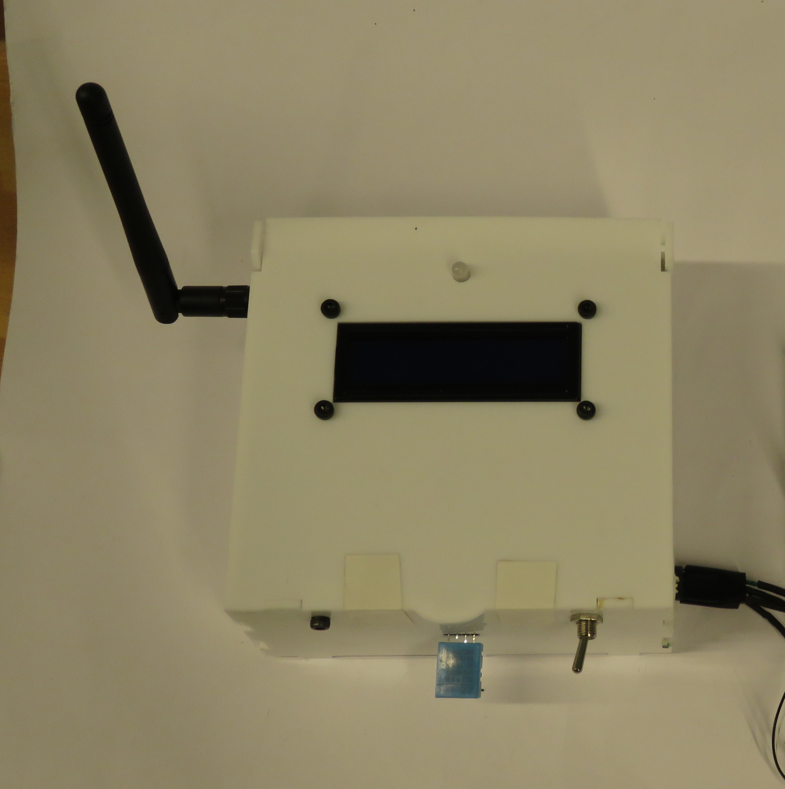

Fonte - Elaboração própria 
  

&emsp;Já a imagem acima demonstra a segunda parte da condição do diagrama de sequência UML, uma vez que o botão está pressionado, ou seja, o botão está em _LOW_, fazendo com que o estado do display LCD seja modificado para _lcdIsOff_. Isso faz com que o display esteja desligado ao pressionar o botão, igual demonstra a figura. 

&emsp;Nesse sentido, por meio da elaboração dos diagramas de sequência dos casos de testes abordados neste tópico, é possível verificar a relação entre os objetos presentes no sistema com os futuros usuários, bem como a análise de necessidades do parceiro, está bem alinhada com o atual estado do projeto. 

### 3.4.6. Testes de Usabilidade
&emsp;O Teste de Guerrilha é uma abordagem de teste de usabilidade que se destaca pela sua simplicidade. Esta metodologia, focada em coletar feedbacks rápidos e diretos, é ideal para ambientes onde recursos como o tempo e o orçamento são limitados. Em essência, o teste de guerrilha envolve apresentar um protótipo ou produto aos usuários reais em um contexto informal e observar como eles interagem com ele. Com isso, o objetivo desse teste é identificar determinados problemas de usabilidade, compreender as reações e percepções dos usuários e obter insights valiosos que podem ser rapidamente implementados para aprimorar o produto. 

&emsp;Nesse sentido, utilizando esse teste, buscamos validar as funcionalidades do protótipo e o design do dashboard desenvolvidos até o momento, bem como identificar possíveis melhorias através das perspectivas de pessoas que não estão envolvidas diretamente com o projeto. 

&emsp;Os testes de guerrilha foram conduzidos no ambiente acadêmico do Inteli, no dia 14/12/2023. Dessa forma, o público-alvo desses testes de guerrilha consistiu em estudantes de graduação de tecnologia, que já possuíam familiaridade prévia com as tecnologias empregadas no projeto. A aplicação ocorreu no ateliê da turma, especificamente na mesa do grupo, com o protótipo montado na protoboard.

&emsp;No contexto dos nossos testes de guerrilha, adotamos uma abordagem centrada na autonomia e na exploração por parte dos testers. Para isso, fornecemos aos participantes acesso tanto ao protótipo físico quanto ao dashboard. Em vez de fornecer instruções detalhadas, optamos por uma estratégia mais aberta: lemos apenas o título de cada tarefa para os testers e os deixamos descobrir por conta própria como realizá-la. Ao todo, quatro tarefas distintas foram propostas para teste, cada uma projetada para avaliar aspectos específicos do protótipo e do dashboard.

#### 3.4.6.1 Resultados obtidos e problemas encontrados:
&emsp;Para que seja possível analisar com mais precisão os resultados obtidos com os testes, você consegue acessar a tabela de tabulação dos resultados por meio do seguinte link: https://docs.google.com/spreadsheets/d/1AkL1Z1tDgWCNaTVT0HVi23hUDwrMZd6E5tM90grGrQw/edit?usp=sharing.

&emsp;A partir do contexpto apresentado, é possível apresentar os testes que realizamos tendo em vista as tarefas que formulamos. Assim, para a aplicação desses testes de guerrilha separamos as seguintes tarefas:
**1. Visualizar peso medido pela célula de carga no protótipo físico:** O objetivo desta tarefa é para verificar o quão intuitivo está a utilização da célula de carga;
**2. Desligar/Ligar o display LCD por meio de um botão:** O objetivo desta tarefa é para verificar o funcionamento do botão para ligar/desligar o display por meio de um botão e verificar a localização do botão que realiza tal funcionalidade;
**3. Zerar o peso medido célula de carga por meio de um botão:** O objetivo desta tarefa é verificar o funcionamento do botão para zerar o peso medido pela célula de carga por meio de um botão e verificar a localização do botão que realiza tal funcionalidade;
**4. Verificar o peso medido pela célula de carga no dashboard:** O objetivo desta tarefa é verificar o funcionamento da ligação entre o protótipo físico e a plataforma web e verificar a sincronicidade do envio de dados entre os dois. 

&emsp;Portanto, com a aplicação dos testes de guerrilha, conforme contextualizado anteriormente, e as tarefas anteriores, é possível destacar quais foram os resultados obtidos, tanto os positivos quanto os negativos. 

&emsp;Nesse sentido, em relação à tarefa 1, que está relacionada à visualização do peso medido pela célula de carga no protótipo físico, todos os testers conseguiram realizá-la com sucesso, ou seja, sem enfrentar erros. Em relação às dificuldades, apenas a Sophia indiciou uma dificuldade inicial de entender o funcional geral do projeto, mas isso pode ser explicado porque foi a primeira vez que ela teve um contato com os projetos desenvolvidos para o IPT, diferentes dos outros testers, haja vista que eles já tinham realizado testes em outros protótipos de outros grupos. 

&emsp;Sobre a tarefa 2, que trata sobre a possibilidade de desligar/ligar o display LCD por meio de um botão, apenas a tester Marina conseguiu realizá-la com sucesso, haja vista que ela conseguiu identificar de primeira qual era o botão responsável por realizar tal função. Já em relação aos outros testers, todos eles apresentaram as mesmas dificuldades, pois não conseguiram identificar qual seria o botão específico que realiza essa função e não conseguiram identificar o tempo certo que precisava pressionar o botão para fazer o desligamento/ligamento do display. Essas dificuldades ocorreram principalmente porque os botões estão conectados na protoboard, a qual não possui nenhuma indicação das funcionalidades dos botões, fazendo com que o usuário tenha que adivinhar o que cada botão faz. 

&emsp;Em relação à tarefa 3, a qual está atrelada sobre a possibilidade de zerar o peso medido pela célula de carga por meio de um botão, ou seja, realizar a tara da célula de carga, todos os testers conseguiram realizá-la com sucesso, ou seja, sem enfrentar erros. Porém, apenas a Sophia apresentou duas dificuldades pontuais, que foram: o não entendimento do termo técnico “tara”, fazendo com que ela ficasse um pouco perdida sobre o objetivo da funcionalidade do botão e o não entendimento do tempo certo para pressionar o botão para que zere a célula de carga. 

&emsp;Por fim, em relação à tarefa 4, a qual tem o objetivo de verificar o peso medido pela célula de carga no dashboard da plataforma web, todos os testers conseguiram realizá-la com sucesso, ou seja, sem enfrentar erros. Além disso, todos os testers não apresentaram alguma dificuldade específica, haja vista que, de acordo com eles, a plataforma e todos os componentes que a compõem são bem objetivos e claros. 

#### 3.4.6.2 Próximos passos, a partir dos resultados obtidos:
&emsp;Tendo em vista os resultados obtidos dos testes, foi possível identificar os próximos passos cruciais para que ele consiga suprir as necessidades dos usuários, além de mitigar as dificuldades que podem ocorrer com os usuários futuros. Assim, abaixo serão listados os possíveis próximos passos:
- **Implementar o sistema IoT em uma case de proteção:** Esse próximo passo é crucial para que os usuários consigam localizar os componentes corretos, haja vista que a case irá conter as indicações corretas de cada um deles. Além disso, com a case de proteção, os usuários não terão contato direto com fios e outros componentes, de modo a deixar uma impressão mais amigável do sistema;
- **Diminuir o tempo de resposta do botão:** Esse próximo passo é crucial para que os usuários consigam utilizar com mais confiança os botões, haja vista que, normalmente, quando se aperta um botão a resposta é praticamente imediata, mas, como atualmente os botões da solução possui um tempo de resposta com um tempo mais longo, os usuários acabaram se perdendo em sua funcionalidade. Sendo assim, é essencial diminuir o tempo de resposta. 

## 4. Possibilidades de Descarte

&emsp;Esta seção da documentação tem como objetivo apresentar as possibilidades de descarte dos componentes eletrônicos utilizados no sistema IoT desenvolvido para a SOC-IPT. Nessa direção, o descarte adequado desses materiais é um aspecto fundamental para a preservação do meio ambiente e da sociedade como um todo, uma vez que evita diversos danos à natureza, como a contaminação do solo, da água e do ar por substâncias tóxicas, bem como o desperdício de recursos naturais, pois há materiais que poderiam ser reciclados ou reaproveitados. Sendo assim, para que o descarte ocorra corretamente, nesta seção serão listados os seguintes itens: **1) Materiais utilizados para o desenvolvimento do Mínimo Produto Viável (MVP)** e **2) Método de descarte e a vida útil dos materiais**. 

**1) Materiais utilizados para o desenvolvimento do Mínimo Produto Viável (MVP)**

&emsp;Abaixo serão listados todos os materiais que foram utilizados para o desenvolvimento completo do MVP para a SOC-IPT:

- **Microcontrolador ESP32:** As funcionalidades deste componente foram destacadas no tópico 3.3.5. Arquitetura do Protótipo. Em relação aos materiais específicos presentes no ESP32, o chip é feito de silício e o componente possui uma placa de circuito impresso (PCI) de fibra de vidro e cobre.
- **Amplificador Analógico (HX711):** As funcionalidades deste componente foram destacadas no tópico 3.3.5. Arquitetura do Protótipo. Sendo assim, este componente possui os seguintes materiais: chip de silício com plástico; uma placa PCI; um regulador de tensão que possui terminais metálicos; um cristal oscilador com piezoelétrico; um capacitor com um material isolante, cerâmica e terminais metálicos, entre outros materiais. 
- **Fios de conexão macho-macho (jumper):** As funcionalidades deste componente foram destacadas no tópico 3.3.5. Arquitetura do Protótipo. Com isso, tais fios possuem terminais metálicos nas pontas, as quais se encaixam nos pinos dos módulos necessários. Sobre os seus materiais específicos, os fios são revestidos por um material isolante, como o plástico. 
- **Buzzer:** As funcionalidades deste componente foram destacadas no tópico 3.3.5. Arquitetura do Protótipo. Portanto, o buzzer possui um material específico, como a carcaça de plástico, algo que protege a parte metálica responsável por vibrar e formar o som.
- **Push Button (Botões):** Estes componentes são usados para fins diferentes deste projeto, as quais foram destacadas no tópico 3.3.5. Arquitetura do Protótipo. Assim sendo, os botões foram formulados com plástico e possuem contatos internos com metal condutor.
- **Switch:** As funcionalidades deste componente foram destacadas no tópico 3.3.5. Arquitetura do Protótipo. Em relação aos materiais, o switch é feito de metal e plástico.
- **Display LCD:** As funcionalidades deste componente foram destacadas no tópico 3.3.5. Arquitetura do Protótipo. Sobre os seus materiais, ele possui uma moldura de plástico que protege a tela, alguns pinos de conexão, além de uma placa PCI. 
- **Bateria de íons de Lítio:** As funcionalidades deste componente foram destacadas no tópico 3.3.5. Arquitetura do Protótipo. Desse modo, os seus materiais específicos são: uma capa de metal que protege a célula eletroquímica que está presente na bateria e terminais de contato com o suporte de pilha.
- **Carregador de bateria:** As funcionalidades deste componente foram destacadas no tópico 3.3.5. Arquitetura do Protótipo. Assim, os seus materiais são: Placa de Fenolite, e Componentes Eletrônicos.
- **Suporte de bateria:** As funcionalidades deste componente foram destacadas no tópico 3.3.5. Arquitetura do Protótipo. Assim, os seus materiais são: base de plástico que possui encaixes para a bateria e os fios de conexão com terminais metálicos. 
- **Sensor de Temperatura (DHT11):** As funcionalidades deste componente foram destacadas no tópico 3.3.5. Arquitetura do Protótipo. Portanto, os materiais do sensor de temperatura são: capa de plástico que protege o componente interno responsável por capturar o valor da temperatura e os fios de conexão com o microcontrolador. 
- **Célula de Carga:** As funcionalidades deste componente foram destacadas no tópico 3.3.5. Arquitetura do Protótipo. Sobre os seus materiais, ela possui uma base de acrílico, ferro e strain gages (extensômetros) fixados em sua superfície interna. Ademais, ela também possui fios de conexão com o microcontrolador.
- **LED RGB:** As funcionalidades deste componente foram destacadas no tópico 3.3.5. Arquitetura do Protótipo. Desse modo, o seu principal material é uma capa de plástico que protege o diodo emissão de luz, além de pinos metálicos de conexão com o microcontrolador. 
- **Antena Wi-fi:** Os seus materiais internos possuem um condutor metálico, uma capa de plástico e um conector de encaixe que permite a conexão com o microcontrolador.
- **Placa de Circuito Impresso (PCB):** As funcionalidades deste componente foram destacadas no tópico 3.3.5. Arquitetura do Protótipo. Sendo assim, o seu material é cobre, com a presença de estanho em algumas partes.
- **Resistor:** As funcionalidades deste componente foram destacadas no tópico 3.3.5. Arquitetura do Protótipo. Em relação aos seus materiais internos, ele possui terminais metálicos que são inseridos na placa de circuito.
- **Conversor de Energia (TP4946):** As funcionalidades deste componente foram destacadas no tópico 3.3.5. Este componente possui diversos materiais internos, como: material ferromagnético, cobre, metal, etc.
- **Case protetora:** Este não é um componente funcional do projeto, mas faz parte dele, uma vez que é por meio dessa case que todos os componentes do projeto são protegidos de situações adversas que podem diminuir ou acabar com a sua vida útil. Sendo assim, a case desenvolvida para o módulo IoT desenvolvido é de acrílico, um material que se mostra razoavelmente resistente à algumas situações adversas. 

**2) Método de descarte e a vida útil dos materiais**

&emsp;Após a listagem dos materiais presentes no sistema IoT que está sendo desenvolvido para a SOC-IPT, é necessário listar quais são as maneiras de descartar tais componentes, além de evidenciar o tempo de vida útil deles, de modo a se ter maior controle de quando descartar. É válido destacar que em diversos componentes da solução pode estar presente o estanho, haja vista que ele é o material utilizado para soldar os componentes eletrônicos da solução, de modo a garantir uma melhor organização e fixação. Portanto, o quadro abaixo evidenciará os componentes, a forma de descarte e a suas vidas úteis:

Componente | Método de Descarte | Vida útil
--- | --- | ---
Microcontrolador ESP32 | 1) O ESP32 deve ser separado dos demais componentes presentes no sistema antes de ser descartado;   2) Procure um local adequado para o descarte do componente, pois ele não deve ser descartado em um lixo comum, já que pode contaminar o meio ambiente;   3) O local correto de descarte deve ser um programa de coleta seletiva, reciclagem ou logística reversa que aceite resíduos eletrônicos, como o [E-cycle](https://www.electronicshub.org/getting-started-with-esp32);   4) Ao descartar o ESP32 nesse programa, você estará contribuindo para a reutilização dos recursos naturais que compõem o componente, como o silício, a fibra de vidro e outros metais. Esses materiais podem ser recuperados e transformados em novos produtos, evitando o desperdício e a extração de mais recursos da natureza. | Este microcontrolador possui a vida útil de 50 mil horas [67]. Mesmo assim, recomendamos que se tenha alguns cuidados para preservar a sua vida útil:   - Evitar a exposição do componente a temperaturas extremas, umidade e poeiras excessivas;   - Evite conectar ou desconectar o componente com o sistema IoT ligado, já que pode gerar picos de tensão ou corrente que podem queimar tal equipamento;   - Evite utilizar fios ou conectores de má qualidade ou que estejam danificados;   - Realize manutenção periódica no componente, de modo a identificar, antecipadamente, sinais de desgastes, corrosão, oxidação ou sujeira.
Amplificador Analógico (HX711) | 1) O HX711 deve ser separado dos demais componentes presentes no sistema antes de ser descartado;   2) Procure um local adequado para o descarte do componente, pois ele não deve ser descartado em um lixo comum, já que pode contaminar o meio ambiente;   3) O local correto de descarte deve ser um programa de coleta seletiva, reciclagem ou logística reversa que aceite resíduos eletrônicos;   4) Ao descartar o HX711 nesse programa, você estará contribuindo para a reutilização dos recursos naturais que compõem o componente, como o silício, a fibra de vidro e outros metais. Esses materiais podem ser recuperados e transformados em novos produtos, evitando o desperdício e a extração de mais recursos da natureza. | Não há informações precisas sobre a vida útil do componente HX711, porém, recomendamos que se tenha alguns cuidados para preservar a sua vida útil:   - Evitar a exposição do componente a temperaturas extremas, umidade e poeiras excessivas;   - Evite conectar ou desconectar o componente com o sistema IoT ligado, já que pode gerar picos de tensão ou corrente que podem queimar tal equipamento;   - Evite utilizar fios ou conectores de má qualidade ou que estejam danificados;   - Realize manutenção periódica no componente, de modo a identificar, antecipadamente, sinais de desgastes, corrosão, oxidação ou sujeira.
Fios de conexão macho-macho (jumper) | 1) Os fios de conexão macho-macho devem ser desconectados dos demais componentes presentes no sistema antes de serem descartados;   2) Procure um local adequado para o descarte dos fios de conexão, haja vista que eles não devem ser descartados em um lixo comum, já que podem conter substâncias nocivas ao meio ambiente;   3) O local correto de descarte deve ser um programa de coleta seletiva, reciclagem ou logística reversa que aceite resíduos eletrônicos;   4) Ao descartar os fios de conexão nesse programa, você estará contribuindo para a reutilização dos materiais que compõem os fios, como o estanho da solda e o plástico. Esses materiais podem ser reciclados e transformados em novos produtos, evitando o desperdício e a poluição. | Não há informações precisas sobre a vida útil dos jumpers utilizados, porém, a sua vida útil pode ser estimada de acordo com a durabilidade de cabos comuns. Assim, a vida útil dos fios de conexão pode ser de 20 a 25 anos [62]. Desse modo, recomendamos que se tenha alguns cuidados para preservar a sua vida útil:  - Evite a exposição dos fios a temperaturas extremas, umidade e poeiras excessivas;  - Evite dobrar, torcer ou puxar os fios de conexão com força, já que isso pode romper o revestimento isolante ou os terminais metálicos;  - Evite utilizar os fios de tamanhos inadequados ou que estejam danificados;  - Realize manutenção periódica nos fios de conexão, de modo a identificar, antecipadamente, sinais de desgastes, corrosão, oxidação ou sujeira.
Buzzer | 1) O buzzer deve ser desconectado dos demais componentes antes de ser descartado;   2) Procure um local adequado para o descarte do buzzer, pois ele não deve ser descartado em um lixo comum, já que pode conter metais pesados, como o ferro, que são nocivos ao meio ambiente;   3) O local correto de descarte deve ser um programa de coleta seletiva, reciclagem ou logística reversa que aceite resíduos eletrônicos;   4) Ao descartar o buzzer nesse programa, você estará contribuindo para a reutilização dos materiais que compõem o buzzer, como o plástico e o metal. Esses materiais podem ser reciclados e transformados em novos produtos, evitando o desperdício e a poluição. | Não há informações precisas sobre a vida útil do buzzer utilizado neste projeto, porém ela pode ser estimada com base em aparelhos semelhantes. Assim, equipamentos de som em geral tem a vida útil de 5 anos [63]. Mesmo assim,  recomendamos que se tenha alguns cuidados para preservar a sua vida útil:   - Evite a exposição do buzzer a temperaturas extremas, umidade e poeiras excessivas;   - Evite conectar ou desconectar o buzzer com o sistema IoT ligado, já que isso pode gerar picos de tensão ou corrente que podem queimar o buzzer;   - Realize manutenção periódica no buzzer, de modo a identificar, antecipadamente, sinais de desgastes, corrosão, oxidação ou sujeira.
Push button (Botões) | 1) Os botões devem ser desconectados dos demais componentes presentes no sistema antes de serem descartados;  2) Procure um local adequado para o descarte dos botões, pois eles não devem ser descartados em um lixo comum, já que podem conter metais pesados, como o cobre, que são nocivos ao meio ambiente;   3) O local correto de descarte deve ser um programa de coleta seletiva, reciclagem ou logística reversa que aceite resíduos eletrônicos;   4) Ao descartar os botões nesse programa, você estará contribuindo para a reutilização dos materiais que compõem os botões, como o plástico e o metal. Esses materiais podem ser reciclados e transformados em novos produtos, evitando o desperdício e a poluição. |A vida útil dos botões presentes no atual sistema pode ser medida de acordo com a quantidade de vezes que tal componente foi pressionado. Sendo assim, a sua vida útil pode ser estimada em 100000 vezes de pressionamento [60]. Tendo isso em vista, recomendamos alguns cuidados extras para os botões ter uma vida útil prolongada:   - Evite a exposição do buzzer a temperaturas extremas, umidade e poeiras excessivas;   - Evite conectar ou desconectar o buzzer com o sistema IoT ligado, já que isso pode gerar picos de tensão ou corrente que podem queimar o buzzer;   - Realize manutenção periódica no buzzer, de modo a identificar, antecipadamente, sinais de desgastes, corrosão, oxidação ou sujeira.
Switch | 1) O switch devem ser desconectados dos demais componentes presentes no sistema antes de serem descartados;  2) Procure um local adequado para o descarte do switch, pois ele não deve ser descartado em um lixo comum, já que pode conter metais pesados, como o ferro, que são nocivos ao meio ambiente;   3) O local correto de descarte deve ser um programa de coleta seletiva, reciclagem ou logística reversa que aceite resíduos eletrônicos;   4) Ao descartar o switch nesse programa, você estará contribuindo para a reutilização dos materiais que compõem o switch, como o plástico e o metal. Esses materiais podem ser reciclados e transformados em novos produtos, evitando o desperdício e a poluição. | Não há informações precisas sobre a vida útil do switch utilizado no projeto, mas, buscando por switchs semelhantes, é possível estimar que a sua vida útil é de 10.000 de ativação, ou seja, de vezes em que este componente é ativado ou desativado [61]. Mesmo assim, recomendamos que se tenha alguns cuidados para preservar a sua vida útil:   - Evite a exposição do switch a temperaturas extremas, umidade e poeiras excessivas;  - Evite acionar o switch com força excessiva ou com objetos pontiagudos, já que isso pode danificar o revestimento plástico ou os contatos metálicos;   - Evite utilizar switch quando ele apresentar o seu primeiro sinal de danificação, haja vista que isso pode causar o mal funcionamento de outros componentes do sistema IoT;   - Realize manutenção periódica no switch, de modo a identificar, antecipadamente, sinais de desgastes, corrosão, oxidação ou sujeira.
Display LCD | 1) O display LCD deve ser desconectado dos demais componentes presentes no sistema antes de serem descartados;   2) Procure um local adequado para o descarte do display LCD, pois ele não deve ser descartado em um lixo comum, já que pode conter substâncias tóxicas que são nocivas ao meio ambiente;   3) O local correto de descarte deve ser um programa de coleta seletiva, reciclagem ou logística reversa que aceite resíduos eletrônicos;   4) Ao descartar o display LCD nesse programa, você estará contribuindo para a reutilização dos materiais que compõem o display, como o plástico. Esses materiais podem ser reciclados e transformados em novos produtos, evitando o desperdício e a poluição. | Em média, um display LCD pode ter uma vida útil de cerca de 60 mil horas de uso, o que equivale a 6,8 anos se usado 24 horas por dia [53]. No entanto, essa vida útil pode ser afetada por diversos fatores e, por isso, recomendamos que se tenha alguns cuidados, como:   - Evite a exposição do display LCD a temperaturas extremas, umidade e poeiras excessivas;  - Evite limpar o display LCD com produtos químicos ou abrasivos, prefira usar um pano macio e seco ou levemente umedecido com água;   - Evite conectar ou desconectar o display LCD com o sistema IoT ligado, já que isso pode gerar picos de tensão ou corrente que podem queimar o display;  - Evite utilizar o display LCD em modo de espera ou com imagens estáticas por muito tempo, já que isso pode causar o efeito de burn-in, que é o desgaste irregular dos pixels da tela;   - Realize manutenção periódica no display LCD, de modo a identificar, antecipadamente, sinais de desgastes, rachaduras, manchas ou sujeira.
Bateria de Íons de Lítio | 1) A bateria de íons de lítio deve ser desconectada dos demais componentes presentes no sistema antes de ser descartada;   2) Procure um local adequado para o descarte da bateria de íons de lítio, pois ela não deve ser descartada em um lixo comum, já que pode conter substâncias tóxicas, como o próprio lítio, que são nocivas ao meio ambiente;   3) O local correto de descarte deve ser um programa de coleta seletiva, reciclagem ou logística reversa que aceite resíduos eletrônicos;   4) Ao descartar a bateria de íons de lítio nesse programa, você estará contribuindo para a reutilização dos materiais que compõem a bateria, como o metal e o plástico. Esses materiais podem ser reciclados e transformados em novos produtos, evitando o desperdício e a poluição. | A vida útil de uma bateria de íons de lítio pode durar de 2 a 10 anos [54], dependendo de diversos fatores. Portanto, recomendamos alguns cuidados para preservar a vida útil de tal componente:   - Evite a exposição da bateria de íons de lítio a temperaturas extremas, umidade e poeiras excessivas;  - Evite carregar ou descarregar a bateria de íons de lítio completamente, prefira manter a carga entre 20% e 80%;  - Evite conectar ou desconectar a bateria de íons de lítio com o sistema IoT ligado, já que isso pode gerar picos de tensão ou corrente que podem queimar a bateria;   - Evite utilizar a bateria de íons de lítio em modo de espera ou com o sistema IoT desligado por muito tempo, já que isso pode causar o efeito de auto-descarga, que é a perda gradual de carga da bateria;  - Verifique periodicamente se a bateria não está sofrendo nenhuma corrosão ou apresentando qualquer sinal de estufamento.
Carregador de Bateria| 1) Antes de descartar o módulo carregador de bateria de lítio TP4056, certifique-se de que ele esteja completamente desconectado de qualquer bateria e outros componentes eletrônicos. Isso evita qualquer risco de curto-circuito ou danos a outros dispositivos;   2) O descarte deste módulo deve ser feito de maneira responsável. Como contém componentes eletrônicos e, possivelmente, metais pesados, não deve ser descartado em lixo comum. Esses materiais podem ser prejudiciais ao meio ambiente se não tratados adequadamente;  3) Procure programas de coleta seletiva, reciclagem ou logística reversa especializados em resíduos eletrônicos. Esses locais garantem que os componentes do módulo carregador de bateria de lítio sejam adequadamente reciclados ou descartados, minimizando o impacto ambiental;  4) Ao descartar o módulo carregador de bateria de lítio TP4056 em locais apropriados, você contribui para a reutilização de materiais valiosos e para a redução do desperdício e da poluição ambiental| Embora não haja informações exatas sobre a vida útil do módulo carregador de bateria de lítio TP4056, algumas práticas podem ajudar a maximizar sua durabilidade e eficiência. Mesmo assim, recomendamos algumas ações para preservar a vida útil do carregador de bateria: -Evite Exposição a Condições Adversas: Proteja o módulo de temperaturas extremas, umidade e acúmulo excessivo de poeira, o que pode afetar seu funcionamento e durabilidade.  -Local Apropriado para Descarte: O descarte deste módulo deve ser feito de maneira responsável. Como contém componentes eletrônicos e, possivelmente, metais pesados, não deve ser descartado em lixo comum. Esses materiais podem ser prejudiciais ao meio ambiente se não tratados adequadamente.   -Programas de Coleta e Reciclagem: Procure programas de coleta seletiva, reciclagem ou logística reversa especializados em resíduos eletrônicos. Esses locais garantem que os componentes do módulo carregador de bateria de lítio sejam adequadamente reciclados ou descartados, minimizando o impacto ambiental.  -Contribuição para a Sustentabilidade: Ao descartar o módulo carregador de bateria de lítio TP4056 em locais apropriados, você contribui para a reutilização de materiais valiosos e para a redução do desperdício e da poluição ambiental.
Suporte de Bateria | 1) O suporte de bateria deve ser desconectado dos demais componentes presentes no sistema antes de ser descartado;   2) Procure um local adequado para o descarte do suporte de bateria, pois ele não deve ser descartado em um lixo comum, já que pode conter metais pesados, como o cobre, que são nocivos ao meio ambiente;   3) O local correto de descarte deve ser um programa de coleta seletiva, reciclagem ou logística reversa que aceite resíduos eletrônicos;   4) Ao descartar o suporte de bateria nesse programa, você estará contribuindo para a reutilização dos materiais que compõem o suporte, como o plástico e o metal. Esses materiais podem ser reciclados e transformados em novos produtos, evitando o desperdício e a poluição. | Não há informações exatas sobre a vida útil do suporte de bateria, mas, considerando que a sua base é de plástico, é possível estimar tal informação por meio da vida útil do plástico. Sendo assim, esse material pode ter uma vida útil de até 100 anos, dependendo do seu tipo, da qualidade e das condições de uso [55]. Mesmo assim, recomendamos algumas ações para preservar a vida útil do suporte de bateria:   - Evite a exposição do suporte de bateria a temperaturas extremas, umidade e poeiras excessivas;   - Evite conectar ou desconectar o suporte de bateria com o sistema IoT ligado, já que isso pode gerar picos de tensão ou corrente que podem queimar o suporte;   - Evite utilizar o suporte de bateria com fios de conexão de tamanhos inadequados ou que estejam danificados;  - Realize manutenção periódica no suporte de bateria, de modo a identificar, antecipadamente, sinais de desgastes, corrosão, oxidação ou sujeira.
Sensor de Temperatura (DHT11) | 1) O sensor de temperatura deve ser desconectado dos demais componentes presentes no sistema antes de ser descartado;   2) Procure um local adequado para o descarte do sensor de temperatura, pois ele não deve ser descartado em um lixo comum, já que pode conter substâncias tóxicas que são nocivas ao meio ambiente;   3) O local correto de descarte deve ser um programa de coleta seletiva, reciclagem ou logística reversa que aceite resíduos eletrônicos;   4) Ao descartar o sensor de temperatura nesse programa, você estará contribuindo para a reutilização dos materiais que compõem o sensor, como o plástico e o metal. Esses materiais podem ser reciclados e transformados em novos produtos, evitando o desperdício e a poluição. | A vida útil de um sensor de temperatura (DHT11) pode variar de acordo com a qualidade do sensor, a frequência de utilização, a temperatura de operação e a sua calibração [56]. Assim, a sua vida útil pode ser de cerca de 10 anos, se usado corretamente [56]. Portanto, recomendamos alguns cuidados para preservar a vida útil desse componente:   - Evite a exposição do sensor de temperatura a temperaturas extremas, umidade e poeiras excessivas;  - Evite conectar ou desconectar o sensor de temperatura com o sistema IoT ligado, já que isso pode gerar picos de tensão ou corrente que podem queimar o sensor;   - Evite utilizar o sensor de temperatura em locais com interferências eletromagnéticas, como motores, transformadores ou rádios;   - Realize a calibração do sensor de temperatura periodicamente, de modo a sincronizar a leitura do sensor com a temperatura real do ambiente. Para isso, basta comparar a leitura do sensor com a de um termômetro confiável e ajustar o valor do sensor se necessário.
Célula de Carga | 1) A célula de carga deve ser desconectada dos demais componentes presentes no sistema antes de ser descartada;   2) Procure um local adequado para o descarte da célula de carga, pois ela não deve ser descartada em um lixo comum, já que pode conter metais pesados, como o ferro, que são nocivos ao meio ambiente;  3) O local correto de descarte deve ser um programa de coleta seletiva, reciclagem ou logística reversa que aceite resíduos eletrônicos;   4) Ao descartar a célula de carga nesse programa, você estará contribuindo para a reutilização dos materiais que compõem a célula, como o acrílico, o ferro e os strain gages. Esses materiais podem ser reciclados e transformados em novos produtos, evitando o desperdício e a poluição. | Não há informações precisas sobre a vida útil da célula de carga específica deste projeto, mas é possível estimar que, de maneira geral, a célula de carga possui a sua vida útil baseada em dez milhões de ciclos de pesagem [65]. Assim, recomendamos que se tenha alguns cuidados para preservar a sua vida útil:   - Evite a exposição da célula de carga a temperaturas extremas, umidade e poeiras excessivas;  - Evite aplicar cargas superiores à capacidade nominal da célula de carga, já que isso pode causar deformações permanentes ou rupturas na célula;   - Realize a calibração da célula de carga periodicamente, de modo a sincronizar a leitura da célula com o peso real do objeto. Para isso, basta comparar a leitura da célula com a de uma balança confiável e ajustar o valor da célula se necessário.
LED RGB | 1) O LED RGB deve ser desconectado dos demais componentes presentes no sistema antes de ser descartado;   2) Procure um local adequado para o descarte do LED RGB, pois ele não deve ser descartado em um lixo comum, já que pode conter metais pesados, como o alumínio, que são nocivos ao meio ambiente;   3) O local correto de descarte deve ser um programa de coleta seletiva, reciclagem ou logística reversa que aceite resíduos eletrônicos; 4) Ao descartar o LED RGB nesse programa, você estará contribuindo para a reutilização dos materiais que compõem o LED, como o plástico e o metal. Esses materiais podem ser reciclados e transformados em novos produtos, evitando o desperdício e a poluição. | A vida útil de um LED RGB pode variar de acordo com a sua qualidade, a frequência de uso, a corrente aplicada e a temperatura de operação [57]. Desse modo, esse componente pode ter uma vida útil de cerca de 50.000 horas, se usado corretamente [57]. Nesse sentido, recomendamos alguns cuidados para preservar a vida útil do LED RGB:   - Evite a exposição do LED RGB a temperaturas extremas, umidade e poeiras excessivas;   - Evite aplicar correntes superiores à capacidade nominal do LED RGB, já que isso pode causar superaquecimento ou queima do LED;   - Evite conectar ou desconectar o LED RGB com o sistema IoT ligado, já que isso pode gerar picos de tensão ou corrente que podem queimar o LED;   - Realize manutenção periódica no LED RGB, de modo a identificar, antecipadamente, sinais de desgastes, corrosão, oxidação ou sujeira.
Antena Wi-fi | 1) A antena Wi-Fi deve ser desconectada dos demais componentes presentes no sistema antes de ser descartada;   2) Procure um local adequado para o descarte da antena Wi-Fi, pois ela não deve ser descartada em um lixo comum, já que pode conter metais pesados, como o metal, que são nocivos ao meio ambiente; 3) O local correto de descarte deve ser um programa de coleta seletiva, reciclagem ou logística reversa que aceite resíduos eletrônicos;   4) Ao descartar a antena Wi-Fi nesse programa, você estará contribuindo para a reutilização dos materiais que compõem a antena, como o plástico e o metal. Esses materiais podem ser reciclados e transformados em novos produtos, evitando o desperdício e a poluição. | Não há informações precisas sobre a vida útil da antena wi-fi, porém, recomendamos que se tenha alguns cuidados para preservar a sua vida útil:   - Evite a exposição da antena Wi-Fi a temperaturas extremas, umidade e poeiras excessivas;   - Evite posicionar a antena Wi-Fi perto de objetos metálicos, paredes grossas ou fontes de ruído, como micro-ondas, telefones sem fio ou alto-falantes;   - Evite conectar ou desconectar a antena Wi-Fi com o sistema IoT ligado, já que isso pode gerar picos de tensão ou corrente que podem queimar a antena;   - Realize manutenção periódica na antena Wi-Fi, de modo a identificar, antecipadamente, sinais de desgastes, corrosão, oxidação ou sujeira.
Placa de Circuito Impresso (PCB) | 1) A placa de circuito impresso (PCB) deve ser separada dos demais componentes presentes no sistema antes de ser descartada;   2) Procure um local adequado para o descarte da placa de circuito impresso, pois ela não deve ser descartada em um lixo comum, já que pode conter metais pesados, como o estanho, que são nocivos ao meio ambiente;   3) O local correto de descarte deve ser um programa de coleta seletiva, reciclagem ou logística reversa que aceite resíduos eletrônicos;   4) Ao descartar a placa de circuito impresso nesse programa, você estará contribuindo para a reutilização dos materiais que compõem a placa, como a fibra de vidro e o estanho. Esses materiais podem ser reciclados e transformados em novos produtos, evitando o desperdício e a poluição. | Como a PCB é formada de cobre, é possível determinar a sua vida útil de acordo com a vida útil do cobre que é de 80 anos [64]. Desse modo, recomendamos algumas ações para preservar a sua vida útil:   - Evite a exposição da placa de circuito impresso a temperaturas extremas, umidade e poeiras excessivas;   - Evite soldar ou dessoldar os componentes da placa de circuito impresso com frequência, já que isso pode causar danos às trilhas de estanho ou aos furos de conexão;   - Realize manutenção periódica na placa de circuito impresso, de modo a identificar, antecipadamente, sinais de desgastes, corrosão, oxidação ou sujeira.
Resistores | 1) O resistor deve ser retirado da placa de circuito impresso antes de ser descartado;   2) Procure um local adequado para o descarte do resistor, pois ele não deve ser descartado em um lixo comum, já que pode conter metais pesados, como o metal, que são nocivos ao meio ambiente;   3) O local correto de descarte deve ser um programa de coleta seletiva, reciclagem ou logística reversa que aceite resíduos eletrônicos;   4) Ao descartar o resistor nesse programa, você estará contribuindo para a reutilização dos materiais que compõem o resistor, como o metal e o carbono. Esses materiais podem ser reciclados e transformados em novos produtos, evitando o desperdício e a poluição. | Em condições normais, os resistores possuem uma vida útil muito longa, dependendo da maneira que está sendo utilizado [58]. Portanto, recomendamos que se tenha alguns cuidados para preservar a vida útil do resistor:   - Evite a exposição do resistor a temperaturas extremas, umidade e poeiras excessivas;   - Evite aplicar correntes superiores à capacidade nominal do resistor, já que isso pode causar superaquecimento ou queima do resistor;  - Evite soldar ou dessoldar o resistor com frequência, já que isso pode causar danos aos terminais metálicos ou ao corpo do resistor;   - Realize manutenção periódica no resistor, de modo a identificar, antecipadamente, sinais de desgastes, corrosão, oxidação ou sujeira.
Conversor de Energia (TP4946) | 1) O conversor de energia (TP4946) deve ser desconectado dos demais componentes presentes no sistema antes de ser descartado;   2) Procure um local adequado para o descarte do conversor de energia, pois ele não deve ser descartado em um lixo comum, já que pode conter metais pesados, como o cobre, que são nocivos ao meio ambiente;   3) O local correto de descarte deve ser um programa de coleta seletiva, reciclagem ou logística reversa que aceite resíduos eletrônicos;   4) Ao descartar o conversor de energia nesse programa, você estará contribuindo para a reutilização dos materiais que compõem o conversor, como o material ferromagnético, o cobre e o metal. Esses materiais podem ser reciclados e transformados em novos produtos, evitando o desperdício e a poluição. | Não há informações precisas sobre a vida útil do conversor de energia, porém, recomendamos que se tenha alguns cuidados para preservar a sua vida útil:   - Evite a exposição do conversor de energia a temperaturas extremas, umidade e poeiras excessivas;  - Evite aplicar correntes superiores à capacidade nominal do conversor de energia, já que isso pode causar superaquecimento ou queima do conversor;   - Evite conectar ou desconectar o conversor de energia com o sistema IoT ligado, já que isso pode gerar picos de tensão ou corrente que podem queimar o conversor;   - Realize manutenção periódica no conversor de energia, de modo a identificar, antecipadamente, sinais de desgastes, corrosão, oxidação ou sujeira.
Case protetora | 1) Todos os componentes internos da case protetora devem ser retirados, de modo a deixar somente a case protetora;   2) Realize uma limpeza geral na case protetora, de modo a retirar sujeitas ou eventuais resíduos presentes no acrílico;   3) Procure um local de coleta seletiva por perto que aceite plásticos. Assim, é possível descartar o item de acrílico na lixeira vermelha, que é destinada aos plásticos. Se não houver coleta seletiva na sua região, é possível entrar em contato com uma empresa que compre ou recicle aparas de acrílico;   4) Ao descartar a case nesta maneira, você estará contribuindo para a reutilização do acrílico, evitando o desperdício e a poluição. | A vida útil da case protetora pode ser medida por meio da vida útil do acrílico, que varia de 5 a 8 anos [66]. Assim, recomendamos que se tenha alguns cuidados para preservar a sua vida útil:   - Evite a exposição da case protetora de acrílico a raios solares diretos, umidade e poeiras excessivas;  - Evite aplicar forças ou impactos excessivos sobre a case protetora de acrílico, já que isso pode causar rachaduras ou quebras na case;   - Evite usar produtos químicos ou abrasivos para limpar a case protetora de acrílico, já que isso pode danificar a superfície ou a transparência da case;   - Realize manutenção periódica na case protetora de acrílico, de modo a identificar, antecipadamente, sinais de desgastes, arranhões, sujeira ou descoloração.

&emsp;Tendo em vista o quadro acima, é possível que os usuários futuros da solução saibam como descartar corretamente todos os componentes envolvidos na solução, de maneira responsável e preservativa do meio ambiente. 

## 5. Conclusões e Recomendações

&emsp;O projeto desenvolvido para a Seção de Obras Civis do IPT, denominado como IoTech, visou desenvolver um condicionador de sinal, o qual será responsável por realizar a medição de dilatação de uma infraestrutura, por meio de uma célula de carga, além de efetuar a medição de temperatura do ambiente em que tal condicionador de sinal estará instalado. Essa solução contém a implementação de aspectos ligados à Internet das Coisas, uma vez que o condicionador de sinal precisa enviar os seus dados de medição, por meio da internet e do protocolo MQTT, para uma plataforma que hospeda dados na nuvem, o Ubidots. 

&emsp;A partir disso, é possível listar quais foram os principais resultados alcançados, os quais contribuem significativamente para a eficiência e praticidade do monitoramento das obras civis que estão sob responsabilidade do IPT. Assim, abaixo serão listados alguns resultados obtidos: 
- **Funcionamento do Mínimo Produto Viável (MVP):** O projeto entregou um MVP funcional, utilizando ESP32, outros componentes físicos de baixo custo e com integração com uma plataforma web que hospeda dados na nuvem (Ubidots), conforme é apresentado no TAPI como necessidade do parceiro. Por meio desse sistema é capaz do parceiro de negócios reduzir os custos dos equipamentos utilizados atualmente para realizar a medição de dilatação em obras civis, proporcionando uma solução eficiente e economicamente viável;
- **Comunicação Sem fio:** O projeto conseguiu implementar uma comunicação sem fio eficiente, por meio do Wi-Fi, de modo a garantir a transferência de dados de medições para o Ubidots de maneira confiável. Ademais, essa abordagem atende uma necessidade explícita do parceiro, que é a diminuição de cabos ao utilizar a célula de carga em obras civis, haja vista que o Wi-Fi não necessita de fios para se conectar à internet;
- **Armazenamento de dados em Nuvem:** Os dados de medição coletados pela célula de carga e pelo sensor de temperatura, são armazenados na nuvem. O armazenamento na nuvem ocorre por meio do Ubidots. Isso assegura uma das necessidades do parceiro apresentado no TAPI de, caso não tenha conexão com internet, o MVP armazene os dados em um local específico, de modo a não perder os dados devido à falta de internet;
- **Dashboard intuitivo:** Por meio do Ubidots, foi possível fornecer ao parceiro de negócios uma aplicação web que contém diferentes dashboards intuitivos que exibem as informações de medição do sistema IoT. Isso permite um fácil acesso dos dados e uma visualização simplificada dos dados, algo que atende outra necessidade do parceiro, expressos no TAPI;
- **Implementação de Tecnologias e Protocolos Modernos:** O projeto desenvolvido adotou tecnologias e protocolos de comunicação sem fio avançados, eliminando a necessidade de cabos, conforme explicado anteriormente. Essa abordagem alinha-se diretamente com as necessidades do parceiro de projetos, apontadas em diferentes momentos, e contribuindo para uma solução mais flexível e adaptável;
- **Case de proteção:** O projeto desenvolvido, além de conter todas as funcionalidades especificadas pela SOC-IPT, possui uma case de proteção para que os componentes não fiquem expostos às condições climáticas que comprometam a integridade deles. Assim, esse aspecto do projeto faz com que a necessidade do parceiro do projeto, expresso no TAPI, de proteger os componentes seja atendida.

&emsp;Ademais, é válido ressaltar que as situações de uso realizadas nos tópicos 3.4.4 e 3.4.5 destacaram efetivamente a dinâmica interativa do sistema IoT desenvolvido, utilizando diagramas de sequência UML para ilustrar este aspecto. Esses testes revelaram a habilidade do protótipo em satisfazer de maneira eficaz e ágil as demandas específicas dos usuários. Exemplos notáveis incluem a facilidade com que o Engenheiro Civil acessa e analisa os dados coletados, e a intuitividade na operação do módulo IoT pelo Técnico de Instalação. Essa eficiência se deve ao fato de que o sistema foi projetado e testado para atender especificamente às necessidades dessas personas, como evidenciado nos tópicos mencionados, garantindo que suas exigências fossem completamente satisfeitas graças às funcionalidades integradas ao sistema.

&emsp;Nesse sentido, o processo de refinamento contínuo dos diagramas de sequência e a execução cuidadosa das situações de usa reforçam a confiabilidade e a robustez do IoTech, fazendo com que ele esteja alinhado com as expectativas práticas dos stakeholders. Essas experiências práticas são fundamentais para as recomendações que serão propostas a seguir, de modo a garantir que o IoTech não apenas atenda aos requisitos atuais, mas, também, esteja preparado para evoluir e se adaptar às necessidades futuras da SOC-IPT.

&emsp;Sendo assim, através dos resultados listados acima, é possível perceber que as necessidades atuais da SOC-IPT foram atendidas, pois todos os aspectos obrigatórios e de grande importância foram implementados. Nesse sentido, o grupo irá listar algumas recomendações formais à Seção de Obras Civis, de modo que o MVP possa ter sua vida útil prolongada e que também possa fornecer resultados precisos. Sendo assim, abaixo serão listadas algumas dessas recomendações:
- **Treinamento Adequado:** O grupo recomenda a realização de treinamentos específicos para que a equipe técnica da SOC-IPT possa utilizar o sistema corretamente, além de conseguir instalar corretamente. Isso irá garantir um entendimento abrangente das funcionalidades do sistema, bem como de seus componentes, algo que maximiza a sua eficácia e mitiga possíveis problemas de funcionamento;
- **Manutenção Preventiva:** Para que o desempenho contínuo do sistema, o grupo sugere a implementação de um programa de manutenção preventiva. Para isso, é necessário realizar verificações regulares dos dispositivos, atualizações de software e monitoramento proativo para identificar e corrigir potenciais problemas;
- **Integração com Sistemas Existentes:** O grupo recomenda avaliar as possibilidades de integração com o sistema desenvolvido com os outros sistemas existentes na Seção de Obras Civis do IPT. Isso pode otimizar a eficiência operacional e garantir uma implementação mais harmoniosa com a SOC-IPT como um todo;
- **Sustentabilidade e Eficiência Energética:** O grupo encoraja a avaliação e implementação de práticas mais sustentáveis e eficientes em termos de energia no funcionamento do MVP. Isso pode incluir o uso de componentes com baixo consumo de energia e a exploração de fontes de energia renováveis, alinhando-se com as iniciativas de sustentabilidade globais e locais.

&emsp;Ao implementar tais recomendações, o projeto desenvolvido irá se tornar uma ferramenta cada vez mais integral e eficiente para o parceiro de negócios, contribuindo para um monitoramento mais exato das infra estruturas que estarão sob a sua responsabilidade. 

### 5.1 Próximos Passos
&emsp;À medida que avançamos com o projeto IoTech, desenvolvido para a Seção de Obras Civis do IPT, é crucial identificar e implementar aprimoramentos que irão elevar a eficácia e a confiabilidade do sistema. Com base nas necessidades identificadas e no feedback recebido, delineamos os seguintes passos que consideramos fundamentais para a próxima fase do projeto:
- **Adicionar uma Célula de Carga com Maior Capacidade:** Como há a necessidade de medir a dilatação em infraestruturas de diferentes infraestruturas, o grupo recomenda a inclusão de uma célula de carga capaz de suportar mais peso. Esta melhoria permitirá ao sistema monitorar uma gama mais ampla de estruturas, incluindo aquelas sujeitas a maiores tensões e cargas. Essa expansão de capacidade é essencial para garantir que o IoTech possa ser aplicado em uma variedade de contextos e projetos de obras civis, aumentando assim sua utilidade e aplicabilidade;
- **Instalar uma Antena Wi-Fi mais Potente:** Para aprimorar a comunicação sem fio do sistema IoT, a instalação de uma antena Wi-Fi mais potente é um passo crucial. Isso irá melhorar significativamente a estabilidade e o alcance da transmissão de dados, assegurando que as informações sejam enviadas de forma confiável, mesmo em locais com conexões Wi-Fi desafiadoras. Essa melhoria é fundamental para a continuidade operacional do sistema em diferentes condições de obra;
- **Integrar Diferentes Fontes de Alimentação:** A diversificação das fontes de alimentação do sistema IoT é um passo importante para aumentar a resiliência e a autonomia do dispositivo. Isso pode incluir a integração de baterias de maior capacidade, sistemas de energia solar ou outras fontes de energia renováveis. Tal diversificação não só assegura uma operação contínua em caso de falhas de energia, mas também contribui para a sustentabilidade do projeto;
- **Implementar um Sistema de Troca Automática de Fonte de Alimentação:** Para maximizar a eficiência e confiabilidade do sistema, o grupo implementou um mecanismo que permite a troca automática entre as fontes de alimentação. Esse sistema garantirá que, em caso de esgotamento ou falha de uma fonte de energia, o dispositivo mude automaticamente para outra fonte disponível, sem interrupção no funcionamento. Esta característica é crucial para assegurar a continuidade das operações e a integridade dos dados coletados, especialmente em ambientes onde o fornecimento de energia pode ser instável.

&emsp;Ao implementar estes próximos passos, o projeto IoTech não só atenderá às necessidades atuais da SOC-IPT, mas também estará preparado para enfrentar desafios futuros, garantindo sua relevância e eficácia a longo prazo. 

## 6. Referências

[1] Instituto de Pesquisa Tecnológica - IPT. Disponível em: [https://web.archive.org/web/20230606230100/https://www.ipt.br/institucional](https://web.archive.org/web/20230606230100/https://www.ipt.br/institucional). Acesso em: 19 out. 2023.  

[2] Inteli - Instituto de Tecnologia e Liderança, 2023. Termo de Abertura de Projeto do Inteli - TAPI: Projeto Parceiro Empresa IPT - 4° Módulo - Modelo IoT.  

[3] Assembleia Legislativa do Estado de São Paulo - ALESP. IPT é referência nacional na pesquisa brasileira. Disponível em: [https://www.al.sp.gov.br/noticia/?id=329312](https://www.al.sp.gov.br/noticia/?id=329312). Acesso em: 18 out. 2023. 

[4] EPR Consultoria. MATRIZ SWOT: O QUE É, QUANDO USAR E COMO FAZER PASSO A PASSO. Disponível em: https://eprconsultoria.com.br/matriz-swot/. Acesso em: 22 out. 2023. 

[5] Portal Sebrae. Construção civil no Brasil: uma análise do mercado para 2022. Disponível em: https://sebrae.com.br/sites/PortalSebrae/artigos/construcao-civil-no-brasil-uma-analise-do-mercado-para-2022,f178e360b0222810VgnVCM100000d701210aRCRD. Acesso em: 22 out. 2023.  

[6] Equipe TOTVS. Cidades inteligentes: guia completo sobre smart cities. Disponível em: https://www.totvs.com/blog/gestao-para-construcao/cidades-inteligentes/. Acesso em: 22 out. 2023.  

[7] Aranha, A. S.; Leite, P. C. Um só planeta: Construções Sustentáveis: como o setor de construção civil pode contribuir com obras menos poluentes. Disponível em: https://umsoplaneta.globo.com/opiniao/colunas-e-blogs/anna-de-souza-aranha/post/2023/03/construcoes-sustentaveis-como-o-setor-de-construcao-civil-pode-contribuir-com-obras-menos-poluentes.ghtml. Acesso em: 22 out. 2023  

[8] R7 Bolsas de Estudos. R7 Educação: Profissionais que investem em especialização podem ter salários 66% maiores, revela pesquisa. Disponível em: https://noticias.r7.com/educacao/profissionais-que-investem-em-especializacao-podem-ter-salarios-66-maiores-revela-pesquisa-21102021. Acesso em: 22 out. 2023.   

[9] Entrevista realizada com parceiros do projeto para a Seção de Obras Civis do  Instituto de Pesquisa Tecnológicas (IPT). Entrevista realizada em 20 out. 2023. Local da Entrevista: Instituto de Tecnologia e Liderança (Inteli). Entrevista concedida a: Turma 9. 

[10] YAMAMOTO, E. USP é a 12a universidade que mais produz pesquisa de impacto no mundo. Disponível em: [https://jornal.usp.br/institucional/usp-e-a-12a-universidade-que-mais-produz-pesquisa-de-impacto-no-mundo/#:~:text=No%20quesito%20impacto%20cient%C3%ADfico%2C%20a,suas%20respectivas%20%C3%A1reas%20do%20conhecimento.](https://jornal.usp.br/institucional/usp-e-a-12a-universidade-que-mais-produz-pesquisa-de-impacto-no-mundo/#:~:text=No%20quesito%20impacto%20cient%C3%ADfico%2C%20a,suas%20respectivas%20%C3%A1reas%20do%20conhecimento.). Acesso em: 18 out. 2023.  

[11] Universidade Estadual de Campinas. Atualidade: Ranking QS classifica Unicamp como 2a melhor do país, 8a na América Latina e 220a do mundo. Disponível em: [https://www.unicamp.br/unicamp/noticias/2023/06/29/ranking-qs-classifica-unicamp-como-2a-melhor-do-pais-8a-na-america-latina-e#](https://www.unicamp.br/unicamp/noticias/2023/06/29/ranking-qs-classifica-unicamp-como-2a-melhor-do-pais-8a-na-america-latina-e#). Acesso em: 18 out. 2023.  

[12] Universidade Estadual de Campinas. Pesquisa. Disponível em: [https://www.unicamp.br/unicamp/pesquisa](https://www.unicamp.br/unicamp/pesquisa). Acesso em: 18 out. 2023. 

[13] Pesquisa na Universidade - PRP. Disponível em: [https://www.prp.unicamp.br/pesquisa-na-universidade/](https://www.prp.unicamp.br/pesquisa-na-universidade/). Acesso em: 18 out. 2023.  

[14] INATEL. Infraestrutura - Inatel. Disponível em: [https://inatel.br/home/infraestrutura](https://inatel.br/home/infraestrutura). Acesso em: 18 out. 2023.  

[15] PATINI, D. Universidades públicas realizam mais de 95% da ciência no Brasil. Disponível em: [https://www.unifesp.br/noticias-anteriores/item/3799-universidades-publicas-realizam-mais-de-95-da-ciencia-no-brasil](https://www.unifesp.br/noticias-anteriores/item/3799-universidades-publicas-realizam-mais-de-95-da-ciencia-no-brasil). Acesso em: 18 out. 2023.  

[16] Erich Casagrande. Disponível em: [https://pt.semrush.com/blog/forcas-porter/](https://pt.semrush.com/blog/forcas-porter/). Acesso em: 19 out. 2023.  

[17] METODOLOGIA CIENTÍFICA. Pesquisa Aplicada. Disponível em: [https://www.metodologiacientifica.org/tipos-de-pesquisa/pesquisa-aplicada/](https://www.metodologiacientifica.org/tipos-de-pesquisa/pesquisa-aplicada/). Acesso em: 23 out. 2023.  

[18] CANGUÇU, R. Requisitos funcionais e requisitos não funcionais, o que são? Disponível em: [https://codificar.com.br/requisitos-funcionais-nao-funcionais/](https://codificar.com.br/requisitos-funcionais-nao-funcionais/). Acesso em: 23 out. 2023.  

‌[19] JAIN, A. What are Functional Requirements: Examples, Definition, Complete Guide. Disponível em: [https://visuresolutions.com/pt/blog/requisitos-funcionais/](https://visuresolutions.com/pt/blog/requisitos-funcionais/). Acesso em: 23 out. 2023.  

[20] Organisation for Economic Co-operation and Development. OECD Main Science and Technology Indicators. Disponível em: https://www.oecd.org/sti/msti.htm. Acesso em: 24 out. 2023.  

[21] Lyra, P. T. Correio Braziliense: Governo contrata consultoria para avaliar eficiência da máquina pública. Disponível em: https://www.correiobraziliense.com.br/app/noticia/politica/2011/12/31/interna_politica,284658/governo-contrata-consultoria-para-avaliar-eficiencia-da-maquina-publica.shtml. Acesso em: 24 out. 2023.  

[22] Fundação de Amparo à Pesquisa do Estado de São Paulo - FAPESP; Pesquisa Inovativa em Pequenas Empresas - PIPE. Cresce o número de startups de base científica e tecnológica em São Paulo. Disponível em: https://fapesp.br/pipe/cresce_o_numero_de_startups_de_base_cientifica_e_tecnologica_em_sao_paulo/219/. Acesso em: 24 out. 2023.  

[23] Instituto de Mauá e Tecnologia. Disponível em: https://maua.br/?utm_medium=cpc&utm_source=google&utm_campaign=vestibular-2024&utm_content=s_institucional Acesso em: 26 out. 2023.  

[24] INATEL. Instituto Nacional de Telecomunicações - Inatel. Disponível em: [https://inatel.br/home/](https://inatel.br/home/). Acesso em: 26 out. 2023.  

[25] LinkedIn - Eldorado. Disponível em: [https://www.linkedin.com/company/instituto-de-pesquisas-eldorado/?originalSubdomain=br](https://www.linkedin.com/company/instituto-de-pesquisas-eldorado/?originalSubdomain=br). Acesso em: 26 out. 2023.  

[26] Fundação CERTI. Disponível em: [https://www.certi.org.br/](https://www.certi.org.br/). Acesso em: 26 out. 2023.  

[27] Ferramentas de qualidade. Matriz de Riscos (Matriz de Probabilidade e Impacto). Disponível em: [https://ferramentasdaqualidade.org/matriz-de-riscos-matriz-de-probabilidade-e-impacto/](https://ferramentasdaqualidade.org/matriz-de-riscos-matriz-de-probabilidade-e-impacto/). Acesso em: 25 out. 2023.  

[28] Ministério do Desenvolvimento Regional. MANUAL DE GESTÃO DE RISCOS, CONTROLES INTERNOS E INTEGRIDADE. Disponível em: [https://www.gov.br/mdr/pt-br/acesso-a-informacao/governanca/MANUALDEINTEGRIDADEGESTAODERISCOSECONTROLESINTERNOSMDR_V9F.pdf](https://www.gov.br/mdr/pt-br/acesso-a-informacao/governanca/MANUALDEINTEGRIDADEGESTAODERISCOSECONTROLESINTERNOSMDR_V9F.pdf). Acesso em: 25 out. 2023.  

[29] Neto, S. J. Setting Consultoria. Exemplo de Matriz de Risco: o que é e como usar nos negócios. Disponível em: [https://www.setting.com.br/blog/riscos-e-compliance/exemplo-de-matriz-risco/](https://www.setting.com.br/blog/riscos-e-compliance/exemplo-de-matriz-risco/). Acesso em: 25 out. 2023.  

[30] Aela Contents. MEDIUM. Como Criar Personas para Projetos de UX Design? Disponível em: [https://medium.com/aela/como-criar-personas-para-projetos-de-ux-design-917f861e4d70](https://medium.com/aela/como-criar-personas-para-projetos-de-ux-design-917f861e4d70). Acesso em: 25 out. 2023.  

[31] Mergo Redação. MEDIUM. Persona: o que é, como criar uma e aplicá-la em um projeto de UX. Disponível em: [https://uxdesign.blog.br/persona-o-que-%C3%A9-como-criar-uma-e-aplic%C3%A1-la-em-um-projeto-de-ux-68ad8dfce0fc](https://uxdesign.blog.br/persona-o-que-%C3%A9-como-criar-uma-e-aplic%C3%A1-la-em-um-projeto-de-ux-68ad8dfce0fc). Acesso em: 25 out. 2023.  

[32] Nielsen Norman Group. The Definition of User Experience (UX). Disponível em: [https://www.nngroup.com/articles/definition-user-experience/](https://www.nngroup.com/articles/definition-user-experience/). Acesso em: 25 out. 2023.  

[33] Nuvemshop. Gerador de política de privacidade. Disponível em: [https://www.nuvemshop.com.br/ferramentas/gerador-politica-de-privacidade](https://www.nuvemshop.com.br/ferramentas/gerador-politica-de-privacidade). Acesso em: 25 out. 2023.  

[34] Voitto. Você sabia que a técnica INVEST pode te auxiliar a criar ótimas histórias de usuário? Disponível em: [https://www.voitto.com.br/blog/artigo/historia-de-usuario-com-tecnica-invest](https://www.voitto.com.br/blog/artigo/historia-de-usuario-com-tecnica-invest). Acesso em: 26 out. 2023.  

[35] Módulo WiFi Bluetooth ESP32-WROOM-32U Ipex. Disponível em : [https://www.eltrogate.com/](https://www.eletrogate.com/modulo-wifi-bluetooth-esp32-wroom-32u-ipex?utm_source=Site&utm_medium=GoogleMerchant&utm_campaign=GoogleMerchant&utm_source=google&utm_medium=cpc&utm_campaign=[MC4]_[G]_Teste_SemRecursos&utm_content=&utm_term=&gad=1&gclid=CjwKCAjwv-2pBhB-EiwAtsQZFHj89ByS_GYTFBOdKHYy4U_UB2oL3bea2U-D_YaOmgJJti0eUzgkoRoCRkIQAvD_BwE). Acesso em: 27 out. 2023.  

[36] Módulo Conversor 24bit Hx711 p/ Célula De Carga. Disponível em : [https://www.eletrogate.com/](https://www.eletrogate.com/modulo-conversor-24bit-hx711-p-celula-de-carga?utm_source=Site&utm_medium=GoogleMerchant&utm_campaign=GoogleMerchant&utm_source=google&utm_medium=cpc&utm_campaign=[MC4]_[G]_Teste_SemRecursos&utm_content=&utm_term=&gad=1&gclid=CjwKCAjwv-2pBhB-EiwAtsQZFMe7lBY1vxXs_XhltBgaH9bGKx-uKcKDC6nh3fDnmZrxNeoUwmtsdRoC9UEQAvD_BwE). Acesso em: 27 out. 2023.  

[37] Célula de Carga 10Kg - Sensor de Peso. Disponível em : [https://www.eletrogate.com/](https://www.eletrogate.com/celula-de-carga-10-kg-sensor-de-peso). Acesso em : 27 out. 2023.  

[38] LCD 16x2 5V Branco no Azul. Disponível em : [https://www.robocore.net/](https://www.robocore.net/display/lcd-16x2-5v-branco-no-azul?gclid=CjwKCAjwv-2pBhB-EiwAtsQZFB7kNV2FS1OovSD7YvgjKydySbLOyC3e1tA6Diufo5YpLMINu3HIfhoCDnMQAvD_BwE). Acesso em: 27 out. 2023.  

[39] Kit 10 Bateria 18650 Samsung 2200mah Icr18650 22p Célula. Disponívle em [https://produto.mercadolivre.com.br/](https://produto.mercadolivre.com.br/MLB-1241861901-kit-10-bateria-18650-samsung-2200mah-icr18650-22p-celula-_JM#position=8&search_layout=grid&type=item&tracking_id=2a75cac7-a2ed-402e-a10f-7c4560bb0674). Acesso em: 27 out. 2023.  

[40] Kit 2 Módulo Carregador Bateria D Lítio Tp4056 1a Usb Tipo C. Disponível em: [https://produto.mercadolivre.com.br/](https://produto.mercadolivre.com.br/MLB-1921494741-kit-2-modulo-carregador-bateria-d-litio-tp4056-1a-usb-tipo-c-_JM#position=15&search_layout=stack&type=item&tracking_id=bae5f95e-9cf1-43df-9d6a-77da884a2243). Acesso em: 27 out. 2023.

[41] Soul Digital. O que é um storyboard no UX design?. Disponível em: <https://souldigital.com.br/blog/o-que-e-um-storyboard-no-ux-design>. Acesso em 27 out 2023.

[42] Awari. O papel do Storyboard em UX Design. Disponível em: <https://awari.com.br/storyboard/?utm_source=blog&utm_campaign=projeto+blog&utm_medium=O%20papel%20do%20Storyboard%20em%20UX%20Design>. Acesso em 27 out 2023.

[43] Aela. Wireframe: O Que É e Como Criar Um Para Seus Projetos De UX Design?. Disponível em: <https://aelaschool.com/pt/designdeinteracao/wireframe-o-que-e-como-desenhar/>. Acesso em 31 de out 2023.

[44] JAIN, A. What are Functional Requirements: Examples, Definition, Complete Guide. Disponível em: <https://visuresolutions.com/pt/blog/functional-requirements/>. Acesso em: 31 out. 2023.

[45] JAIN, A. What are Functional Requirements: Examples, Definition, Complete Guide. Disponível em: <https://visuresolutions.com/pt/blog/functional-requirements/>. Acesso em: 31 out. 2023.

[46] One Day Testing Blog. A ISO/IEC 25010 E SUA IMPORT NCIA PARA A QUALIDADE DE SOFTWARE. Disponível em: <https://blog.onedaytesting.com.br/iso-iec-25010/>. Acesso em: 31 out. 2023.

[47] Hayashi, Victor. Microsserviços e RM-ODP. Disponível em: <https://drive.google.com/file/d/11aZivxH_0z-Xs-asljj7SV_4xkfmx90K/view>. Acesso em: 22/11/2023.

[48] RM-ODP (org.). The Reference Model of Open Distributed Processing (RM-ODP). Disponível em: <https://rm-odp-new.lcc.uma.es/#The_RM-ODP>. Acesso em: 13 nov. 2023

[49] COSTA, Fábio M. Aula 04: RM-ODP – Visão Geral. Universidade Federal de Goiás - UFG. Disponível em: <https://ww2.inf.ufg.br/~fmc/DS-MSc2006/Aula04.pdf>. Acesso em: 13 nov. 2023.

[50] CAMPOS, Diego Mariano de. Aplicações das visões arquiteturais ODP na especificação e execução de processos de negócios. 2013. 83 f. Tese (Doutorado) - Curso de Mestrado em Engenharia, Escola Politécnica da Universidade de São Paulo. Disponível em: <https://www.teses.usp.br/teses/disponiveis/3/3141/tde-11072014-114356/publico/dissertacao_DiegoCampos.pdf>. Acesso em: 13 nov. 2023.

[51]  PROTOCOLO I2C RESUMO. [s.l: s.n.]. Disponível em: <http://www.univasf.edu.br/~romulo.camara/novo/wp-content/uploads/2013/11/Barramento-e-Protocolo-I2C.pdf>. Acessado 21 nov. 2023.

[52] DIO. Desvendando os Segredos do MQTT: O Protocolo Revolucionário que Conecta o Mundo em Tempo Real! Disponível em: <https://www.dio.me/articles/desvendando-os-segredos-do-mqtt-o-protocolo-revolucionario-que-conecta-o-mundo-em-tempo-real>. Acesso em: 21 nov. 2023.

[53] Melo, Douglas. Quanto tempo dura uma TV de LED? Descubra aqui. Disponível em: https://reviewtv.com.br/quanto-dura-tv-led/. Acesso em: 29 nov. 2023. 

[54] Lambda Geeks. Vida útil da bateria de íons de lítio: maximizando o desempenho e a longevidade. Disponível em: https://pt.lambdageeks.com/lithium-ion-battery-lifespan/. Acesso em: 29 nov. 2023. 

[55] Equipe eCycle. Ciclo de vida do plástico: o que é e como otimizá-lo. Disponível em: https://www.ecycle.com.br/ciclo-de-vida-do-plastico/. Acesso em: 29 nov. 2023. 

[56] Curto Circuito. Módulo DHT11 - Sensor de Temperatura | Componentes Eletrônicos e Arduino. Disponível em: https://curtocircuito.com.br/modulo-dht11-sensor-de-temperatura.html. Acesso em: 30 nov. 2023. 

[57] Blog Raisa. Vida útil do LED: Vida Útil do Diodo Emissor de Luz e MTBF. Acesso em: https://blog.raisa.com.br/vida-util-do-led-vida-util-do-diodo-emissor-de-luz-e-mtbf/. Acesso em: 29 nov. 2023. 

[58] Marques, Jemerson. O que São Resistores? Como Funcionam? Tipos de Resistores e suas Definições! Acesso em: https://www.fvml.com.br/2020/08/o-que-sao-resistores-como-funcionam.html. Disponível em: 29 nov. 2023.  

[59] Blog Hestone. TBW, DWPD e MTBF: entenda o que são antes de utilizar SSD. Disponível em: https://blog.hostone.com.br/tbw-dwpd-mtbf-ssd/. Acesso em: 29 nov. 2023. 

[60] SmartKits. Kit Arduino UNO R3 Avançado. Disponível em: https://www.smartkits.com.br/arduino/kits-arduino/kit-starter-arduino-uno. Acesso em: 4 dez, 2023. 

[61] Amazon. Interruptor LIGADO DESLIGADO, vida útil de 10.000 vezes Interruptor de 2 posições à prova de fogo 2 PA66 resistente a impactos para eletrodomésticos. Disponível em: https://www.amazon.com.br/Interruptor-DESLIGADO-posi%C3%A7%C3%B5es-resistente-eletrodom%C3%A9sticos/dp/B09V5DSKNS#:~:text=2.,3. Acesso em: 4 dez. 2023. 

[62] Cordeiro Soluções em Energia. Qual a durabilidade média de fios e cabos?. Disponível em: https://www.cordeiro.com.br/duvidas-tecnicas/qual-a-durabilidade-media-de-fios-e-cabos/. Acesso em: 4 dez. 2023. 

[63] Bersan, Fernando. Durabilidade de equipamentos de áudio. Disponível em: https://www.somaovivo.org/artigos/durabilidade-de-equipamentos-de-audio/#:~:text=Mas%20voltando%20%C3%A0%20pergunta%2C%20j%C3%A1,durar%20em%20m%C3%A9dia%205%20anos. Acesso em: 4 dez. 2023. 

[64] Bronze Ligas de Aço e Metais. De baixa manutenção, cobre tem vida útil média de 80 anos. Disponível em: https://usibronze.com.br/2021/01/04/de-baixa-manutencao-cobre-tem-vida-util-media-de-80-anos. Acesso em: 4 dez. 2023. 

[65] MK Controle e Instrumentação LTDA. Critérios para a escolha de uma célula de carga. Disponível em: https://mkcontrole.com.br/artigos/. Acesso em: 4 dez. 2023

[66] Campion. Fabricação do Acrílico e algumas características importantes. Disponível em: https://campion.com.br/fabricacao-do-acrilico-e-algumas-caracteristicas-importantes/#:~:text=Resistente%20%C3%A0s%20intemp%C3%A9ries%20ao%20ar,2. Acesso em: 4 dez. 2023. 

[67] SmartKits. Kit ESP32 - Iniciante. Disponível em: https://www.smartkits.com.br/kit-esp32-starter#:~:text=Vida%20%C3%BAtil%20%3A%2050%2C000%20Horas. Acesso em: 5 dez. 2023. 

[68] Lucidchart. O que é um diagrama de sequência UML? Disponível em: https://www.lucidchart.com/pages/pt/o-que-e-diagrama-de-sequencia-uml. Acesso em: 27 nov. 2023.

[69] GeeksparaGeeks. Unified Modeling Language (UML) | Sequence Diagrams. Disponível em: https://www.geeksforgeeks.org/unified-modeling-language-uml-sequence-diagrams/. Acesso em: 27 nov. 2023. 
